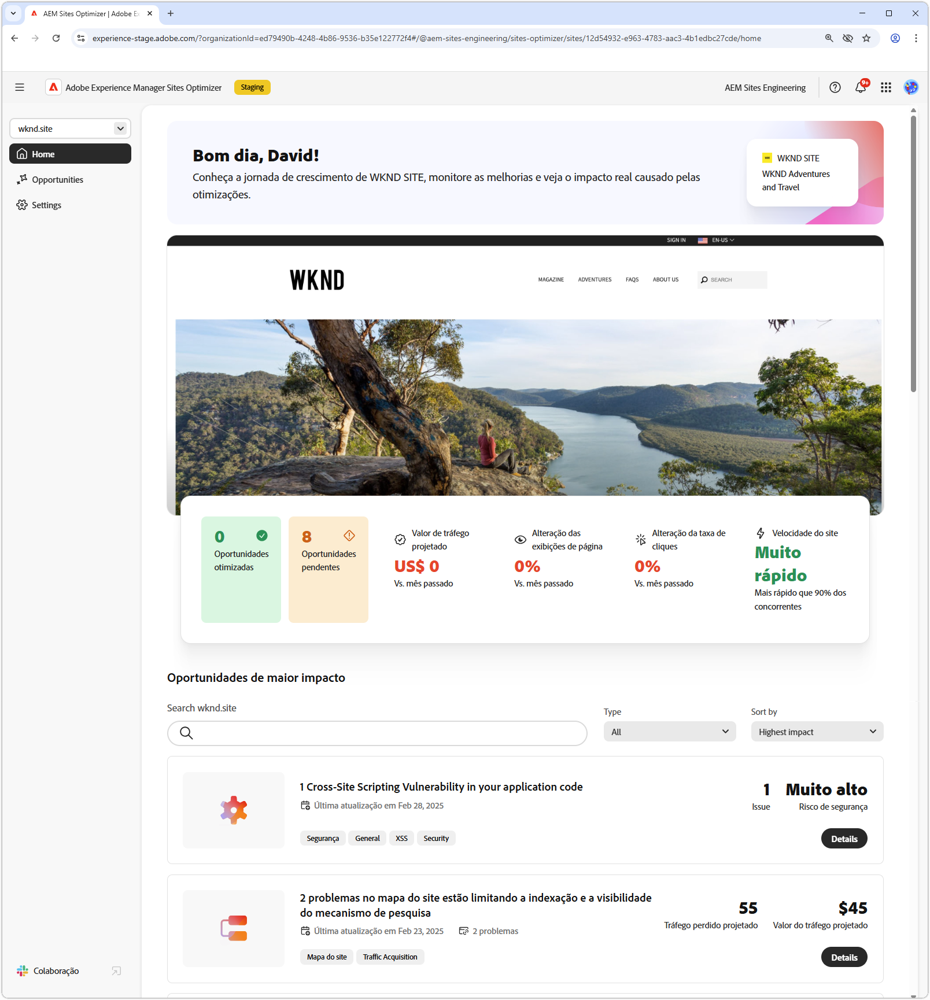
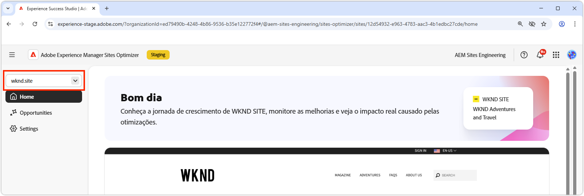
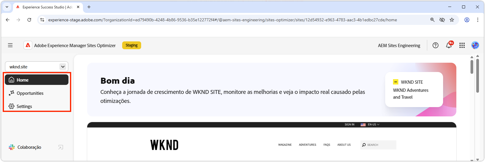
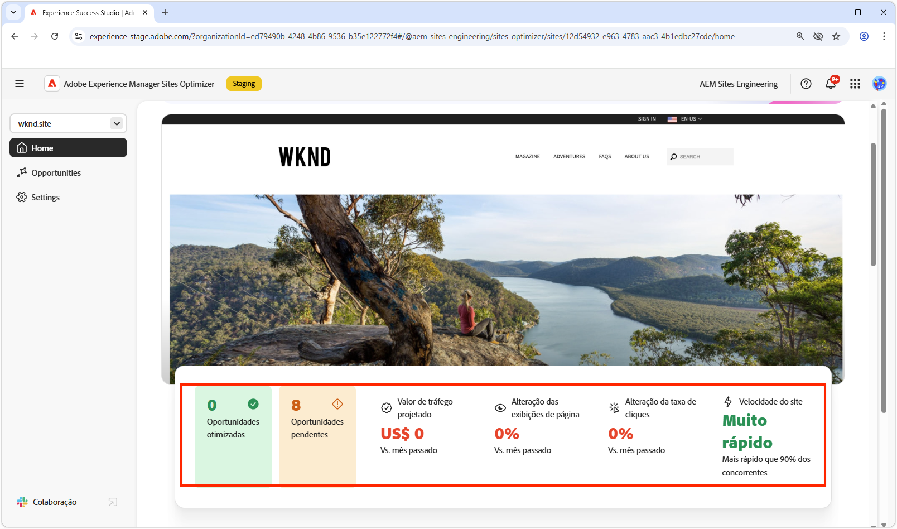
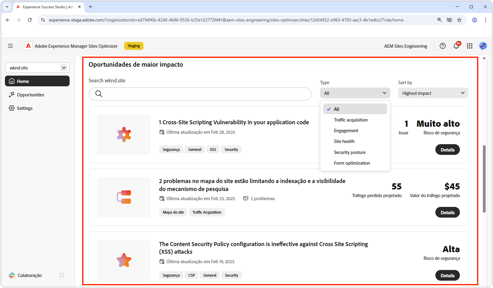
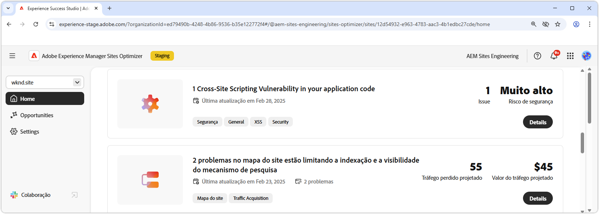

# Noções básicas do Sites Optimizer

{align="center"}

O painel do Sites Optimizer fornece uma visão geral de alto nível do desempenho do site e oportunidades de melhoria.

## Gerenciador de domínio

{align="center"}

O menu de contexto do gerenciador de domínio permite escolher o site do AEM, por domínio, que você deseja avaliar e otimizar. O Sites Optimizer fornece uma lista de todos os sites de produção do AEM registrados no [Cloud Manager](https://experienceleague.adobe.com/pt-br/docs/experience-manager-cloud-service/content/implementing/using-cloud-manager/edge-delivery-sites/add-edge-delivery-site).

## Navegação

{align="center"}

A seção Navegação fornece acesso rápido e persistente a áreas principais do Sites Optimizer de qualquer lugar no Sites Optimizer, incluindo:

* **Página inicial**: o painel principal, que fornece uma visão geral de alto nível do desempenho do site e oportunidades de melhoria.
* **Oportunidades** - Exiba e gerencie as oportunidades identificadas pela Sites Optimizer, incluindo aquelas que foram otimizadas ou permanecem não otimizadas.
* **Configurações**: defina as configurações do Sites Optimizer, incluindo os sites que você está monitorando e as notificações que você recebe.

## Resumo do site

{align="center"}

A seção Resumo do site fornece um instantâneo do desempenho do site, como o Sites Optimizer melhorou o site ao longo do tempo e oportunidades de melhoria. As métricas principais incluem:

* **Oportunidades otimizadas**: o número de oportunidades identificadas que foram aprimoradas para melhorar o desempenho empresarial.
* **Oportunidades pendentes**: o número de melhorias potenciais que permanecem não otimizadas, representando áreas de ganhos empresariais.
* **Valor do tráfego do projeto**: a alteração no valor estimado do tráfego do site em comparação ao mês passado, ajudando a medir a contribuição do Site Optimizer para as metas empresariais.
* **Alteração nas exibições de página**: a mudança de porcentagem na frequência com que o site é visualizado, refletindo o interesse do usuário e a eficácia do conteúdo.
* **Alteração na taxa de cliques**: a alteração percentual na frequência de cliques dos usuários, indicando mudanças no potencial de engajamento e conversão.
* **Velocidade do site**: um indicador importante da velocidade e usabilidade do site, afetando a experiência do usuário e as classificações de pesquisa.

## Oportunidades de alto impacto

{align="center"}

A seção Oportunidades de alto impacto destaca as oportunidades pendentes mais significativas para melhoria, com base em seu impacto potencial no desempenho do site. Essas oportunidades são organizadas por tipo, facilitando a priorização de esforços de otimização.

Filtre oportunidades por palavras-chave, tags, URLs ou [tipo de oportunidade](../opportunity-types/overview.md) para se concentrar nas áreas mais críticas para melhoria.

### Detalhes da oportunidade

{align="center"}

Cada oportunidade fornece uma breve descrição do problema, seu impacto potencial no site e um link para detalhes completos. Você também pode ver seu status, indicando se ele foi otimizado ou se ainda está pendente.

* **Título da oportunidade**: uma breve descrição do problema e seu impacto potencial no desempenho do site.
* **Última atualização** - A Sites Optimizer atualizou a oportunidade pela última vez com novos dados nesta data.
* **Contagem de problemas**: o número de instâncias do problema identificadas no site.
* **Tipos de oportunidade** - Os [tipos de oportunidade](../opportunity-types/overview.md) dos quais esta oportunidade faz parte — como aquisição de tráfego, envolvimento ou integridade do site.

As informações resumidas de cada oportunidade variam de acordo com o tipo e podem incluir detalhes sobre o impacto na receita, tráfego, engajamento do usuário ou ameaças à segurança.

Para exibir os detalhes de uma oportunidade, clique no botão **Detalhes**.

Para excluir uma oportunidade do painel e dos relatórios do Sites Optimizer, clique no botão **Ignorar**.
