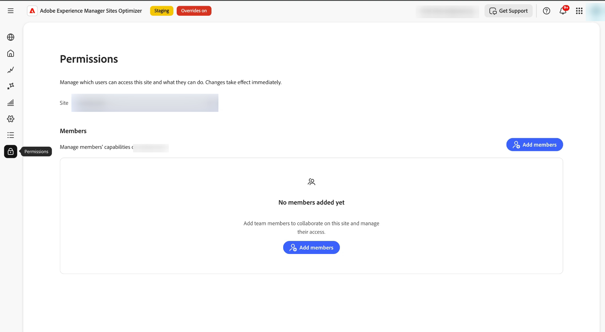

# Gerenciar permissões do usuário

Controlar quem pode acessar um site no Sites Optimizer e o que eles podem fazer com ele. O Access é criado a partir de um pequeno conjunto de *recursos* independentes — Exibir, Editar, Implantar, Configurar e Gerenciar usuários — que você concede a cada pessoa.

O acesso é **aditivo**: as permissões de uma pessoa são a soma de tudo o que ela recebeu. Não há &quot;negar&quot;, então as concessões nunca entram em conflito ou se cancelam mutuamente. Para conceder menos acesso a alguém, remova uma concessão em vez de tentar substituí-la.

Para gerenciar o acesso, abra a guia **Permissões** (o ícone de bloqueio na navegação à esquerda) e selecione o site que deseja gerenciar.

{align="center"}

## Como o acesso é concedido

Há duas maneiras de uma pessoa ter acesso a eles, e eles trabalham juntos:

- **Acesso a toda a organização** — atribuído pelo administrador da organização da Adobe no [Adobe Admin Console](https://adminconsole.adobe.com/). Ela se aplica a todos os sites da organização. Use-o para pessoas que precisam do mesmo acesso em qualquer lugar.
- **Acesso no nível do site** — atribuído dentro do Sites Optimizer, na guia **Permissões**. Ela se aplica a um único site e pode ser tão abrangente ou tão limitado quanto necessário. Nenhum acesso ao Admin Console é necessário.

>[!NOTE]
>
>As duas camadas se somam. Uma pessoa com acesso de visualização em toda a organização que também tenha permissão para Editar em um site pode visualizar cada site e editá-lo. Para manter uma pessoa limitada a um único site, certifique-se de que ela não ocupe também uma função em toda a organização.

### Funções em toda a organização (Admin Console)

O acesso de toda a organização vem de uma das duas funções de produto do **AEM Sites Optimizer**, atribuídas no [Adobe Admin Console](https://adminconsole.adobe.com/):

- **Gerenciador ASO** — acesso total a todos os sites, incluindo **Gerenciar usuários**. Um Gerente pode abrir a guia **Permissões** para qualquer site e atribuir acesso a outros.
- **Usuário ASO** — acesso somente para visualização a cada site. Sem alterações e sem gerenciamento de usuários.

Para atribuir uma função, você deve ser um **administrador do sistema** da organização ou um **administrador de produto** da AEM Sites Optimizer.

1. Entrar na [Adobe Admin Console](https://adminconsole.adobe.com/).
1. Vá para **Produtos** e selecione **AEM Sites Optimizer**.
1. Abra a guia **Usuários** e adicione o usuário por email (ou selecione um usuário existente).
1. Clique no ícone **+** (adicionar) para adicionar um perfil de produto e escolha o perfil de produto.

   {align="center"}

1. Clique em **Avançar**.
1. Escolha a função — **Gerenciador ASO** para acesso total ou **Usuário ASO** para acesso somente para visualização — e clique em **Aplicar**.

   {align="center"}

   {align="center"}

Para obter mais informações sobre como adicionar usuários, consulte [Integrar usuários](setup/onboard-users.md).

>[!IMPORTANT]
>
>Somente um administrador de organização pode conceder **Gerenciar usuários** para toda a organização. Um membro que tenha **Gerenciar usuários** em um site pode atribuir acesso a ele, mas não pode criar um **ASO Manager** para toda a organização.

## Níveis de recursos

Cada recurso controla um tipo de ação. Elas são independentes — por exemplo, você pode conceder Implantação sem Editar.

| Recurso | O que ele permite | O que não permite |
|---|---|---|
| Exibir | Veja os dados do site — oportunidades, sugestões, correções, relatórios e configuração — sem alterar nada. | Qualquer alteração. |
| Editar | Crie e altere oportunidades e sugestões (o que deve mudar). | Publicar alterações, alterar configurações ou gerenciar usuários. |
| Implantar | Publique correções em tempo real no site e reverta-as. | Gerenciamento de usuários. |
| Configurar | Altere as configurações e conexões do site. | Publicar correções ou gerenciar usuários. |
| Gerenciar usuários | Conceder ou revogar o acesso de outros membros ao site. | Gerenciar um site ao qual a pessoa ainda não tem acesso. |

>[!NOTE]
>
>**A exibição é sempre incluída.** Cada concessão inclui Exibir automaticamente — não é possível gerenciar, configurar, editar ou implantar algo que não possa ser visto. Por causa disso, a Exibição não pode ser removida sozinha. Para remover completamente o acesso de alguém, remova o membro (consulte [Editar ou remover um membro](#edit-or-remove-a-member) abaixo) em vez de desmarcar todos os recursos.

## Acesso de escopo a tipos de oportunidade

Em um único site, você pode conceder as opções Exibir, Editar e Implantar para **tipos de oportunidade específicos** (por exemplo, links internos Core Web Vitals ou Quebrados) em vez do site inteiro. Isso permite que uma pessoa edite o Core Web Vitals enquanto visualiza apenas todo o resto.

- **Exibir**, **Editar** e **Implantar** podem ser limitados a um ou mais tipos de oportunidade, ou a **Todos** tipos de oportunidade.
- **Configurar** e **Gerenciar usuários** sempre se aplicam a todo o site; eles não podem ser limitados a um tipo de oportunidade.

Cada concessão com escopo aparece como sua própria linha para o membro, com uma coluna **Aplica-se a** mostrando o tipo de oportunidade **Tudo** ou **Todo o site**.

>[!CAUTION]
>
>O escopo limita apenas o que *aquela* concessão oferece — nunca remove o acesso que outra concessão oferece. Se uma pessoa também tiver acesso em toda a organização ou uma concessão de **Todos** tipos, esse acesso mais amplo ainda se aplicará. Portanto, para realmente limitar alguém a tipos de oportunidade específicos, certifique-se de que eles não tenham uma função mais ampla ou uma concessão de **Todos** tipos.

## Adicionar um membro

1. Abra a guia **Permissões** (o ícone de bloqueio na navegação à esquerda) e selecione o site.
1. Clique em **Adicionar membros**.
1. Pesquisar por nome ou email e selecionar uma ou mais pessoas.
1. Escolha o(s) **tipo(s) de oportunidade** aos quais o acesso se aplica (ou **Todos**) e selecione os recursos a serem concedidos.
1. Clique em **Adicionar**.

## Editar ou remover um membro

Na tabela **Members**:

- Clique em **Editar recursos** na linha de um membro para alterar o que ele pode fazer. Quando você edita uma concessão existente, o tipo de oportunidade permanece fixo — você altera somente as capacidades e pelo menos uma capacidade deve permanecer selecionada.
- Clique em **Remover** para revogar totalmente o acesso desse membro ao site.

>[!NOTE]
>
>Alterar recursos e remover um membro são ações diferentes. Para remover todo o acesso, use **Remover** — não é possível fazer isso desmarcando recursos, pois uma concessão deve manter pelo menos um recurso (e a Exibição sempre permanece).

## Quem pode gerenciar permissões

A guia **Permissões** para um site está disponível para:

- Membros com o recurso **Gerenciar usuários** nesse site e
- Administradores da organização (um gerente ASO).

Os membros sem **Gerenciar usuários** veem uma mensagem informando que não têm permissão para gerenciar o acesso a esse site.

## Ativar gerenciamento de usuários e de acesso

O gerenciamento de usuários e de acesso é controlado por uma configuração para sua organização. Você pode atribuir acesso antes que ele seja ativado, mas só é **imposto** depois que a configuração é ativada.

Se ainda não estiver habilitado, a guia **Permissões** mostrará um banner solicitando que você entre em contato com a equipe de conta. Entre em contato com a equipe de conta da Sites Optimizer para ativá-la.

>[!NOTE]
>
>Até que o gerenciamento de usuários e acessos seja ativado, as permissões atribuídas serão salvas, mas não impostas.

## Configurar acesso antes da imposição

Você não precisa aguardar a aplicação para começar a atribuir acesso. Mesmo que o gerenciamento de usuários e acessos ainda esteja **desativado**, os usuários com a função **ASO Manager** poderão abrir a guia **Permissões** e atribuir sites e recursos a outros usuários.

Isso permite que você prepare o acesso certo para todos com antecedência. Quando a imposição for ativada posteriormente, os usuários já terão o acesso necessário, portanto ninguém será bloqueado inesperadamente.

>[!IMPORTANT]
>
>Enquanto a imposição estiver desativada, a guia **Permissões** estará disponível somente para usuários do **ASO Manager**. Configure o acesso de todos os usuários primeiro e, depois, ative a imposição.

## Perguntas frequentes

**Os membros no nível do site precisam de uma função Admin Console?**

Não. O acesso em nível de site é concedido inteiramente dentro do Sites Optimizer, na guia **Permissões**. Somente funções em toda a organização são atribuídas na Admin Console.

**O que acontece se alguém tiver acesso a toda a organização e a nível do site?**

Ambos se aplicam. O acesso efetivo deles é a combinação dos dois. As concessões nunca entram em conflito, pois nenhuma concessão pode negar acesso.

**Por que um membro com Gerenciar usuários não pode criar um Gerente em toda a organização?**

Criar uma função em toda a organização é uma ação do Admin Console. Um membro com **Gerenciar usuários** pode atribuir acesso em seu próprio site, mas somente um administrador da organização pode conceder funções em toda a organização.

**Como revogar o acesso de uma pessoa a um site?**

Remova a concessão na guia **Permissões**. Isso é diferente dos recursos de edição, que sempre devem deixar pelo menos um recurso.

**Posso limitar uma pessoa a tipos de oportunidade específicos?**

Sim — conceder Exibição, Editar ou Implantar com escopo para tipos de oportunidade específicos em vez de **Todos**. Como o acesso é aditivo, ele só terá efeito se a pessoa não tiver também acesso em toda a organização ou uma concessão de **Todos** tipos.
