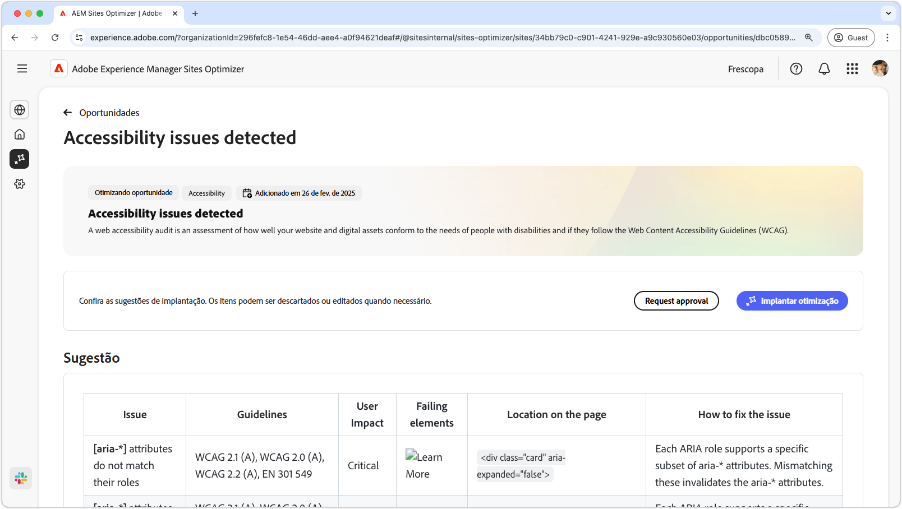
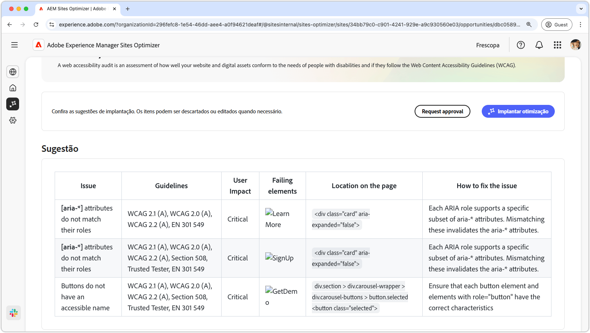
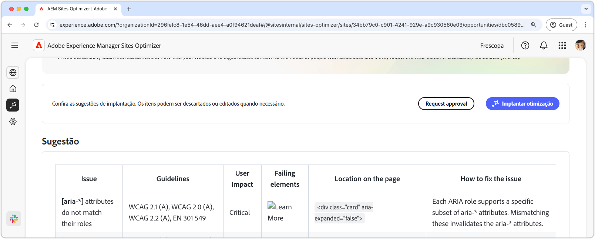

# Oportunidade de problemas de acessibilidade

{align="center"}

A oportunidade de problemas de acessibilidade identifica como o seu site está em conformidade com as necessidades das pessoas com deficiência e se ele segue as [Diretrizes de Acessibilidade de Conteúdo da Web (WCAG)](https://www.w3.org/TR/WCAG21/). Ao avaliar a conformidade do seu site com a WCAG, você ajuda a criar uma experiência online inclusiva. Por sua vez, permite que indivíduos com deficiências visuais, auditivas, cognitivas e motoras naveguem, interajam e se beneficiem do seu conteúdo. Essa funcionalidade não só é essencial por motivos éticos, como também promove a conformidade com os requisitos legais, melhora o SEO e pode aumentar o alcance do público-alvo, melhorando a experiência do usuário e o desempenho da empresa.

## Identificação automática

{align="center"}

A **Oportunidade de problemas de acessibilidade** identifica problemas de acessibilidade no seu site e inclui o seguinte:

* **Problemas**: o problema de acessibilidade específico encontrado.
* **Diretrizes**: a [ID de diretrizes da WCAG](https://www.w3.org/TR/WCAG21/) que o problema está violando.
* **Impacto no usuário**: uma avaliação do impacto sobre usuários portadores de deficiências.
* **Elementos com falha**: os elementos HTML na página da Web afetados pelo problema.
* **Local na página**: o trecho HTML do elemento na página afetada pelo problema.

## Sugestão automática

{align="center"}

A Sugestão automática fornece recomendações geradas por IA no campo **Como corrigir o problema**, que fornece orientação prescritiva sobre o que fazer para corrigir o problema.

## Otimizar automaticamente

[!BADGE Ultimate]{type=Positive tooltip="Ultimate"}

{align="center"}

O Sites Optimizer Ultimate adiciona a capacidade de implantar a otimização automática para as vulnerabilidades encontradas.

>[!BEGINTABS]

>[!TAB Implantar otimização]

{{auto-optimize-deploy-optimization-slack}}

>[!TAB Solicitar aprovação]

{{auto-optimize-request-approval}}

>[!ENDTABS]

## Consulte também

[Oportunidade de problemas de acessibilidade do Forms](/help/documentation/opportunities/forms-accessibility-issues.md)