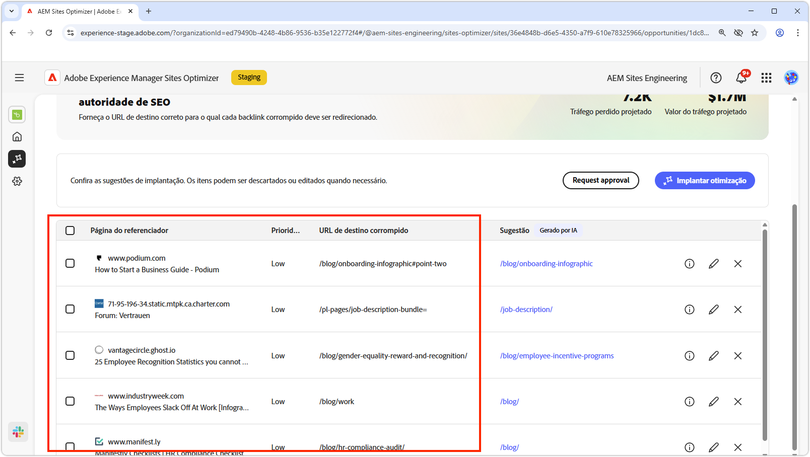
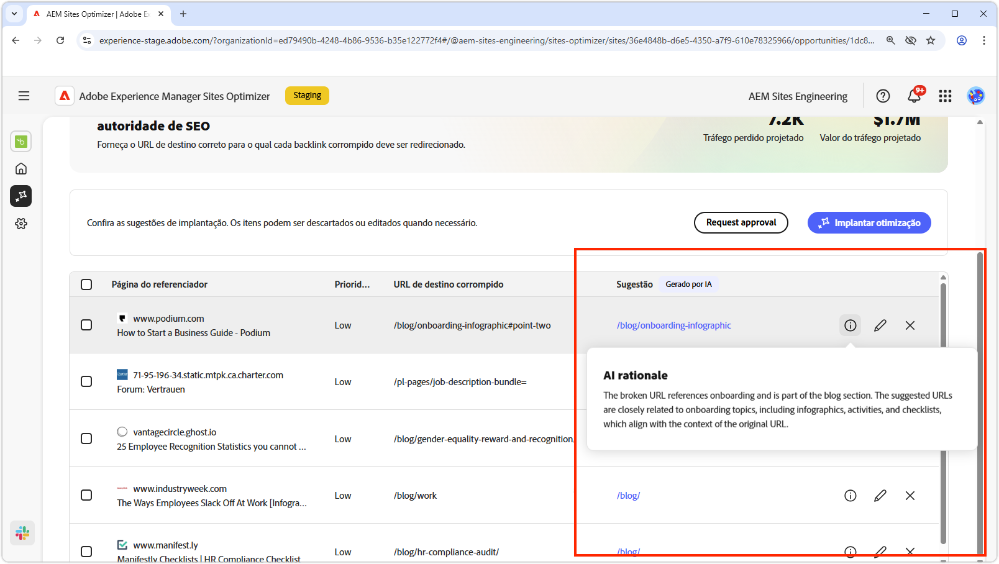
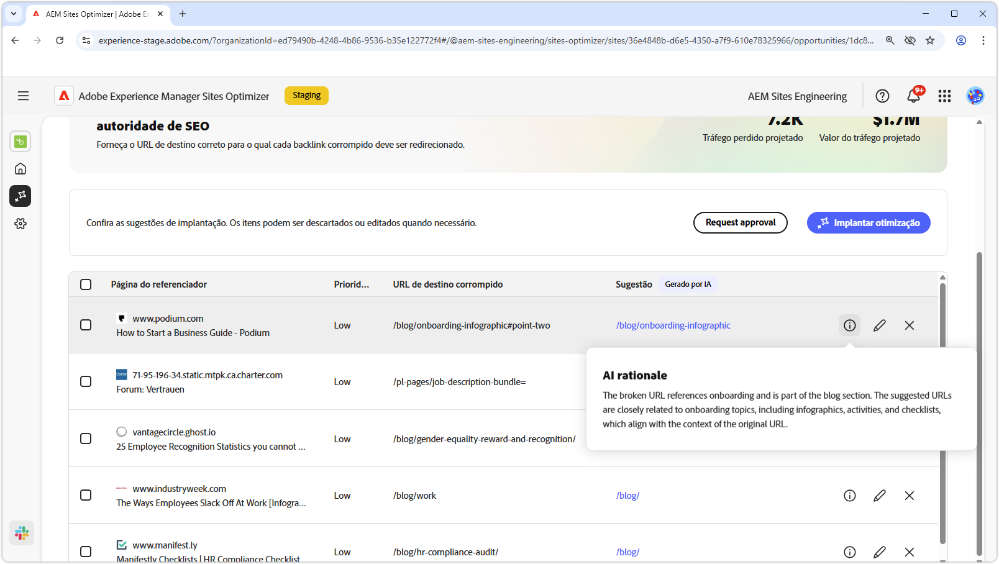
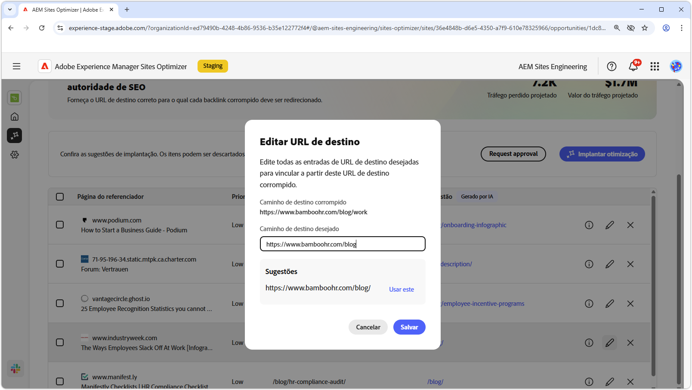
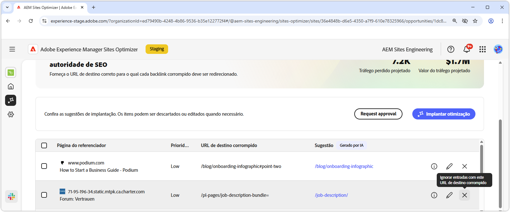
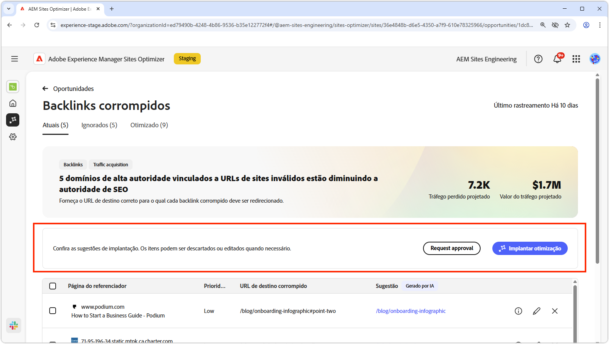
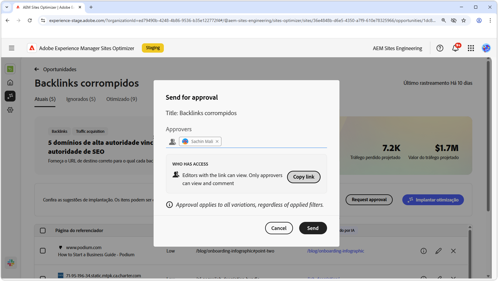

# Oportunidade de backlinks corrompidos

{align="center"}

A oportunidade de backlinks corrompidos identifica links de outros sites para o seu que resultam em um erro 404. Como os mecanismos de pesquisa usam backlinks para determinar a relevância da pesquisa, os links corrompidos podem afetar negativamente a SEO e a capacidade de descoberta do site. Esses problemas podem surgir de fatores como alterações de URL ou a remoção da página vinculada.

A oportunidade de backlinks corrompidos exibe um resumo na parte superior da página, incluindo um resumo do problema e seu impacto no site e na empresa.

* **Tráfego projetado perdido**: a perda de tráfego estimada devido a backlinks corrompidos.
* **Valor de tráfego projetado**: o valor estimado do tráfego perdido.

## Identificação automática

{align="center"}

A oportunidade de backlinks corrompidos lista todos os backlinks corrompidos do site, incluindo:

* **Página de referência**: o domínio do site que contém o link corrompido.
* **Prioridade**: alta, média ou baixa, indicando o impacto que o link corrompido tem na SEO baseado em TODO.
* **URL de destino corrompido**: o URL inexistente no site que está sendo vinculado.

## Sugestão automática

{align="center"}

A oportunidade de backlinks corrompidos também fornece sugestões geradas por IA sobre para qual página do seu site o URL corrompido deve redirecionar. As sugestões são baseadas no texto que compreende o URL corrompido e o conteúdo da página sugerida.

>[!BEGINTABS]

>[!TAB Lógica de IA]

{align="center"}

Clique no ícone **informações** para exibir a lógica de IA para o URL sugerido. A lógica explica por que a IA acredita que o URL sugerido é a melhor opção para o link corrompido. Ela pode ajudar a entender o processo de tomada de decisão da IA e tomar uma decisão fundamentada sobre aceitar ou rejeitar a sugestão.

>[!TAB Editar URL de destino]

{align="center"}

Se você discordar da sugestão gerada pela IA, poderá editar o URL sugerido clicando no **ícone de edição**. A edição permite inserir manualmente o URL que você acredita ser a melhor opção para o link corrompido. O Sites Optimizer também lista quaisquer outros URLs no seu site que ele acredite serem uma boa opção para o link corrompido.

>[!TAB Ignorar entradas]

{align="center"}

Você pode optar por ignorar entradas com o URL de destino corrompido. Clicar  remove o backlink corrompido da lista de oportunidades. Os backlinks corrompidos ignorados podem ser engajados novamente na guia **Ignorados**, na parte superior da página de oportunidade.

>[!ENDTABS]

## Otimizar automaticamente

[!BADGE Ultimate]{type=Positive tooltip="Ultimate"}

{align="center"}

O Sites Optimizer Ultimate adiciona a capacidade de implantar a otimização automática para backlinks corrompidos. Clicar no botão **Otimização automática** atualiza automaticamente as regras de redirecionamento do AEM Sites para mapear o **URL de destino corrompido** para o **URL sugerido**. Essa funcionalidade garante que os visitantes do site e os bots de pesquisa que seguem os links corrompidos nas **páginas de referência** sejam redirecionados à página correta do seu site, melhorando a SEO e a experiência do usuário.

>[!BEGINTABS]

>[!TAB Implantar otimização]

{align="center"}

Selecionar **Implantar otimização** atualiza as regras de redirecionamento do AEM Sites para mapear o **URL de destino corrompido** para o **URL sugerido**. Essa funcionalidade garante que os visitantes do site e os bots de pesquisa que seguem os links corrompidos nas **páginas de referência** sejam redirecionados à página correta do seu site, melhorando a SEO e a experiência do usuário.

>[!TAB Solicitar aprovação]

{align="center"}

{{auto-optimize-request-approval}}

>[!ENDTABS]
