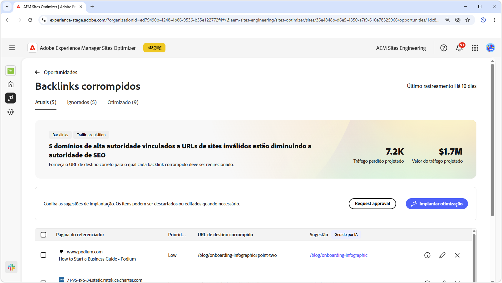
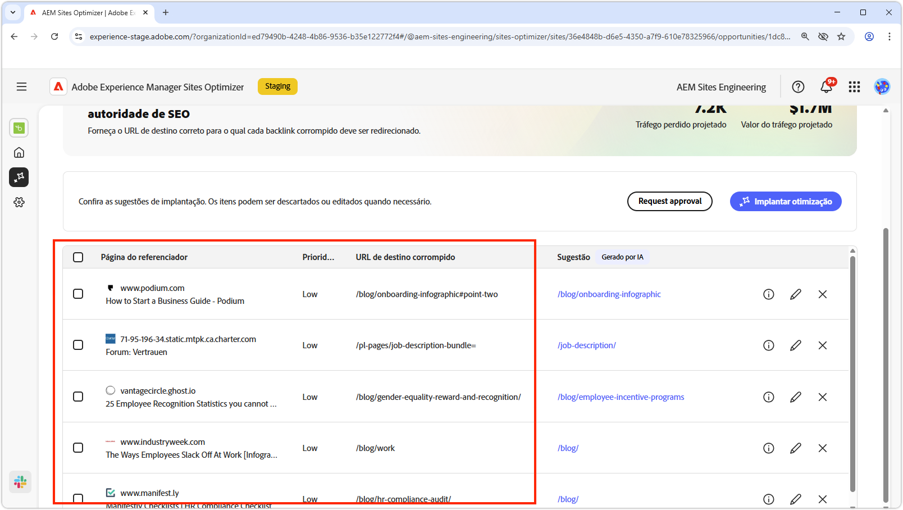
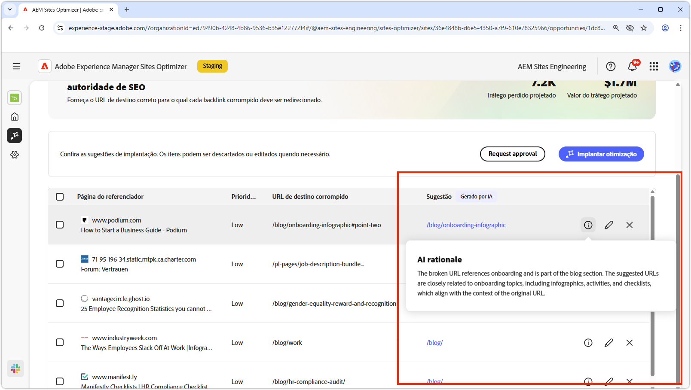
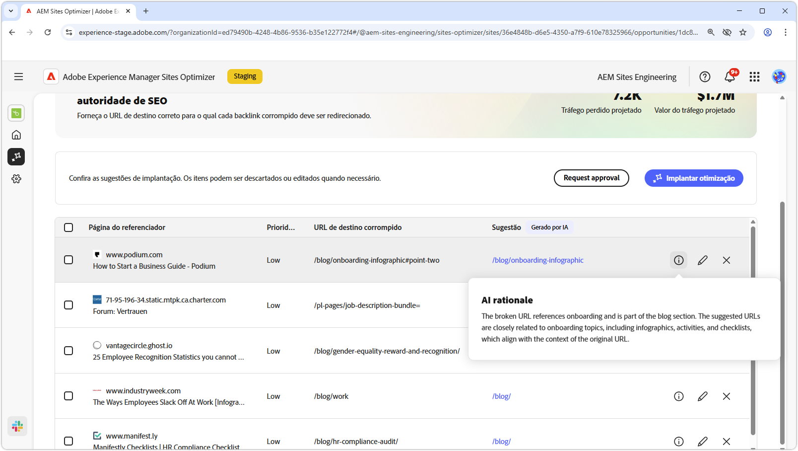
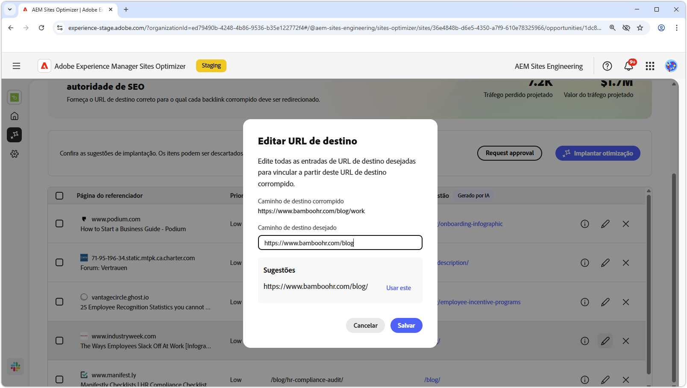
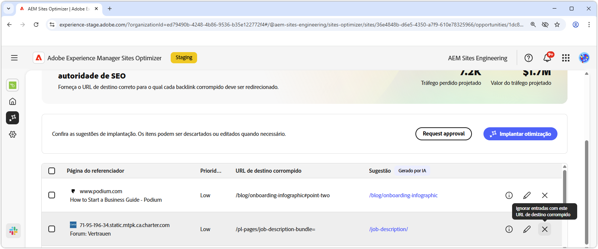

# Oportunidade de backlinks corrompidos

<!--{align="center"}-->

>[!VIDEO](https://video.tv.adobe.com/v/3483250/?learn=on&enablevpops)

A oportunidade Backlinks corrompidos identifica links externos que apontam para páginas inexistentes (404) no seu site. Esses links resultam em perda de tráfego de referência e redução do valor de SEO, já que os mecanismos de busca dependem de backlinks para avaliar relevância e autoridade. Esses problemas ocorrem quando URLs são alterados, um conteúdo é removido ou páginas se tornam indisponíveis devido a ausência de redirecionamentos adequados. O AEM Sites Optimizer identifica todos os backlinks quebrados, fornece recomendações específicas de IA e permite a implantação com um clique para corrigi-los, tudo em uma única visualização centralizada.

## Identificação automática

<!--{align="center"}-->

O AEM Sites Optimizer verifica continuamente as fontes de dados externas para detectar backlinks que apontam para páginas 404 inexistentes no site. Os dados são agregados de várias fontes, incluindo o Google Search Console, [Telemetria operacional](https://experienceleague.adobe.com/en/docs/experience-manager-cloud-service/content/sites/operational-telemetry-for-aem-as-a-cloud-service) e plataformas de SEO de terceiros. A oportunidade de identificação automática identifica domínios externos vinculados a URLs quebrados e os prioriza com base no impacto, incluindo a autoridade do domínio e o tráfego esperado e as perdas de valor do link.

Esta oportunidade lista todos os problemas identificados, incluindo os seguintes detalhes:

* **Página e domínio referenciador** — A página ou domínio externo que contém o link quebrado.
* **Prioridade** – Alta, média ou baixa, indicando o impacto que o link quebrado tem no processo de SEO.
* **URL de destino corrompido** – O URL inexistente no site que está sendo vinculado.

## Sugestão automática

<!--{align="center"}-->

Para cada backlink corrompido identificado, o AEM Sites Optimizer recomenda o destino mais apropriado para restaurar o tráfego e o valor de SEO. Ele determina a intenção do backlink analisando:

* Estrutura e tokens do URL
* Texto de âncora
* Título e contexto da página de referência

Essa intenção é comparada com o conteúdo existente no site para identificar a página de destino mais relevante. Cada URL corrompido é mapeado para uma página de substituição exata ou para a mais próxima página relevante. Se nenhum destino adequado puder ser determinado, o problema será exposto para revisão manual.

>[!BEGINTABS]

>[!TAB Lógica de IA]

<!--{align="center"}-->

Clique no ícone **informações** para exibir a lógica de IA para o URL sugerido. A lógica explica por que a IA acredita que o URL sugerido é a melhor opção para o link corrompido. Ela pode ajudar a entender o processo de tomada de decisão da IA e tomar uma decisão fundamentada sobre aceitar ou rejeitar a sugestão.

>[!TAB Editar URL de destino]

<!--{align="center"}-->

Se você discordar da sugestão gerada pela IA, poderá editar o URL sugerido clicando no **ícone de edição**. A edição permite inserir manualmente o URL que você acredita ser a melhor opção para o link corrompido. O Sites Optimizer também lista quaisquer outros URLs no seu site que ele acredite serem uma boa opção para o link corrompido.

>[!TAB Ignorar entradas]

<!--{align="center"}-->

Você pode optar por ignorar entradas com os URLs corrompidos direcionados. Clicar  remove o backlink corrompido da lista de oportunidades. Os backlinks corrompidos ignorados podem ser engajados novamente na guia **Ignorados**, na parte superior da página de oportunidade.

>[!ENDTABS]

## Otimizar automaticamente

<!--[!BADGE Ultimate]{type=Positive tooltip="Ultimate"}-->

Depois que as sugestões forem revisadas e aprovadas, você poderá clicar em **Implantar otimização**. O AEM Sites Optimizer aplica as correções no ambiente de criação, com base em como os redirecionamentos são gerenciados na implementação. O autor do AEM pode então publicar as alterações no Sistema de gerenciamento de conteúdo (CMS).

Dependendo da configuração, as correções são aplicadas como alterações de conteúdo ou código nos fluxos de trabalho de implantação existentes. O processo de otimização inclui as seguintes etapas:

* **Validação** – Garante que as alterações funcionem conforme esperado e não introduz regressões antes da implantação.
* **Implantação** – Aplica as alterações feitas por meio de processos existentes, como atualizações de conteúdo no AEM ou implantação de código por meio de pipelines de CI/CD.
* **Verificação de permissões** – Verifica se o usuário tem as permissões apropriadas para implantar alterações. Caso contrário, saídas alternativas, como listas de redirecionamento para download ou patches de código serão fornecidas.

Esse processo garante que os redirecionamentos sejam implementados com precisão, validados antes do lançamento e alinhados às configurações e aos processos de controle existentes.
