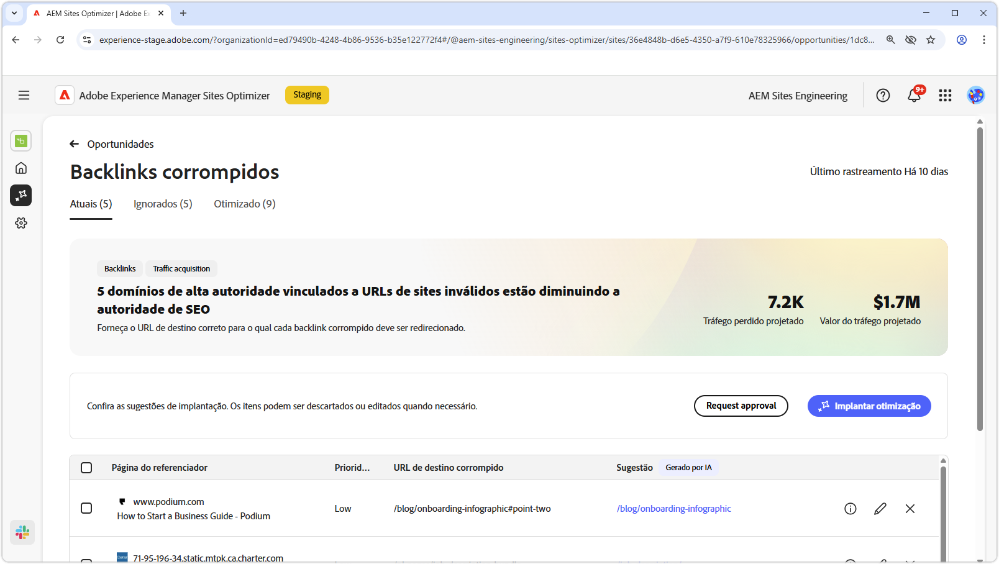

# Oportunidade de backlinks quebrados

{align="center"}

A oportunidade de backlinks quebrados identifica links de outros sites para o seu site que resultam em um erro 404. Como os mecanismos de pesquisa usam backlinks para determinar a relevância da pesquisa, os links com falha podem afetar negativamente a SEO e a capacidade de descoberta do site. Esses problemas podem surgir de fatores como alterações de URL ou a remoção da página vinculada.

A oportunidade de backlinks quebrados exibe um resumo na parte superior da página, incluindo um resumo do problema e seu impacto no site e na empresa.

* **Tráfego projetado perdido** - A perda de tráfego estimada devido a backlinks com falha.
* **Valor de tráfego projetado** - O valor estimado do tráfego perdido.

## Identificação automática

{align="center"}

A oportunidade de backlinks desfeitos lista todos os backlinks desfeitos do site, incluindo:

* **Página de referência** - O domínio do site que contém o link corrompido.
* **Prioridade** - Alta, média ou baixa, indicando o impacto que o link corrompido tem na SEO baseada em TODO.
* **URL de destino corrompida** - A URL inexistente no site que está sendo vinculado.

## Sugestão automática

{align="center"}

A oportunidade de backlinks quebrados também fornece sugestões geradas por IA para qual página do site o URL quebrado deve ser redirecionado. As sugestões são baseadas no texto que compreende o URL corrompido e o conteúdo da página sugerida.

>[!BEGINTABS]

>[!TAB Lógica de IA]

{align="center"}

Selecione o ícone **informações** para exibir a lógica de IA para a URL sugerida. A lógica explica por que a IA acredita que o URL sugerido é o melhor ajuste para o link quebrado. Isso pode ajudá-lo a entender o processo de tomada de decisões da IA e tomar uma decisão informada sobre aceitar ou rejeitar a sugestão.

>[!TAB Editar URL de destino]

{align="center"}

Se você discordar da sugestão gerada pela IA, poderá editar o URL sugerido selecionando o **ícone de edição**. Isso permite inserir manualmente o URL que você acha que é o melhor ajuste para o link quebrado. O Sites Optimizer também listará quaisquer outros URLs em seu site que ele acredita que possam ser uma boa opção para o link quebrado.

>[!TAB Ignorar entradas]

{align="center"}

Você pode optar por ignorar entradas com o URL de destino corrompido. Selecionar o **ícone ignorar** remove o backlink corrompido da lista de oportunidades. Os backlinks com falha ignorados podem ser engajados novamente na guia **Ignorados**, na parte superior da página de oportunidade.

>[!ENDTABS]

## Otimizar automaticamente

[!BADGE Ultimate]{type=Positive tooltip="Ultimate"}

{align="center"}

O Sites Optimizer Ultimate adiciona a capacidade de implantar otimização automática para backlinks desfeitos. Selecionar o botão **Otimização automática** atualiza automaticamente as regras de redirecionamento do site do AEM para mapear a **URL de destino corrompida** para a **URL sugerida**. Isso garante que os visitantes do site e os bots de pesquisa que seguem os links com falha nas **páginas de referência** sejam redirecionados para a página correta no seu site, melhorando o SEO e a experiência do usuário.

>[!BEGINTABS]

>[!TAB Implantar otimização]

{align="center"}

Selecionar **Implantar otimização** atualizará as regras de redirecionamento do Site do AEM para mapear a **URL de destino corrompida** para a **URL sugerida**. Isso garante que os visitantes do site e os bots de pesquisa que seguem os links com falha nas **páginas de referência** sejam redirecionados para a página correta no seu site, melhorando o SEO e a experiência do usuário.

>[!TAB Solicitar aprovação]

{align="center"}

{{auto-optimize-request-approval}}

>[!ENDTABS]
