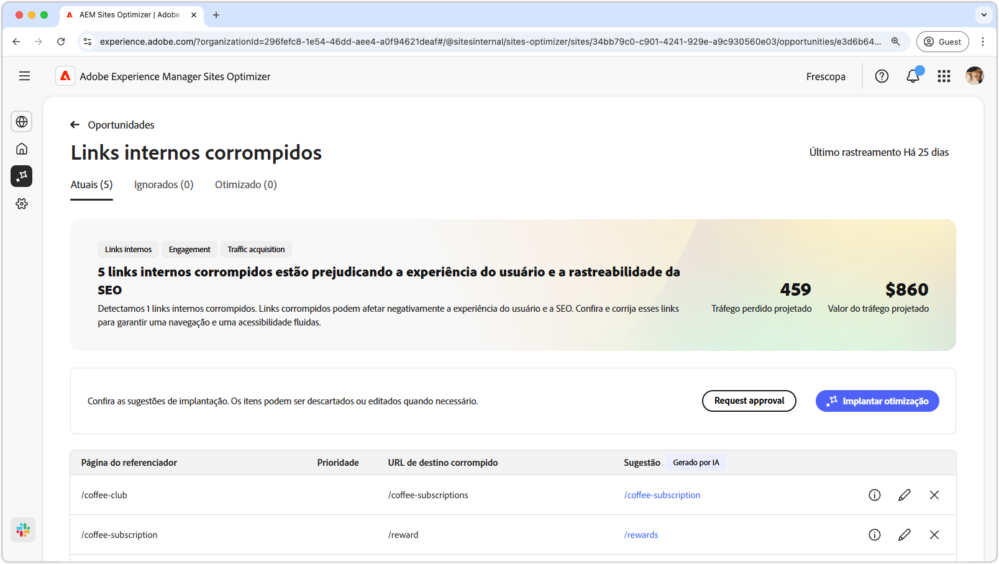

# Oportunidade de metadados inválida ou ausente

{align="center"}

Links internos corrompidos afetam a capacidade do mecanismo de pesquisa de indexar seu site e afetam negativamente a experiência do usuário e a otimização do mecanismo de pesquisa. Para ajudar a corrigir esse problema, a oportunidade de links internos corrompidos aponta URLs corrompidos e fornece sugestões para atualizações de links válidos. A solução desses problemas melhorará o engajamento do usuário e garantirá uma navegação e acessibilidade tranquilas.

A oportunidade de links internos quebrados exibe um resumo na parte superior da página, incluindo um resumo do problema e seu impacto no site e na empresa.

* **Tráfego projetado perdido** - A perda de tráfego estimada devido a links internos corrompidos.
* **Valor de tráfego projetado** - O valor estimado do tráfego perdido.

## Identificação automática

<!---{align="center"}-->

A oportunidade de links internos corrompidos identifica automaticamente e lista todos os links internos corrompidos em suas páginas e inclui o seguinte:

* **Página de referência** - A página que contém o link corrompido.
* **URL de Destino Incorreta** - O link interno inválido.
* **Sugestão** - Uma sugestão gerada por IA sobre como atualizar o link corrompido. Consulte a seção Sugestão automática para obter mais detalhes.

## Sugestão automática

<!--{align="center"}-->

A oportunidade de links internos quebrados fornece sugestões geradas por IA sobre como atualizar os links quebrados. Essas sugestões são baseadas no URL inválido direcionado e fornecem uma substituição adequada. Selecionar o **ícone de informações** fornece um motivo gerado pela IA para a atualização sugerida.

>[!BEGINTABS]

>[!TAB Lógica de IA]

<!--[AI rationale of broken internal links](./assets/broken-internal-links/auto-suggest-ai-rationale.png) -->

Selecione o ícone **informações** para exibir a lógica de IA para a URL sugerida. A lógica explica por que a IA acredita que o URL sugerido é o melhor ajuste para o link quebrado. Isso pode ajudá-lo a entender o processo de tomada de decisões da IA e tomar uma decisão informada sobre aceitar ou rejeitar a sugestão.

>[!TAB Editar URL de destino]

<!--{align="center"}-->

Se você discordar da sugestão gerada pela IA, poderá editar o valor do link sugerido selecionando o **ícone de edição**. Isso permite inserir manualmente o link desejado. A janela de edição contém o **caminho de destino corrompido** do link, o **caminho de destino desejado**, onde você pode editar manualmente o link e um campo com a sugestão gerada pela Ia. Depois de concluir a edição, clique em **Salvar** para atualizar a entrada de link corrompido. Um ponto amarelo será exibido no campo de entrada para indicar que o link foi editado.

>[!TAB Ignorar entradas]

<!--{align="center"}-->

Você pode optar por ignorar entradas com os URLs com falha direcionados. Selecionar o **ícone de ignorar** remove a entrada da lista de oportunidades. As entradas ignoradas podem ser engajadas novamente na guia **Ignoradas**, na parte superior da página de oportunidade.

>[!ENDTABS]

## Otimizar automaticamente

[!BADGE Ultimate]{type=Positive tooltip="Ultimate"}

<!---{align="center"}-->

O Sites Optimizer Ultimate adiciona a capacidade de implantar otimização automática para os links quebrados encontrados pela oportunidade. <!--- TBD-need more in-depth and opportunity specific information here. What does the auto-optimization do?-->

>[!BEGINTABS]

>[!TAB Implantar otimização]

{{auto-optimize-deploy-optimization-slack}}

>[!TAB Solicitar aprovação]

{{auto-optimize-request-approval}}

>[!ENDTABS]

