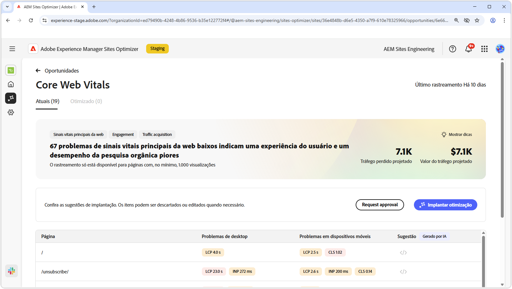
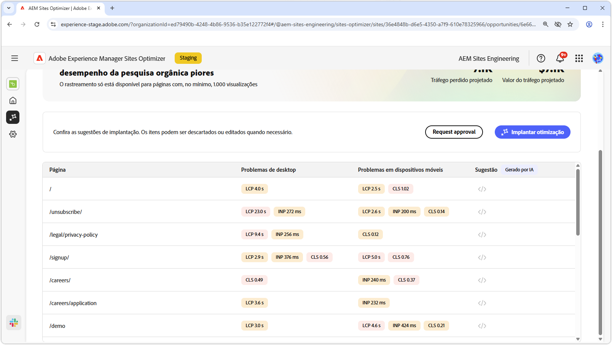
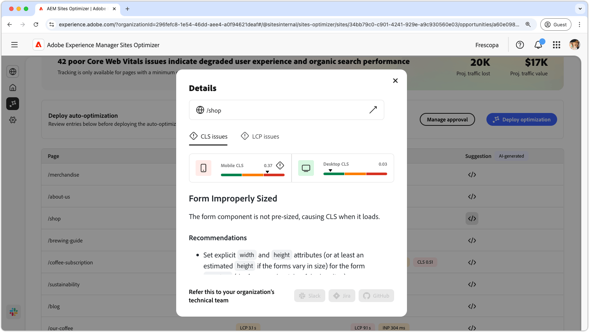

# Oportunidade dos sinais vitais principais da Web

{align="center"}

A oportunidade dos sinais vitais principais da Web identifica problemas que podem degradar a experiência do usuário e o desempenho da pesquisa orgânica de suas páginas da Web. Esses problemas surgem de vários fatores, como fontes personalizadas, dependências não otimizadas do JavaScript, scripts de terceiros e assim por diante. A oportunidade dos sinais vitais principais da Web aponta esses elementos com falha e sugere correções que podem aumentar o desempenho da sua página da Web. Observe que somente as páginas com pelo menos 1000 visualizações podem ser analisadas.

Para começar, a oportunidade dos sinais vitais principais da Web exibe um resumo na parte superior da página, incluindo um resumo do problema e seu impacto no site e na empresa.

* **Perda de tráfego projetada**: a perda de tráfego estimada devido aos sinais vitais principais que estão abaixo dos limites de desempenho.
* **Valor de tráfego projetado**: o valor estimado do tráfego perdido.

## Identificação automática

{align="center"}

Na parte inferior da página, você tem uma lista de todos os problemas atuais agrupados como:

* **Problemas em dispositivos móveis**: uma lista de problemas que afetam a versão para dispositivos móveis da página.
* **Problemas de desktop**: uma lista de problemas que afetam a versão de desktop da página.

Cada problema é exibido em uma tabela, com a coluna **Página** identificando a entrada de página afetada.

O sistema agrupa esses problemas pelas métricas de desempenho padrão no relatório Web Vitals principais:

* maior pintura contentful **LCP**
* interação com a próxima pintura **INP**
* deslocamento de layout cumulativo **CLS**

## Sugestão automática

{align="center"}

A oportunidade dos sinais vitais principais da Web fornece sugestões de correção geradas por IA. Ao clicar no botão de sugestões, uma nova janela é exibida contendo as métricas de desempenho **LCP**, **INP** e **CLS** como categorias. Você pode alternar entre essas categorias para ver uma lista de problemas específicos.

Cada categoria pode conter vários problemas. Portanto, role a tela para baixo para ver a lista completa de problemas e recomendações.  Além disso, há dois medidores de desempenho, para dispositivos móveis e desktop, para cada métrica.

## Otimizar automaticamente

[!BADGE Ultimate]{type=Positive tooltip="Ultimate"}

{align="center"}

O Sites Optimizer Ultimate adiciona a capacidade de implantar a otimização automática para os problemas encontrados pela oportunidade dos sinais vitais principais da Web. <!--- TBD-need more in-depth and opportunity specific information here. What does the auto-optimization do?-->

>[!BEGINTABS]

>[!TAB Implantar otimização]

{{auto-optimize-deploy-optimization-slack}}

>[!TAB Solicitar aprovação]

{{auto-optimize-request-approval}}

>[!ENDTABS]

