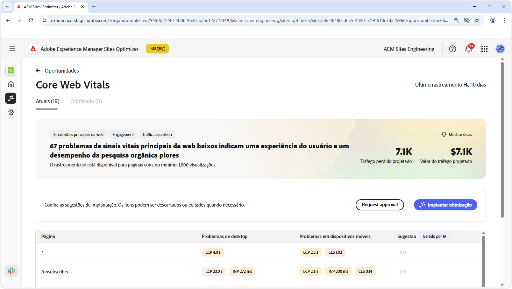
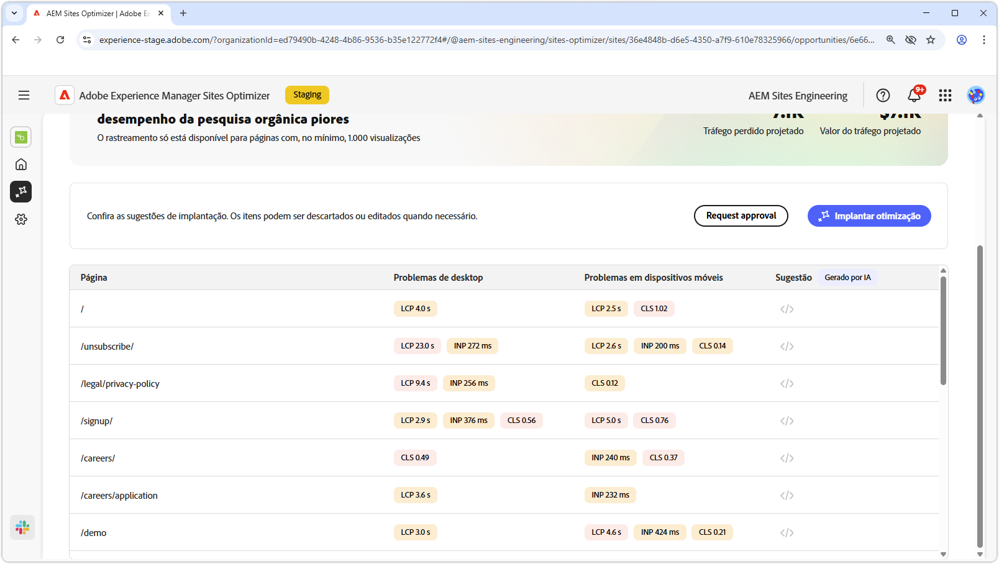

# Oportunidade dos sinais vitais principais da Web

<!--{align="center"}-->

>[!VIDEO](https://video.tv.adobe.com/v/3483371/?learn=on&enablevpops)

A ferramenta Core Web Vitals identifica páginas em seu site que têm baixo desempenho e afetam a experiência do usuário e o desempenho da pesquisa orgânica. Esses problemas podem surgir de fatores como fontes personalizadas, dependências não otimizadas do JavaScript e scripts de terceiros. O Core Web Vitals mede a velocidade de carregamento do conteúdo, a estabilidade do layout da página e a capacidade de resposta da página às interações do usuário.

O AEM Sites Optimizer detecta páginas afetadas por esses problemas, fornece recomendações específicas de IA no nível do código e aplica correções por meio de fluxos de trabalho de desenvolvimento existentes. Observe que apenas páginas com pelo menos 1000 visualizações podem ser analisadas.

## Identificação automática

<!--{align="center"}-->

O AEM Sites Optimizer monitora continuamente o desempenho do site usando a [Telemetria operacional](https://experienceleague.adobe.com/en/docs/experience-manager-cloud-service/content/sites/operational-telemetry-for-aem-as-a-cloud-service) para detectar regressões nas métricas do Core Web Vitals, como LCP (Largest Contentful Paint), CLS (Cumulative Layout Shift) e INP (Interaction to Next Paint). Ele usa dados reais do usuário para identificar regressões de desempenho e prioriza problemas com base em seu impacto na experiência do usuário.

O AEM Sites Optimizer exibe a lista de todos os problemas atuais, detalhados por dispositivos móveis e desktop. A coluna **Página** indica a entrada de página afetada e os problemas são categorizados por LCP, INP e CLS.

## Sugestão automática

<!--{align="center"}-->

Para cada problema identificado, o AEM Sites Optimizer gera recomendações prescritivas de nível de código para melhorar o desempenho do Core Web Vitals. Ele avalia a implementação subjacente acessando o repositório de códigos. Isso permite que o sistema analise como os componentes, scripts e estilos são implementados e identifique a causa básica dos problemas de desempenho. Com base nessa análise, o sistema fornece recomendações direcionadas e gera patches de código que especificam as alterações necessárias para melhorar o desempenho. Cada recomendação pode ser revisada antes de ser aplicada.

Ao clicar no botão de sugestões, uma nova janela é exibida contendo as métricas de desempenho LCP, INP e CLS como categorias. Você pode alternar entre essas categorias para ver a lista de problemas específicos. Cada categoria pode conter vários problemas; portanto, certifique-se de rolar a página para baixo para ver a lista completa de problemas e recomendações. Além disso, há dois indicadores de desempenho para dispositivos móveis e desktop para cada métrica.

## Otimizar automaticamente

<!--[!BADGE Ultimate]{type=Positive tooltip="Ultimate"}-->

Depois que as recomendações forem revisadas e aprovadas, você pode clicar em **Implantar otimização**. O AEM Sites Optimizer gera patches de código com base nos problemas identificados e os disponibiliza por meio de processos de controle de versão. O processo de otimização inclui as seguintes etapas:

* **Criação de problema** – Cria um problema no GitHub com um rótulo para cada correção, incluindo uma descrição clara e o URL afetado para maior visibilidade.
* **Entrega de solicitação de pull** - Abre automaticamente uma solicitação de pull vinculada com a correção de código exata, pronta para revisão, teste e mesclagem.
* **Rastreamento de status** – Rastreia cada correção até a conclusão, sinalizando tentativas parciais ou malsucedidas para acompanhamento.

Antes de disponibilizar essas atualizações, o AEM Sites Optimizer executa a validação para garantir que as correções resolvam o problema subjacente e não introduzam regressões. Todas as atualizações seguem práticas padrão de desenvolvimento, exigindo revisão e aprovação antes de serem incorporadas à produção.

Isso garante que as otimizações de desempenho sejam precisas, validadas e integradas aos processos existentes de desenvolvimento e governança.
