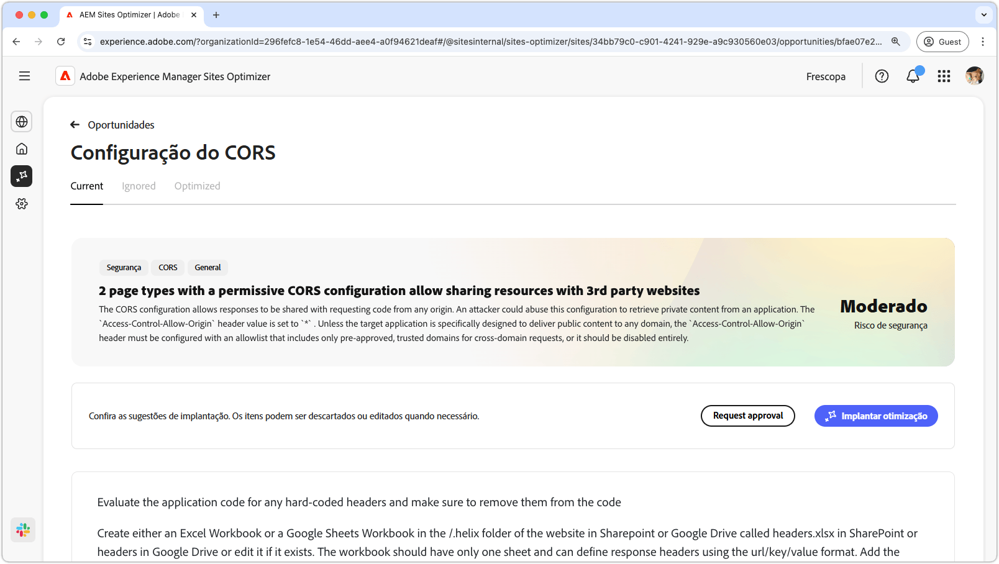

# Oportunidade de configuração do CORS

{align="center"}

A configuração correta do CORS (Cross-Origin Resource Sharing, Compartilhamento de recursos entre origens) é essencial para proteger aplicativos da Web contra o acesso não autorizado aos dados. Quando o cabeçalho `Access-Control-Allow-Origin` é definido como `*`, qualquer domínio pode solicitar e receber respostas, potencialmente expondo informações confidenciais a invasores. Isso oferece uma oportunidade de fortalecer a segurança implementando uma lista de permissões controlada de domínios confiáveis ou desabilitando o CORS onde não é necessário. Garantir uma configuração segura do CORS ajuda a proteger o conteúdo privado, mantendo o acesso ininterrupto para usuários autorizados.

## Identificação automática

{align="center"}

A identificação automática verifica o site em busca de erros de configuração do CORS e detecta URLs suscetíveis a acesso não autorizado. Esses URLs são listados na tabela superior, juntamente com os seguintes detalhes:

* **Prefixo de página**: o prefixo de caminho de URL vulnerável à configuração incorreta do CORS.
* **Exemplo de página**: um exemplo de URL que é suscetível a acesso não autorizado.

## Sugestão automática

{align="center"}

A sugestão automática fornece **Arquivos de código de aplicativo** e suas **Linhas** a serem revisadas, o que pode estar definindo políticas de CORS inadequadas.

## Otimizar automaticamente

[!BADGE Ultimate]{type=Positive tooltip="Ultimate"}

>[!BEGINTABS]

>[!TAB Implantar otimização]

{{auto-optimize-deploy-optimization-slack}}

>[!TAB Solicitar aprovação]

{{auto-optimize-request-approval}}

>[!ENDTABS]
