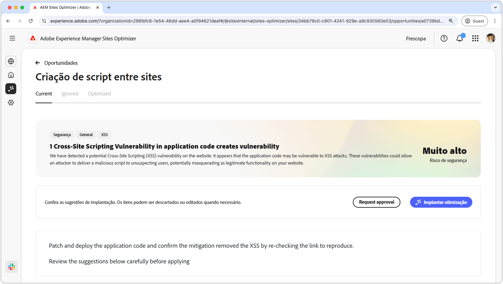
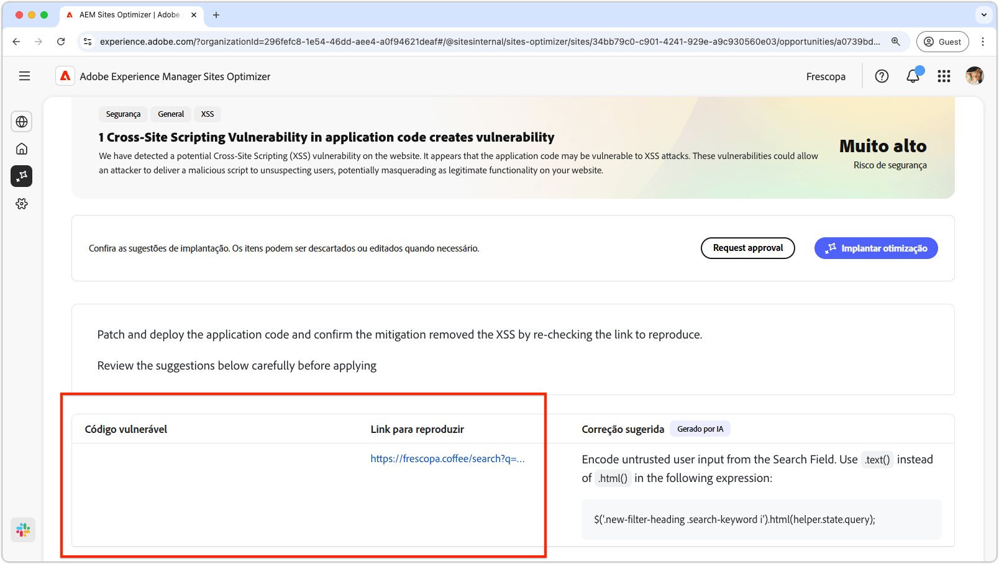
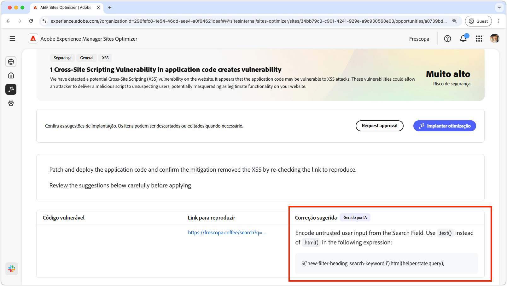

# Oportunidade de script entre sites

{align="center"}

A oportunidade de criação de script entre sites identifica e corrige vulnerabilidades no código do site que podem ser exploradas por invasores para injetar scripts mal-intencionados em páginas da Web visualizadas por outros usuários. Esses scripts podem roubar informações confidenciais, como cookies de sessão, ou executar ações em nome do usuário, como alterar a senha do usuário.

## Identificação automática

{align="center"}

* **Código vulnerável** - Qualquer código vulnerável a ataques de script entre sites.
* **Link a ser reproduzido** - O link para a página onde a vulnerabilidade foi encontrada.

## Sugestão automática

{align="center"}

* **Correção sugerida** - Uma sugestão gerada por IA sobre como corrigir a vulnerabilidade.

## Otimizar automaticamente

[!BADGE Ultimate]{type=Positive tooltip="Ultimate"}

>[!BEGINTABS]

>[!TAB Implantar otimização]

{{auto-optimize-deploy-optimization-slack}}

>[!TAB Solicitar aprovação]

{{auto-optimize-request-approval}}

>[!ENDTABS]
