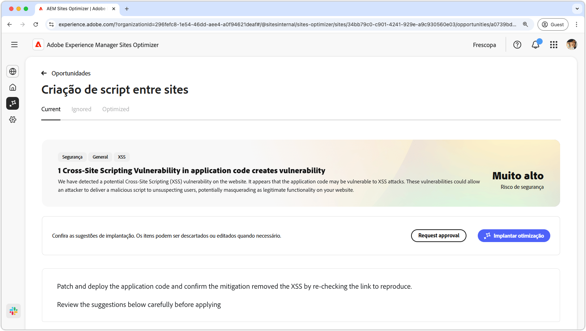
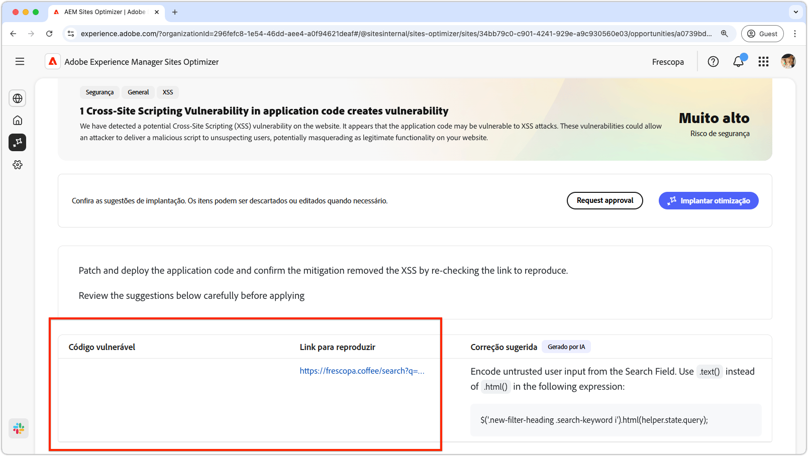
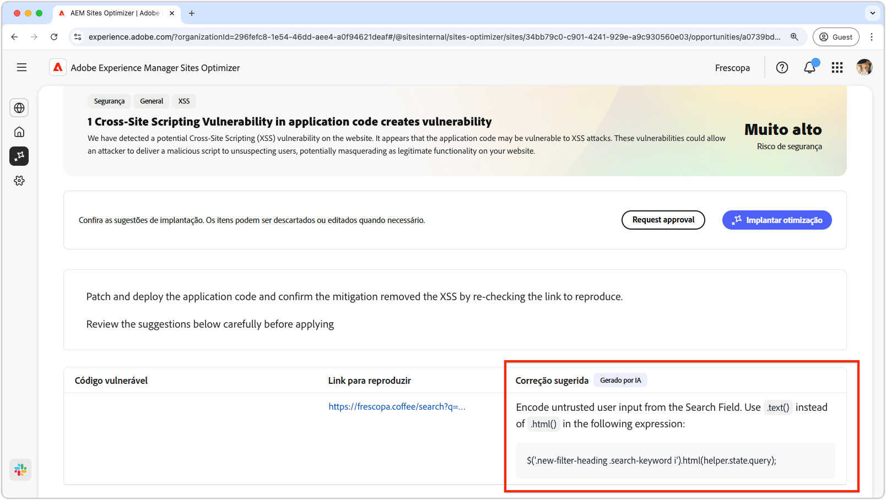

# Oportunidade de criação de script entre sites

{align="center"}

A oportunidade de criação de script entre sites identifica vulnerabilidades no código do seu site. Em seguida, ela corrige problemas que os invasores poderiam explorar para injetar scripts maliciosos em páginas da web visualizadas por outros usuários. Esses scripts podem roubar informações confidenciais, como cookies de sessão, ou executar ações em nome do usuário, como alterar sua senha.

## Identificação automática

{align="center"}

* **Código vulnerável**: qualquer código vulnerável a ataques de criação de script entre sites.
* **Link a ser reproduzido**: o link para a página onde a vulnerabilidade foi encontrada.

## Sugestão automática

{align="center"}

* **Correção sugerida**: uma sugestão gerada por IA sobre como corrigir a vulnerabilidade.

## Otimizar automaticamente

[!BADGE Ultimate]{type=Positive tooltip="Ultimate"}

>[!BEGINTABS]

>[!TAB Implantar otimização]

{{auto-optimize-deploy-optimization-slack}}

>[!TAB Solicitar aprovação]

{{auto-optimize-request-approval}}

>[!ENDTABS]
