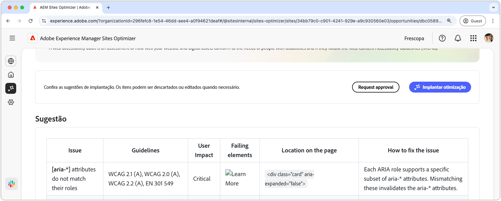

# Oportunidade de problemas de acessibilidade do Forms

 O recurso Otimização do Forms está disponível no programa de acesso antecipado. Você pode enviar um email para aem-forms-ea@adobe.com a partir de sua ID de email oficial para participar do programa de acesso antecipado e solicitar acesso ao recurso. 

{align="center"}

A oportunidade de problemas de acessibilidade de formulários identifica como seus formulários estão em conformidade com as necessidades de pessoas com deficiência e se seguem as [Diretrizes de Acessibilidade de Conteúdo da Web (WCAG)](https://www.w3.org/TR/WCAG21/). Ao avaliar se seus formulários estão em conformidade com a WCAG, você ajuda a criar uma experiência de formulários inclusiva, permitindo que indivíduos com deficiências visuais, auditivas, cognitivas e motoras naveguem, interajam e preencham com êxito seus formulários. Isso não só é essencial por motivos éticos, como também promove a conformidade com os requisitos legais, melhora as taxas de conclusão de formulários e pode aumentar o alcance do público-alvo, melhorando a experiência do usuário e o desempenho da empresa.

## Identificação automática

{align="center"}

A **oportunidade de problemas de acessibilidade do Forms** identifica problemas de acessibilidade especificamente em seus formulários e inclui o seguinte:

* **Problemas** - O problema específico de acessibilidade encontrado em seus formulários.
* **Critério da WCAG** - A [ID das diretrizes da WCAG](https://www.w3.org/TR/WCAG21/) do qual o problema do formulário está violando.
* **Nível** - Os [Níveis de Conformidade](https://www.w3.org/WAI/WCAG21/Understanding/conformance#levels) do problema.
* **Recomendação** - Orientação específica sobre como corrigir o problema de acessibilidade em seus formulários, incluindo exemplos de código e práticas recomendadas.
* **Source HTML** - O trecho HTML do elemento de formulários na página afetada pelo problema.

## Sugestão automática

{align="center"}

A sugestão automática fornece recomendações geradas por IA no campo **Sugestões**, que fornece orientação prescritiva sobre o que fazer para corrigir o problema de acessibilidade dos formulários.

<!-- 

## Auto-optimize

[!BADGE Ultimate]{type=Positive tooltip="Ultimate"}

{align="center"}

Sites Optimizer Ultimate adds the ability to deploy auto-optimization for the form accessibility issues found.

>[!BEGINTABS]

>[!TAB Deploy optimization]

{{auto-optimize-deploy-optimization-slack}}

>[!TAB Request approval]

{{auto-optimize-request-approval}}

>[!ENDTABS]
-->

