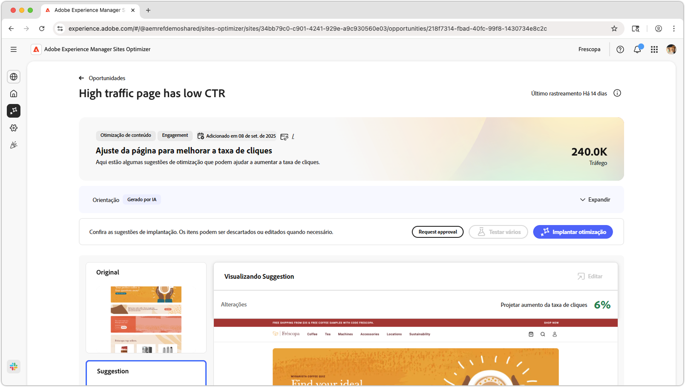
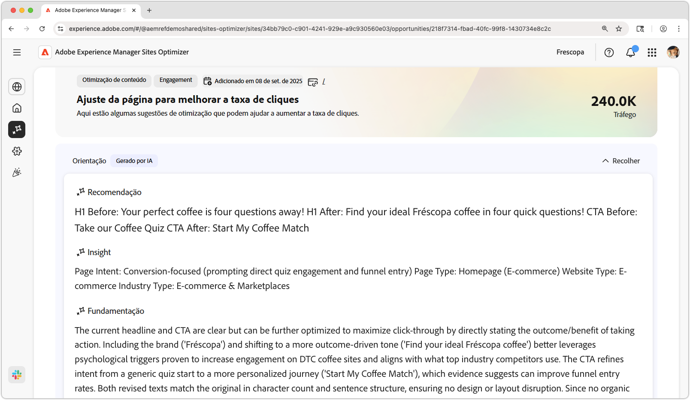
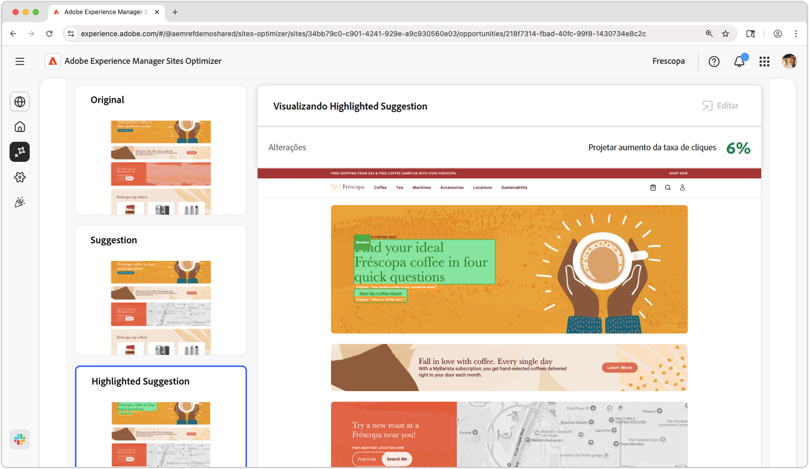
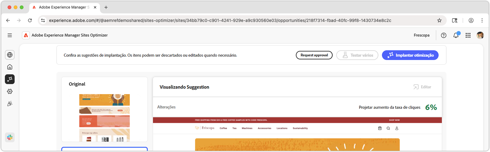

# Oportunidade “a página de alto tráfego tem uma baixa taxa de cliques”

{align="center"}

A oportunidade “a página de alto tráfego tem uma baixa taxa de cliques” identifica páginas do seu site que recebem uma quantidade significativa de tráfego, mas têm uma baixa taxa de cliques (CTR, na sigla em inglês). Ao analisar essas páginas, você pode descobrir possíveis problemas que podem estar atrapalhando o engajamento dos usuários e tomar medidas para melhorar o desempenho. Essa oportunidade é essencial para otimizar o conteúdo e o layout do seu site, resultando em taxas de conversão mais altas e melhores experiências do usuário.

## Identificação automática

{align="center"}

A **Oportunidade “a página de alto tráfego tem uma baixa taxa de cliques”** identifica páginas de alto tráfego com uma taxa de cliques baixa no seu site e inclui o seguinte:

* **Recomendação**: ação sugerida para melhorar a taxa de cliques da página.
* **Insight**: explicação do motivo pelo qual a página tem uma taxa de cliques baixa.
* **Razão**: o motivo por trás da recomendação.

## Sugestão automática

{align="center"}

A sugestão automática fornece sugestões geradas por IA referente a como seria uma experiência da web otimizada. As sugestões incluem uma visualização **realçada**, facilitando a visualização das alterações sugeridas.

As sugestões podem ser selecionadas para ser visualizadas na visualização completa, seu impacto projetado na taxa de cliques e a capacidade de editá-las antes de aplicá-las à página.

## Otimizar automaticamente

[!BADGE Ultimate]{type=Positive tooltip="Ultimate"}

{align="center"}

O Sites Optimizer Ultimate adiciona a capacidade de implantar a otimização automática para a otimização sugerida.

>[!BEGINTABS]

>[!TAB Implantar otimização]

{{auto-optimize-deploy-optimization-slack}}

>[!TAB Solicitar aprovação]

{{auto-optimize-request-approval}}

>[!ENDTABS]
