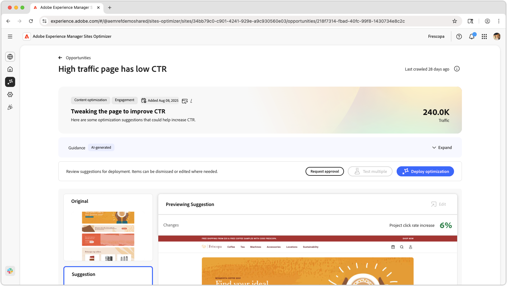

# Página de alto tráfego tem baixa oportunidade de CTR

{align="center"}

A página de alto tráfego tem baixa oportunidade de CTR. Ela identifica páginas em seu site que recebem uma quantidade significativa de tráfego, mas têm uma baixa taxa de cliques (CTR). Ao analisar essas páginas, você pode descobrir possíveis problemas que podem estar atrapalhando o engajamento do usuário e tomar medidas para melhorar o desempenho. Essa oportunidade é essencial para otimizar o conteúdo e o layout do seu site, resultando em taxas de conversão mais altas e melhores experiências de usuário.

## Identificação automática

{align="center"}

A **Página de alto tráfego Tem baixa oportunidade de CTR** identifica páginas de alto tráfego com baixo CTR em seu site e inclui o seguinte:

* **Recomendação** - Ação sugerida para melhorar o CTR da página.
* **Insight** - Explicação do motivo pelo qual a página tem um CTR baixo.
* **Razão** - O motivo por trás da recomendação.

## Sugestão automática

{align="center"}

A Sugestão automática fornece sugestões geradas pela IA para a aparência de uma experiência otimizada da Web. As sugestões incluem uma exibição **destacada**, facilitando a visualização das alterações sugeridas.

As sugestões podem ser selecionadas para exibi-las na exibição completa, seu impacto projetado na CTR e a capacidade de editá-las antes de aplicá-las à página.

## Otimizar automaticamente

[!BADGE Ultimate]{type=Positive tooltip="Ultimate"}

{align="center"}

O Sites Optimizer Ultimate adiciona a capacidade de implantar a otimização automática para a otimização sugerida.

>[!BEGINTABS]

>[!TAB Implantar otimização]

{{auto-optimize-deploy-optimization-slack}}

>[!TAB Solicitar aprovação]

{{auto-optimize-request-approval}}

>[!ENDTABS]
