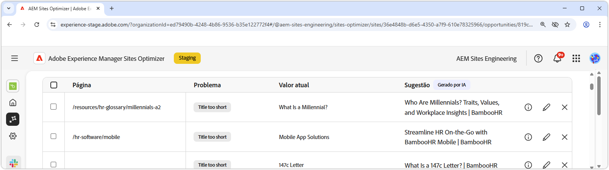

# Oportunidade de metadados inválidos ou ausentes

{align="center"}

A oportunidade de metadados inválidos ou ausentes identifica metadados ausentes ou com falha nas páginas da Web. Corrigir problemas de metadados impulsiona a SEO ao melhorar a visibilidade do conteúdo, as classificações de pesquisa e o engajamento do usuário. Esses problemas podem surgir de fatores como tags ausentes ou inválidas, descrições muito longas ou muito curtas e assim por diante.

A oportunidade de metadados inválidos ou ausentes exibe um resumo na parte superior da página, incluindo um resumo do problema e seu impacto no site e na empresa.

* **Tráfego projetado perdido**: a perda de tráfego estimada devido a metadados com falha.
* **Valor de tráfego projetado**: o valor estimado do tráfego perdido.

## Identificação automática

{align="center"}

A oportunidade de metadados inválidos ou ausentes lista todos os metadados com falha em suas páginas e inclui o seguinte:

* **Página**: a página que contém os metadados inválidos ou ausentes.
* **Problema**: indica o tipo de problema que afeta a tag de metadados. Esses problemas podem variar de títulos ausentes a H1 duplicados e assim por diante.
* **Valor**: o valor da tag de metadados atual que precisa ser alterado.
* **Sugestão**: uma sugestão gerada por IA para atualizações de tag adequadas. Consulte a seção abaixo para obter mais detalhes.

## Sugestão automática

{align="center"}

A oportunidade de metadados inválidos ou ausentes também fornece sugestões geradas por IA sobre como alterar ou atualizar as tags de metadados. Essas sugestões são baseadas na tag inicial, que continha os metadados com falha, e no conteúdo da atualização sugerida.

>[!BEGINTABS]

>[!TAB Lógica de IA]

Selecionar  fornece a lógica da IA para a atualização sugerida.

>[!TAB  Editar valor de metadados sugerido]

{align="center"}

Se você discordar da sugestão gerada pela IA, poderá editar o valor de metadados sugerido selecionando . Essa capacidade permite inserir manualmente o valor que você acredita ser o melhor ajuste para os metadados. A janela de edição contém o seguinte:

* **Caminho**: o caminho para a página que contém os metadados (ou a falta deles).
* **Descrição do problema**: indica o tipo de problema que afeta a tag de metadados e uma breve descrição.
* **Sugestão para valor de tag**: a sugestão gerada pela IA sobre como alterar ou atualizar a tag de metadados. Por exemplo, quantos caracteres a atualização da tag deve conter e assim por diante.
* **Conteúdo da tag original**: o valor da tag original.
* **Valor da tag de destino**: edite este campo e adicione manualmente o valor da tag desejada. Ao selecionar **Salvar**, o valor é aplicado à atualização proposta.
* **Sugestão**: a sugestão gerada pela IA sobre como alterar o valor.
* **Salvar**: salva e aplica o valor no campo **Valor da tag de destino**.

>[!TAB Ignorar entradas]

Você pode optar por ignorar entradas com metadados inválidos ou corrompidos. Selecionar  remove a entrada da lista de oportunidades. As entradas ignoradas podem ser engajadas novamente na guia **Ignoradas**, na parte superior da página de oportunidade.

>[!ENDTABS]

## Otimizar automaticamente

[!BADGE Ultimate]{type=Positive tooltip="Ultimate"}

{align="center"}

O Sites Optimizer Ultimate adiciona a capacidade de implantar a otimização automática para os problemas encontrados pela oportunidade de metadados inválidos ou ausentes. <!--- TBD-need more in-depth and opportunity specific information here. What does the auto-optimization do?-->

>[!BEGINTABS]

>[!TAB Implantar otimização]

{{auto-optimize-deploy-optimization-slack}}

>[!TAB Solicitar aprovação]

{{auto-optimize-request-approval}}

>[!ENDTABS]
