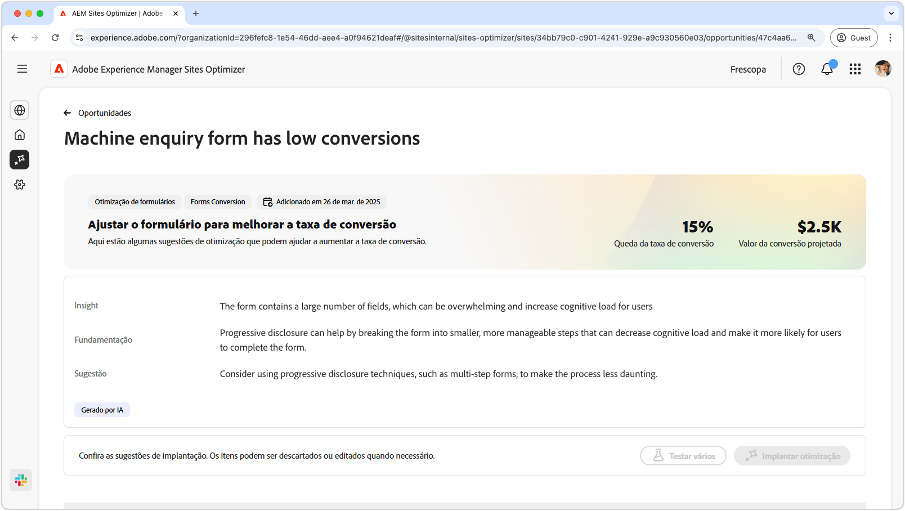
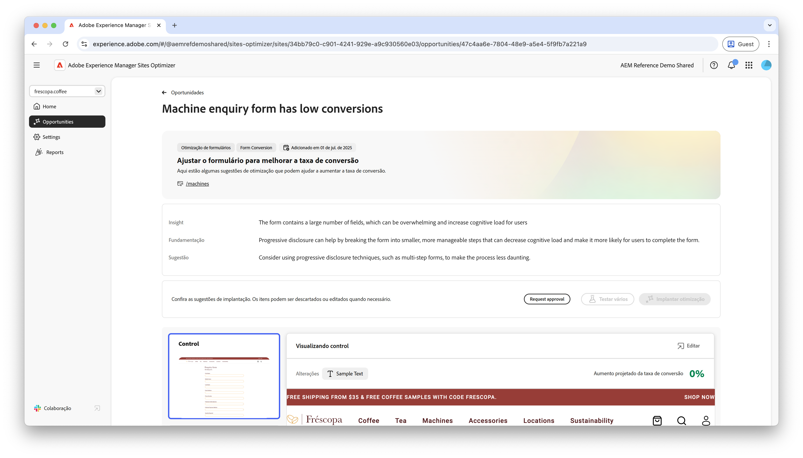
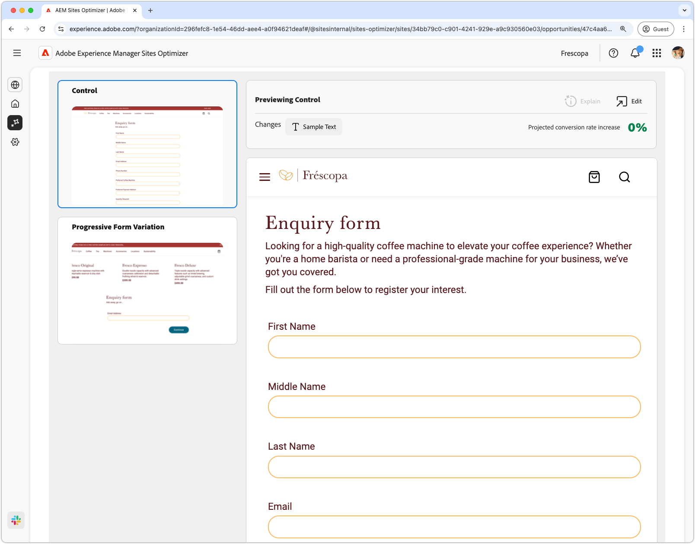

# Oportunidade com conversões de formulários baixas

 O recurso de otimização de formulários está disponível no programa de acesso antecipado. Você pode escrever para o endereço aem-forms-ea@adobe.com com o sua ID de email oficial para entrar no programa de acesso antecipado e solicitar acesso ao recurso. 

{align="center"}

A oportunidade com conversões baixas identifica formulários no seu site que têm taxas de conversão baixas. Este tipo de oportunidade ajuda a entender quais formulários não estão apresentando um bom desempenho e fornece sugestões de como melhorar suas taxas de engajamento.

## Identificação automática

{align="center"}

Cada página da web com formulários com conversões baixas está listada como sua própria oportunidade de **conversões baixas**. Um breve resumo da oportunidade e da lógica é exibido na parte superior da página da oportunidade.

## Sugestão automática

{align="center"}

A sugestão automática fornece variações de formulários geradas por IA e projetadas para aumentar as conversões dos seus formulários. Cada variação exibe a **projeção de aumento da taxa de conversão** com base em seu potencial de melhorar o engajamento dos formulários, ajudando a priorizar as sugestões mais eficazes.

>[!BEGINTABS]

>[!TAB Variação de controle]

{align="center"}

A variação de controle são os formulários originais que estão disponíveis no seu site atualmente. Essa variação é usada como uma base de referência para comparar o desempenho das variações sugeridas.

>[!TAB Variações sugeridas]

{align="center"}

As variações sugeridas são variações de formulários geradas por IA e projetadas para aumentar as conversões dos seus formulários. Cada variação exibe a **projeção de aumento da taxa de conversão** com base em seu potencial de melhorar o engajamento dos formulários, ajudando a priorizar as sugestões mais eficazes.

Clique em cada variação para visualizá-la no lado direito da tela. Na parte superior da visualização, as seguintes ações e informações estão disponíveis:

* **Alterações**: Um breve resumo do que foi alterado nesta variação em relação à variação de **controle**.
* **Aumento projetado da taxa de conversão**: o aumento estimado do engajamento dos formulários se esta variação for implementada.
* **Editar**: clique para editar a variação na criação do AEM.

>[!ENDTABS]

<!-- 

## Auto-optimize

[!BADGE Ultimate]{type=Positive tooltip="Ultimate"}

{align="center"}

Sites Optimizer Ultimate adds the ability to deploy auto-optimization for the issues found by the low conversions opportunity.

>[!BEGINTABS]

>[!TAB Test multiple]

>[!TAB Publish selected]

{{auto-optimize-deploy-optimization-slack}}

>[!TAB Request approval]

{{auto-optimize-request-approval}}

>[!ENDTABS]

-->