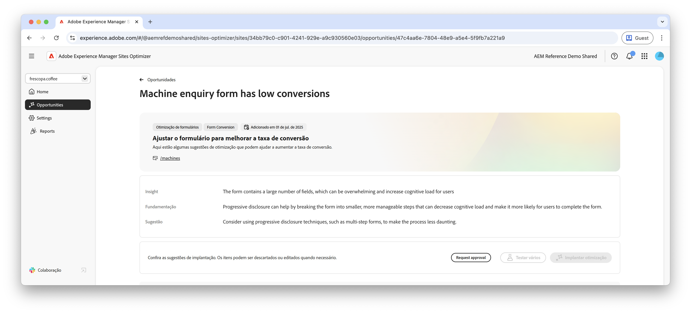

# Oportunidade de poucas conversões

{align="center"}

A oportunidade de poucas conversões identifica formulários no seu site que têm baixas taxas de conversão. Essa oportunidade ajuda a entender quais formulários não estão apresentando um bom desempenho e fornece sugestões sobre como melhorar suas taxas de engajamento. Ao otimizar as conversões de seus formulários, você pode aumentar o número de envios de formulários e melhorar o desempenho geral do seu site.

## Identificação automática

{align="center"}

Cada página da Web com um formulário com poucas conversões está listada como sua própria oportunidade de **Poucas conversões**. Um breve resumo da oportunidade e da lógica de IA é exibido na parte superior da página da oportunidade.

## Sugestão automática

{align="center"}

A sugestão automática fornece variações de página da Web geradas por IA projetadas para aumentar as conversões de seus formulários. Cada variação exibe o **aumento da taxa de conversão do projeto** com base em seu potencial para melhorar o engajamento do formulário, ajudando a priorizar as sugestões mais eficazes.

>[!BEGINTABS]

>[!TAB Variação de controle]

{align="center"}

A variação de controle é o formulário original que está atualmente disponível no site. Essa variação é usada como uma base de referência para comparar o desempenho das variações sugeridas.

>[!TAB Variações sugeridas]

{align="center"}

As variações sugeridas são variações de página da Web geradas por IA projetadas para aumentar as conversões de seus formulários. Cada variação exibe a **projeção de aumento da taxa de conversão** com base em seu potencial para melhorar o engajamento do formulário, ajudando a priorizar as sugestões mais eficazes.

Clique em cada variação para visualizá-la no lado direito da tela. Na parte superior da visualização, as seguintes ações e informações estão disponíveis:

* **Alterações**: Um breve resumo do que foi alterado nesta variação em relação à variação de **controle**.
* **Aumento projetado da taxa de conversão**: O aumento estimado no engajamento do formulário se esta variação for implementada.
* **Editar**: Clique para editar a variação na criação do AEM.

>[!ENDTABS]

## Otimizar automaticamente

[!BADGE Ultimate]{type=Positive tooltip="Ultimate"}

{align="center"}

O Sites Optimizer Ultimate adiciona a capacidade de implantar otimização automática para os problemas encontrados pela oportunidade de poucas conversões.

>[!BEGINTABS]

>[!TAB Testar vários]

>[!TAB Publicar selecionado(s)]

{{auto-optimize-deploy-optimization-slack}}

>[!TAB Solicitar aprovação]

{{auto-optimize-request-approval}}

>[!ENDTABS]
