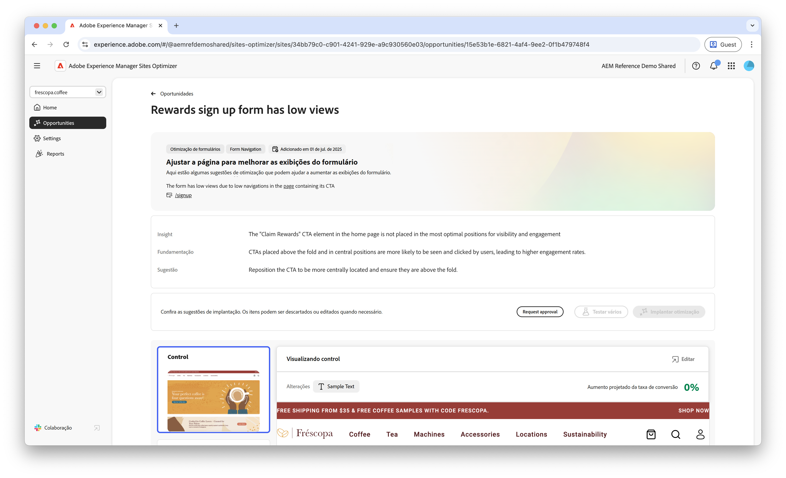
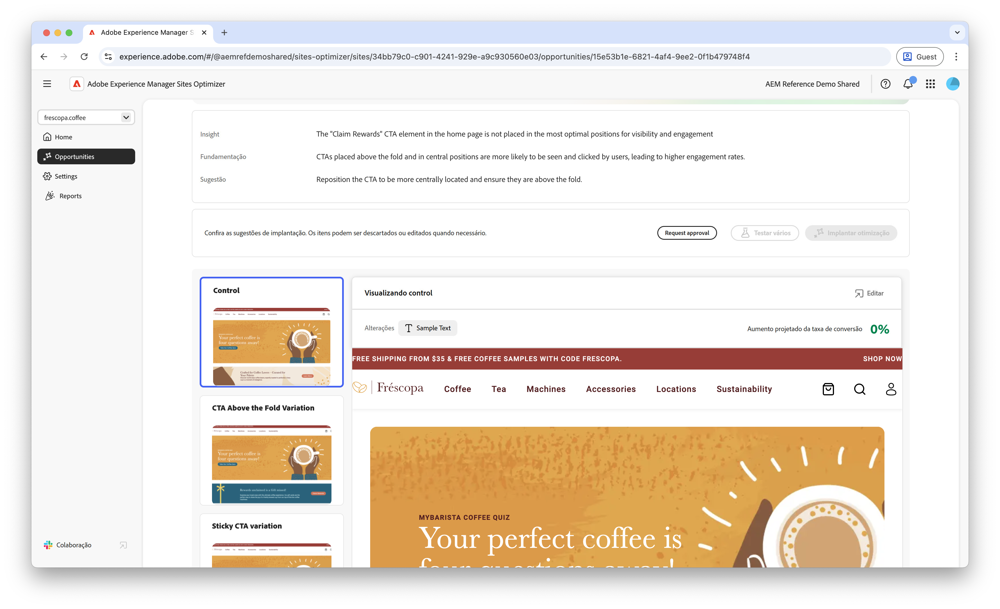
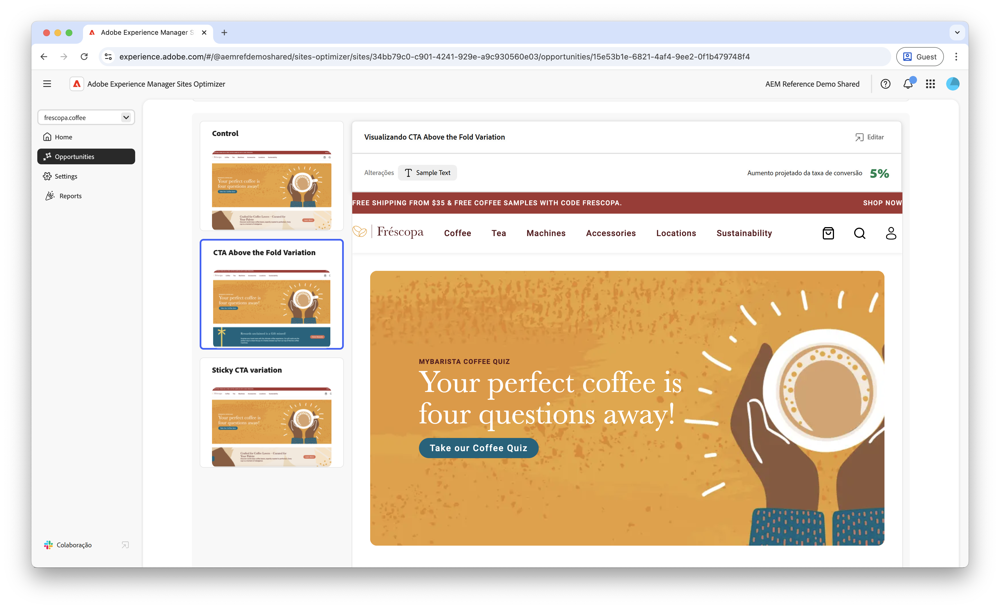

# Oportunidade de navegação baixa do Forms

{align="center"}

A oportunidade de navegação baixa identifica formulários em seu site que têm taxas de navegação baixas. Esse tipo de oportunidade ajuda você a entender quais formulários não estão sendo detectados ou acessados pelos usuários e fornece sugestões sobre como melhorar sua descoberta.

## Identificação automática

{align="center"}

Cada página da Web com formulários com navegação baixa está listada como sua própria oportunidade **Navegação baixa**. Um breve resumo da oportunidade e do motivo é exibido na parte superior da página de oportunidade.

## Sugestão automática

A Sugestão automática fornece variações de formulários geradas por IA projetadas para aumentar a navegação até seus formulários. Cada variação exibe o **aumento projetado da taxa de conversão** com base em seu potencial para melhorar a visibilidade e a acessibilidade dos formulários, ajudando você a priorizar as sugestões mais eficazes.

>[!BEGINTABS]

>[!TAB Variação de controle]

{align="center"}

A variação de controle são os formulários originais que estão atualmente no site. Essa variação é usada como uma base de referência para comparar o desempenho das variações sugeridas.

>[!TAB Variações sugeridas]

{align="center"}

As variações sugeridas são variações de formulários geradas pela IA projetadas para aumentar a navegação até seus formulários. Cada variação exibe o **aumento projetado da taxa de conversão** com base em seu potencial para melhorar a visibilidade e a acessibilidade dos formulários, ajudando você a priorizar as sugestões mais eficazes.

Clique em cada variação para visualizá-la no lado direito da tela. Na parte superior da visualização, as seguintes ações e informações estão disponíveis:

* **Alterações**: Um breve resumo do que foi alterado nesta variação em relação à variação de **controle**.
* **Aumento projetado da taxa de conversão** - O aumento estimado na participação de formulários se essa variação for implementada.
* **Editar**: Clique para editar a variação na criação do AEM.

>[!ENDTABS]

<!-- 

## Auto-optimize

[!BADGE Ultimate]{type=Positive tooltip="Ultimate"}

{align="center"}

Sites Optimizer Ultimate adds the ability to deploy auto-optimization for the issues found by the low navigation opportunity.

>[!BEGINTABS]

>[!TAB Test multiple]

>[!TAB Publish selected]

{{auto-optimize-deploy-optimization-slack}}

>[!TAB Request approval]

{{auto-optimize-request-approval}}

>[!ENDTABS]

-->
