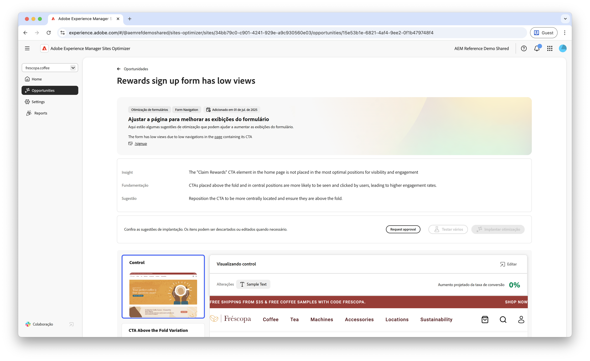
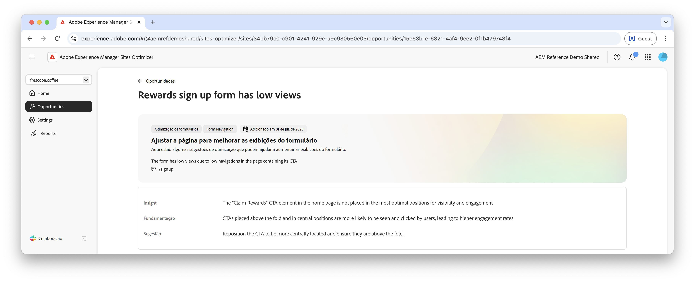
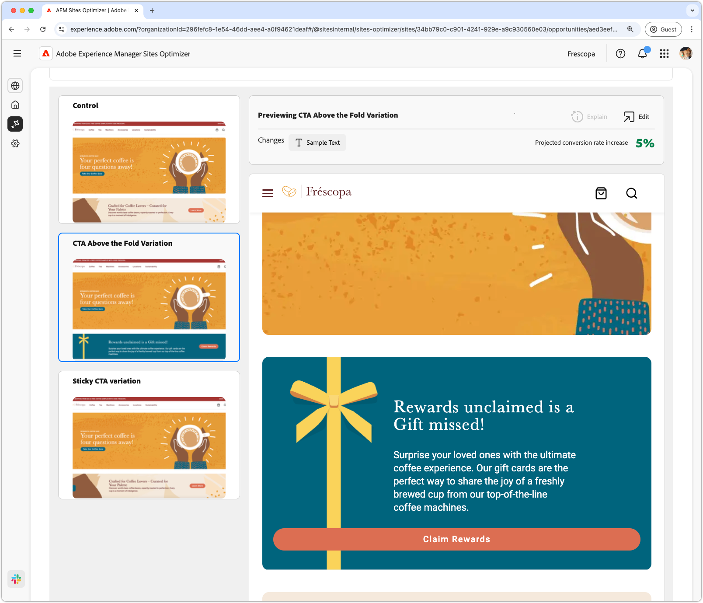

# Oportunidade de exibições baixas

{align="center"}

A oportunidade de exibições baixas identifica formulários em seu site que têm taxas de exibição baixas. Essa oportunidade ajuda você a entender quais formulários não estão apresentando um bom desempenho e fornece sugestões sobre como melhorar suas taxas de engajamento. Ao otimizar as exibições de seus formulários, você pode aumentar o número de envios de formulários e melhorar o desempenho geral do site.

## Identificação automática

{align="center"}

Cada página da Web com um formulário com exibições baixas é listada como sua própria oportunidade **Exibições baixas**. Um breve resumo da oportunidade e a lógica de IA são exibidas na parte superior da página de oportunidade.

## Sugestão automática

{align="center"}

A Sugestão automática fornece variações de página da Web geradas por IA projetadas para aumentar as visualizações de seus formulários. Cada variação exibe o **aumento da taxa de conversão do projeto** com base em seu potencial para melhorar o envolvimento do formulário, ajudando você a priorizar as sugestões mais eficazes.

>[!BEGINTABS]

>[!TAB Controlar variação]

{align="center"}

A variação de controle é o formulário original que está disponível no site. Essa variação é usada como uma linha de base para comparar o desempenho das variações sugeridas.

>[!TAB Variações sugeridas]

{align="center"}

As variações sugeridas são variações de página da Web geradas por IA projetadas para aumentar as visualizações de seus formulários. Cada variação exibe o **aumento projetado da taxa de conversão** com base em seu potencial para melhorar o engajamento no formulário, ajudando você a priorizar as sugestões mais eficazes.

Clique em cada variação para visualizá-la no lado direito da tela. Na parte superior da visualização, as seguintes ações e informações estão disponíveis:

* **Alterações** - Um breve resumo do que foi alterado nesta variação da variação **Controle**.
* **Aumento projetado da taxa de conversão** - O aumento estimado na participação do formulário se essa variação for implementada.
* **Editar** - Clique para editar a variação na criação do AEM.

>[!ENDTABS]

## Otimizar automaticamente

[!BADGE Ultimate]{type=Positive tooltip="Ultimate"}

{align="center"}

O Sites Optimizer Ultimate adiciona a capacidade de implantar otimização automática para os problemas encontrados pela oportunidade de exibições baixas.

>[!BEGINTABS]

>[!TAB Testar vários]

>[!TAB Publicação selecionada]

{{auto-optimize-deploy-optimization-slack}}

>[!TAB Solicitar aprovação]

{{auto-optimize-request-approval}}

>[!ENDTABS]
