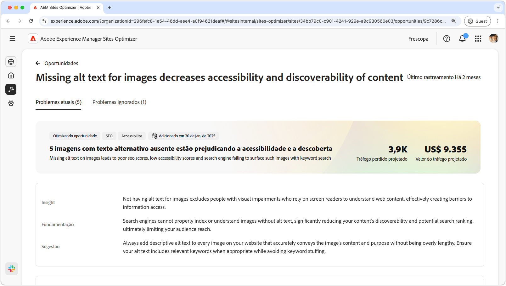
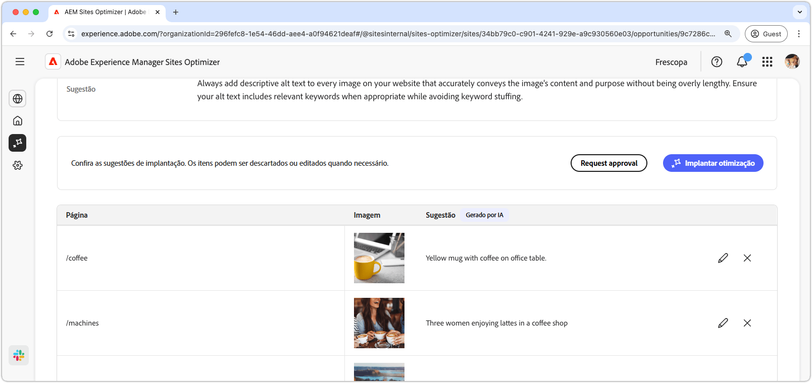
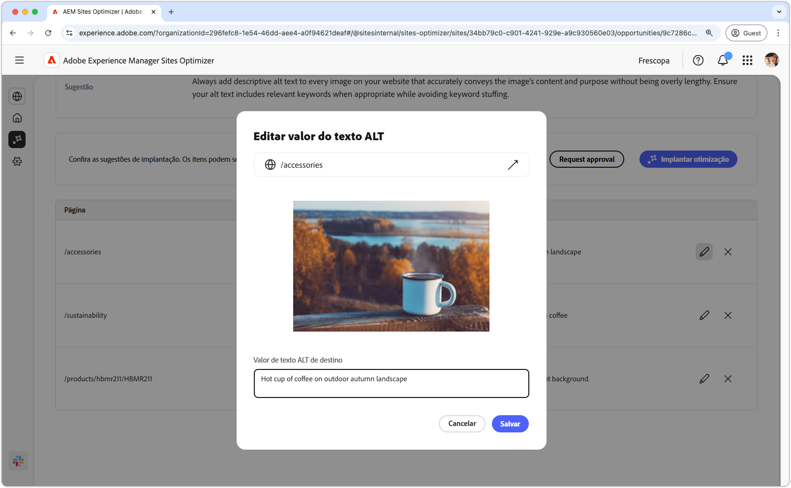
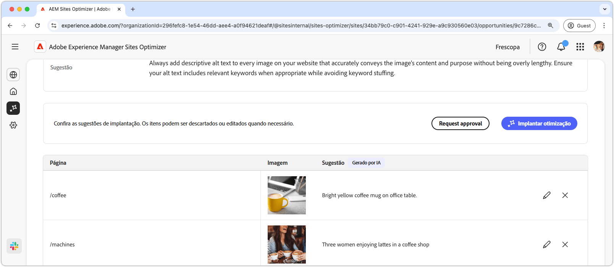

# Oportunidade de texto alternativo ausente

{align="center"}

A oportunidade de texto alternativo ausente identifica imagens sem texto alternativo descritivo no seu site. Os mecanismos de pesquisa não podem indexar nem compreender imagens corretamente sem um texto alternativo. Essa funcionalidade reduz significativamente a capacidade de descoberta e a classificação de pesquisa do seu conteúdo, limitando, em última análise, o alcance do público-alvo. Além disso, não ter texto alternativo para imagens exclui as pessoas com deficiências visuais que dependem dos leitores de tela para entender o conteúdo da Web, criando barreiras ao acesso às informações.

A oportunidade de texto alternativo ausente exibe um resumo na parte superior da página, incluindo um resumo do problema e seu impacto no site e na empresa.

* **Tráfego projetado perdido**: a perda de tráfego estimada devido ao texto alternativo ausente.
* **Valor de tráfego projetado**: o valor estimado do tráfego perdido.

Há também um campo adicional que mostra a lógica, o insight e as sugestões relacionadas à oportunidade.

## Identificação automática

{align="center"}

A oportunidade de texto alternativo ausente lista todas as imagens em seu site que não têm texto alternativo. Esta seção contém as seguintes categorias:

* **Página**: o caminho para a página que contém o texto alternativo ausente.
* **Imagem**: a imagem que não tem o texto alternativo descritivo.
* **Sugestão**: uma sugestão gerada por IA para o texto alternativo.

## Sugestão automática

{align="center"}

A sugestão automática fornece sugestões geradas pela IA para o texto alternativo das imagens. As sugestões geradas pela IA foram projetadas para ajudar a adicionar um texto alternativo a imagens rapidamente, sem precisar analisar cada imagem manualmente.

>[!BEGINTABS]

>[!TAB Editar texto alternativo ausente]

{align="center"}

Se você discordar da sugestão gerada pela IA, poderá editar o texto alternativo sugerido clicando no **ícone de edição**. Essa capacidade permite ajustar manualmente o texto que você acha que é a melhor opção para a imagem. A janela de edição contém o seguinte:

* **Caminho da página**: um campo somente leitura que exibe o caminho para a página onde ocorre o problema de texto alternativo ausente. Clique na seta ao lado do caminho para abrir a página correspondente.
* **Imagem**: uma visualização de somente leitura da imagem que requer texto alternativo.
* **Texto alternativo de destino**: um campo editável onde você pode inserir manualmente um texto alternativo descritivo para a imagem. Certifique-se de que o texto alternativo transmita o conteúdo e a finalidade da imagem de forma concisa. Quando pertinente, inclua palavras-chave naturalmente sem sobrecarregá-las.

>[!TAB Ignorar entradas]

Você pode optar por ignorar as entradas na lista de oportunidades. Clicar no  remove a entrada da lista. As entradas ignoradas podem ser engajadas novamente na guia **Ignoradas**, na parte superior da página da oportunidade.

>[!ENDTABS]

## Otimizar automaticamente

[!BADGE Ultimate]{type=Positive tooltip="Ultimate"}

{align="center"}

O Sites Optimizer Ultimate adiciona a capacidade de implantar otimização automática para os problemas encontrados pela oportunidade de texto alternativo ausente. <!--- TBD-need more in-depth and opportunity specific information here. What does the auto-optimization do?-->

>[!BEGINTABS]

>[!TAB Implantar otimização]

{{auto-optimize-deploy-optimization-slack}}

>[!TAB Solicitar aprovação]

{{auto-optimize-request-approval}}

>[!ENDTABS]
