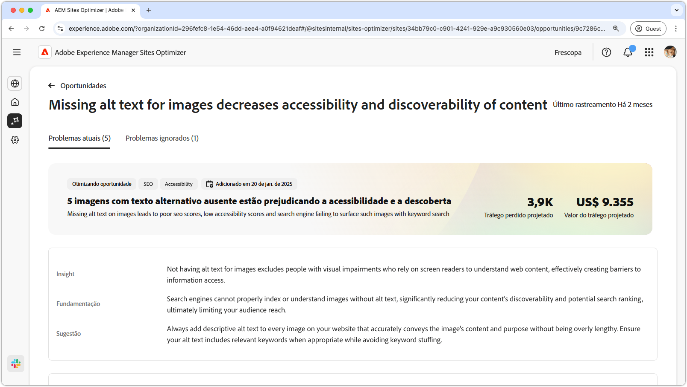
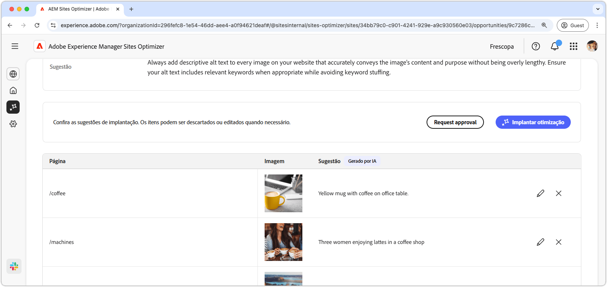
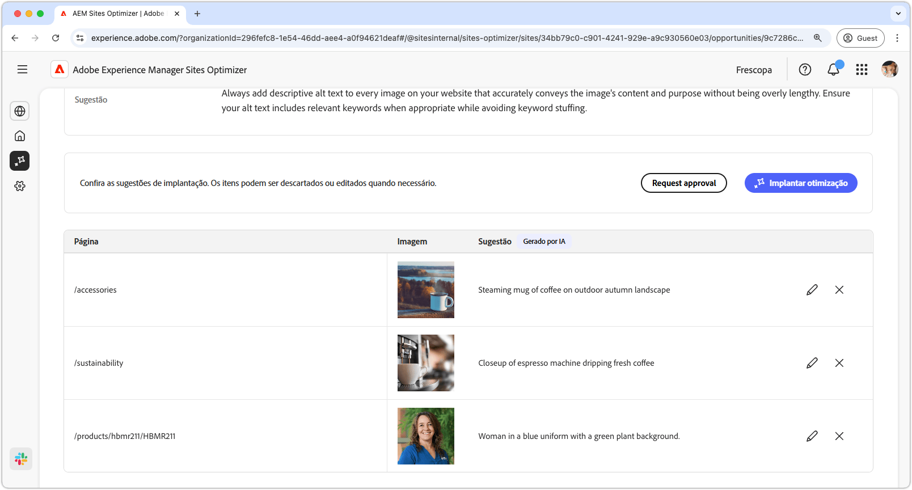
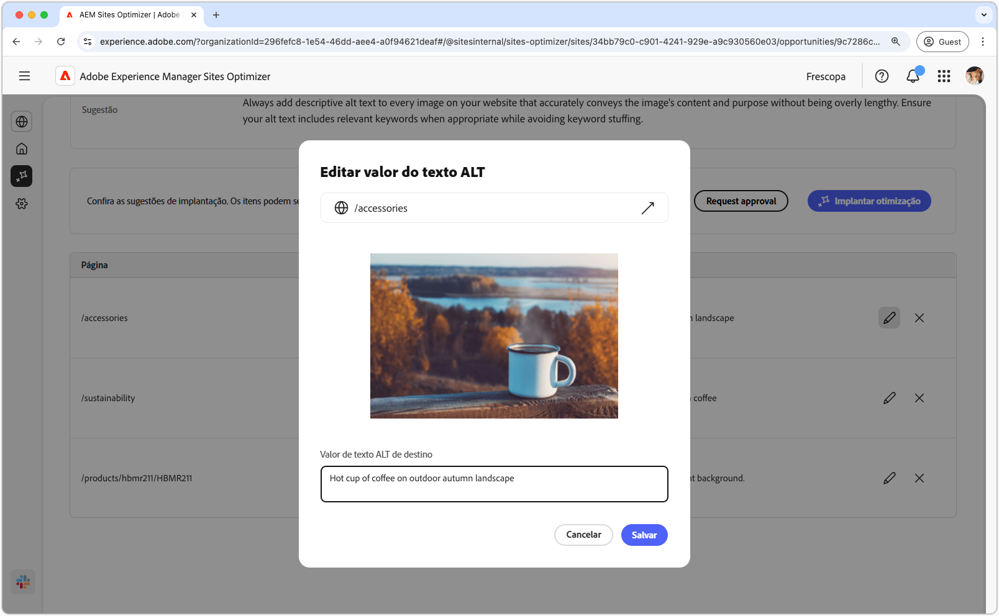

# Oportunidade de texto alternativo ausente

<!--{align="center"}-->

>[!VIDEO](https://video.tv.adobe.com/v/3483269/?captions=por_br&learn=on&enablevpops)

A oportunidade de texto alternativo ausente identifica imagens no seu site que não possuem texto alternativo descritivo. Sem texto alternativo, os usuários que dependem de leitores de tela não conseguem interpretar o conteúdo visual, o que cria barreiras de acessibilidade. Isso também limita a forma como os mecanismos de pesquisa interpretam e indexam imagens, reduzindo a visibilidade do conteúdo e o desempenho da pesquisa. O AEM Sites Optimizer identifica problemas relacionados à falta de texto alternativo, oferece recomendações específicas baseadas em IA e permite a implementação com um clique para corrigi-los, tudo em uma única visualização centralizada.

## Identificação automática

<!--{align="center"}-->

O AEM Sites Optimizer analisa seu site por meio de uma auditoria em várias etapas que combina o rastreamento do site, dados reais de tráfego de usuários e análise de IA para identificar imagens que precisam de texto alternativo, mas não o têm definido. Ele também analisa as imagens na página para determinar se é necessário incluir texto alternativo, excluindo imagens decorativas ou sem conteúdo informativo, de acordo com as Diretrizes de accessibilidade para conteúdo da Web (WCAG). As imagens são analisadas com base em sua função e relevância na página, priorizando as correções que têm maior impacto na acessibilidade e no SEO.

Esta oportunidade fornece uma lista de problemas identificados, incluindo:

* **Página**: o caminho para a página que contém o texto alternativo ausente.
* **Imagem**: a imagem que não tem o texto alternativo descritivo.

## Sugestão automática

<!--{align="center"}-->

Para cada problema identificado, o AEM Sites Optimizer sugere um texto alternativo descritivo para a imagem. Ele usa modelos de visão de IA para analisar a imagem e gerar uma descrição que reflete seu conteúdo e função na página. As recomendações são concisas, relevantes e estão alinhadas com as práticas recomendadas de acessibilidade. Cada sugestão pode ser revisada e editada antes de ser aplicada.

>[!BEGINTABS]

>[!TAB Editar texto alternativo ausente]

<!--{align="center"}-->

Se você discordar da sugestão gerada pela IA, poderá editar o texto alternativo sugerido clicando no **ícone de edição**. Essa capacidade permite ajustar manualmente o texto que você acha que é a melhor opção para a imagem. A janela de edição contém o seguinte:

* **Caminho da página**: um campo somente leitura que exibe o caminho para a página onde ocorre o problema de texto alternativo ausente. Clique na seta ao lado do caminho para abrir a página correspondente.
* **Imagem**: uma visualização de somente leitura da imagem que requer texto alternativo.
* **Texto alternativo de destino**: um campo editável onde você pode inserir manualmente um texto alternativo descritivo para a imagem. Certifique-se de que o texto alternativo transmita o conteúdo e a finalidade da imagem de forma concisa. Quando pertinente, inclua palavras-chave naturalmente sem sobrecarregá-las.

>[!TAB Ignorar entradas]

Você pode optar por ignorar as entradas na lista de oportunidades. Clicar no  remove a entrada da lista. As entradas ignoradas podem ser engajadas novamente na guia **Ignoradas**, na parte superior da página da oportunidade.

>[!ENDTABS]

## Otimizar automaticamente

<!--[!BADGE Ultimate]{type=Positive tooltip="Ultimate"}-->

Depois que as sugestões forem revisadas e aprovadas, você poderá clicar em **Implantar otimização**. O AEM Sites Optimizer aplica as correções no ambiente de criação, com base em como o texto alternativo é gerenciado na implementação. O autor do AEM pode então publicar as alterações no Sistema de gerenciamento de conteúdo (CMS).

Dependendo da configuração, as atualizações podem ser aplicadas diretamente ao conteúdo da página, aos metadados de ativos ou aos modelos de conteúdo de suporte. O processo de otimização inclui as seguintes etapas:

* **Validação** – Garante que as atualizações sejam aplicadas com segurança sem afetar a funcionalidade existente.
* **Implantação** – Aplica as atualizações por meio de processos existentes, como atualizações de conteúdo no AEM ou integração com APIs de conteúdo.
* **Verificação de permissões** – Verifica se o usuário tem as permissões apropriadas para aplicar as alterações. Caso contrário, saídas alternativas, como atualizações para download, podem ser usadas para a entrega.

As atualizações recebem controle de versão onde há suporte, fornecendo visibilidade e capacidade de reversão. Isso garante que as atualizações de texto alternativo sejam aplicadas com precisão, alinhadas com as implementações existentes e consistentes com os padrões de governança e acessibilidade.

O AEM Sites Optimizer aplica automaticamente atualizações de texto alternativo com base na sua configuração, da seguinte maneira:

>[!BEGINTABS]

>[!TAB Edge Delivery Services]

Atualiza o documento de origem (por exemplo, Google Docs ou SharePoint).

>[!TAB AEM as a Cloud Service]

Grava atualizações diretamente por meio da API de conteúdo com controle de versão e suporte de fallback.

>[!TAB Gerenciamento de ativos digitais (opcional)]

Atualiza o texto alternativo no nível do ativo, quando aplicável.

>[!ENDTABS]
