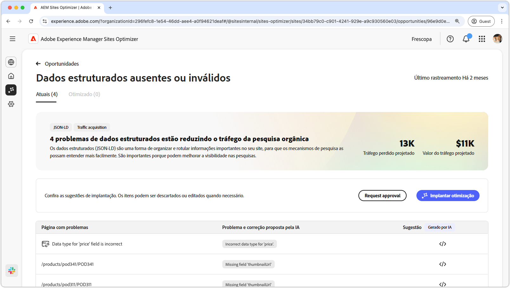
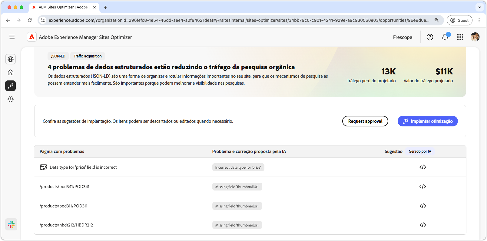
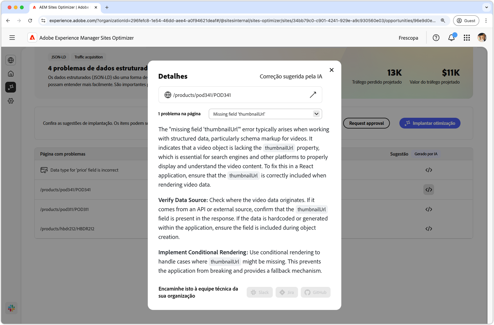
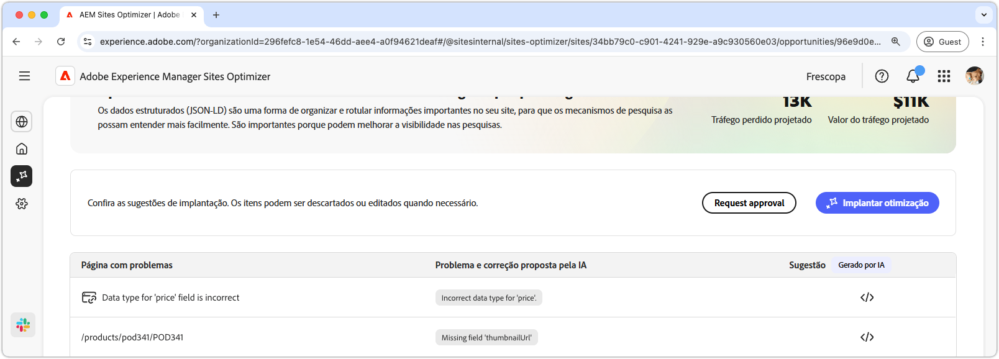

# Oportunidade de dados estruturados ausente ou inválida

{align="center"}

A oportunidade de dados estruturados ausentes ou inválidos identifica dados estruturados ausentes ou com falha no formato padronizado Json-LD. Dados estruturados são uma maneira de organizar, descrever e rotular informações importantes em seu site. Ele ajuda os mecanismos de pesquisa a interpretar o conteúdo de suas páginas e melhora a visibilidade dos resultados da pesquisa. Melhores resultados de pesquisa podem levar mais usuários a se envolverem com o seu site.

A oportunidade de dados estruturados ausente ou inválida exibe um resumo na parte superior da página, incluindo uma sinopse do problema e seu impacto no site e na empresa.

* **Tráfego projetado perdido** - A perda de tráfego estimada devido a dados estruturados com falha.
* **Valor de tráfego projetado** - O valor estimado do tráfego perdido.

## Identificação automática

{align="center"}

A oportunidade de dados estruturados ausente ou inválida lista todos os problemas detectados em suas páginas e contém as seguintes categorias:

* **Página com problemas** - A página que contém os dados estruturados inválidos ou ausentes.
* **Correção proposta por AI e problema** - Indica o tipo de problema com dados estruturados que afeta a página.
* **Sugestão** - Uma sugestão gerada por IA para atualizações de dados estruturados adequadas. Consulte a seção abaixo para obter mais detalhes.

## Sugestão automática

{align="center"}

A oportunidade de dados estruturados inválidos ou ausentes também fornece sugestões geradas por IA sobre como alterar ou atualizar os dados estruturados. Quando você clica no botão de sugestões, é exibida uma nova janela que contém o seguinte:

* **Caminho da página** - Um campo que contém o caminho para a página com dados estruturados inválidos ou ausentes.
* **Problemas** - Um campo que contém o número de problemas e um menu suspenso que lista todos os problemas.
* **Campo de sugestão** - Uma descrição gerada por IA e sugestões para atualizações de dados estruturados adequadas. Você pode rolar para baixo para sugestões e problemas adicionais.

## Otimizar automaticamente o [!BADGE Ultimate]{type=Positive tooltip="Ultimate"}

{align="center"}

O Sites Optimizer Ultimate adiciona a capacidade de implantar a otimização automática para os problemas encontrados pela oportunidade de dados estruturados inválidos ou ausentes. <!--- TBD-need more in-depth and opportunity specific information here. What does the auto-optimization do?-->

>[!BEGINTABS]

>[!TAB Implantar otimização]

{{auto-optimize-deploy-optimization-slack}}

>[!TAB Solicitar aprovação]

{{auto-optimize-request-approval}}

>[!ENDTABS]
