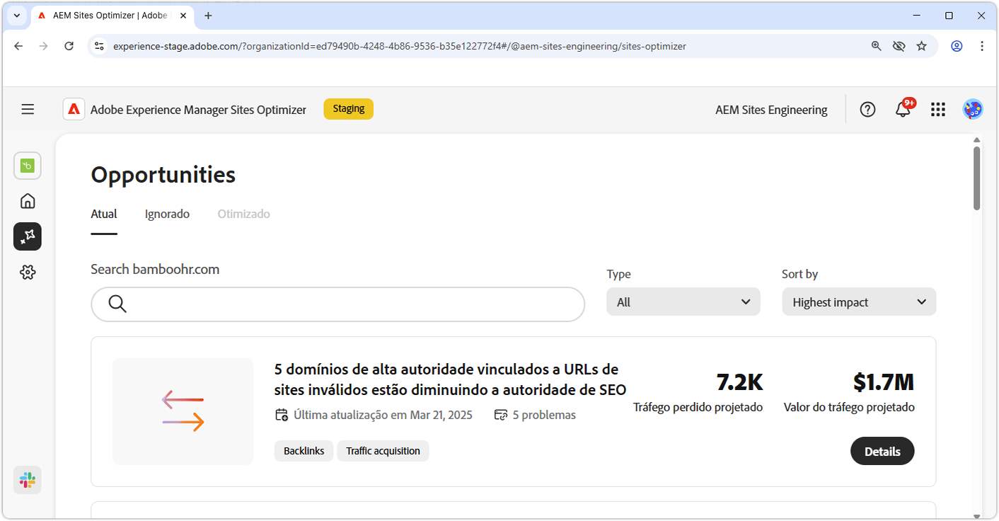
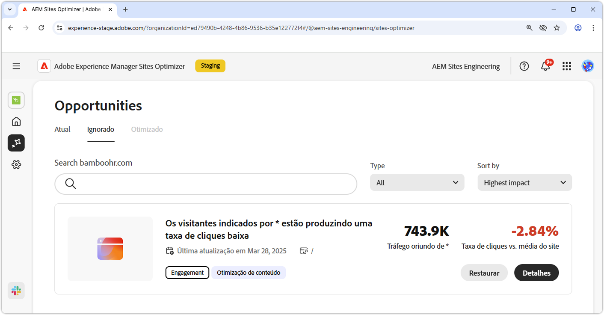

# Documentação de oportunidades

{align="center"}

O Sites Optimizer é composto por um conjunto cada vez maior de oportunidades viabilizadas pela IA do Adobe, projetado para identificar e sugerir melhorias para seu site. Cada oportunidade oferece insights sobre o valor comercial potencial, destaca áreas que precisam de atenção e fornece recomendações acionáveis para otimização. Clique em cada oportunidade para explorar os problemas identificados, as melhorias sugeridas e a orientação passo a passo sobre como implementar essas alterações para melhorar o desempenho do site e a experiência do usuário.

As oportunidades estão disponíveis através da opção de menu **Oportunidades** na [navegação persistente do Site Otimizer](/help/documentation/basics.md#navigation).

## Status da oportunidade

As oportunidades podem ser organizadas e filtradas por status usando as guias na parte superior:

>[!BEGINTABS]

>[!TAB Atual]

{align="center"}

Oportunidades pendentes no momento.

>[!TAB Ignorado]

{align="center"}

Oportunidades ignoradas. As oportunidades ignoradas podem ser restauradas nesta visualização.

>[!TAB Otimizado]

Uma lista histórica de oportunidades que foram otimizadas.

>[!ENDTABS]

## Oportunidades

Com um [status de oportunidade](#opportunity-status) selecionado, você pode exibir uma lista de oportunidades. A lista de oportunidades pode ser filtrada ainda por:

* **Pesquisa** - Pesquisa de oportunidades por **palavras-chave, marcas ou URLs**.
* **Tipo de oportunidade** - Use a lista suspensa **Tipo** para filtrar oportunidades por [tipo de oportunidade](/help/opportunity-types/overview.md).

### Detalhes da oportunidade

{align="center"}

Cada oportunidade fornece uma breve descrição do problema, seu impacto potencial no site e um link para detalhes completos. Você também pode ver seu status, indicando se ele foi otimizado ou se ainda está pendente.

* **Título da oportunidade** - Uma breve descrição do problema e seu impacto potencial no desempenho do site.
* **Última atualização** - A data em que a oportunidade foi atualizada pela última vez pela Sites Optimizer com novos dados.
* **Contagem de problemas** - O número de instâncias do problema identificadas no site.
* **Tipo(s) de oportunidade** - O(s) [tipo(s) da oportunidade](/help/opportunity-types/overview.md), esta oportunidade faz parte de — como aquisição de tráfego, envolvimento ou integridade do site.

As informações resumidas de cada oportunidade variam de acordo com o tipo e podem incluir detalhes sobre o impacto na receita, tráfego, engajamento do usuário ou ameaças à segurança.

Para exibir os detalhes de uma oportunidade, clique no botão **Detalhes**.

Para excluir uma oportunidade do painel do Sites Optimizer, clique no botão **Ignorar**.  Esta ação move a oportunidade para a guia [**Ignorado**](#opportunity-status).

## Todas as oportunidades

Explore todas as oportunidades possíveis disponíveis no Sites Optimizer:

<!-- CARDS

* ./accessibility-issues.md
  {title=Accessibility issues}
  {image=../../assets/common/card-arrows.png} 
* ./broken-backlinks.md
  {title=Broken backlinks}
  {image=../../assets/common/card-arrows.png}
* ./broken-internal-links.md
  {title=Broken internal links}
  {image=../../assets/common/card-link.png}
* ./cors-configuration.md
  {title=CORS configuration}
  {image=../../assets/common/card-code.png}
* ./core-web-vitals.md
  {title=Core web vitals}
  {image=../../assets/common/card-performance.png}
* ./cross-site-scripting.md
  {title=Cross-site scripting}
  {image=../../assets/common/card-code.png}
* ./high-bounce-rate.md
  {title=High bounce rate}
  {image=../../assets/common/card-arrows.png}    
* ./invalid-or-missing-metadata.md
  {title=Invalid or missing metadata}
  {image=../../assets/common/card-code.png}
* ./low-conversions.md
  {title=Low conversions}
  {image=../../assets/common/card-bag.png}
* ./low-views.md
  {title=Low views}
  {image=../../assets/common/card-bag.png}   
* ./missing-alt-text.md
  {title=Missing alt text}
  {image=../../assets/common/card-arrows.png}
* ./missing-invalid-structured-data.md
  {title=Missing or invalid structured data}
  {image=../../assets/common/card-bag.png}
* ./sitemap-issues.md
  {title=Sitemap issues}
  {image=../../assets/common/card-relationship.png}
* ./website-permissions.md
  {title=Website permissions}
  {image=../../assets/common/card-people.png}
* ./website-vulnerabilities.md
  {title=Website vulnerabilities}
  {image=../../assets/common/card-puzzle.png}
  
--->
<!-- START CARDS HTML - DO NOT MODIFY BY HAND -->

    

        

            

                <figure class="image x-is-16by9">
                    
                </figure>
            

            

                

                    

                        <a href="./accessibility-issues.md" target="_blank" rel="referrer" title="Problemas de acessibilidade">Problemas de acessibilidade</a>
                    

                    
Saiba mais sobre a oportunidade de problemas de acessibilidade e como usá-la para aumentar a segurança do em seu site.

                

                <a href="./accessibility-issues.md" target="_blank" rel="referrer" class="spectrum-Button spectrum-Button--outline spectrum-Button--primary spectrum-Button--sizeM" style="align-self: flex-start; margin-top: 1rem;">
                    Saiba mais
                </a>
            

        

    

    

        

            

                <figure class="image x-is-16by9">
                    
                </figure>
            

            

                

                    

                        <a href="./broken-backlinks.md" target="_blank" rel="referrer" title="Backlinks corrompidos">Backlinks desfeitos</a>
                    

                    
Saiba mais sobre a oportunidade de backlinks quebrados e como usá-la para melhorar a aquisição do tráfego.

                

                <a href="./broken-backlinks.md" target="_blank" rel="referrer" class="spectrum-Button spectrum-Button--outline spectrum-Button--primary spectrum-Button--sizeM" style="align-self: flex-start; margin-top: 1rem;">
                    Saiba mais
                </a>
            

        

    

    

        

            

                <figure class="image x-is-16by9">
                    
                </figure>
            

            

                

                    

                        <a href="./broken-internal-links.md" target="_blank" rel="referrer" title="Links internos corrompidos">Links internos desfeitos</a>
                    

                    
Saiba mais sobre a oportunidade de links quebrados e como usá-la para melhorar o engajamento no seu site.

                

                <a href="./broken-internal-links.md" target="_blank" rel="referrer" class="spectrum-Button spectrum-Button--outline spectrum-Button--primary spectrum-Button--sizeM" style="align-self: flex-start; margin-top: 1rem;">
                    Saiba mais
                </a>
            

        

    

    

        

            

                <figure class="image x-is-16by9">
                    
                </figure>
            

            

                

                    

                        <a href="./cors-configuration.md" target="_blank" rel="referrer" title="Configuração do CORS">Configuração do CORS</a>
                    

                    
Saiba mais sobre a oportunidade de configuração do CORS e para identificar e corrigir vulnerabilidades de segurança do site.

                

                <a href="./cors-configuration.md" target="_blank" rel="referrer" class="spectrum-Button spectrum-Button--outline spectrum-Button--primary spectrum-Button--sizeM" style="align-self: flex-start; margin-top: 1rem;">
                    Saiba mais
                </a>
            

        

    

    

        

            

                <figure class="image x-is-16by9">
                    
                </figure>
            

            

                

                    

                        <a href="./core-web-vitals.md" target="_blank" rel="referrer" title="Vídeos da Web principais">Vídeos da Web principais</a>
                    

                    
Saiba mais sobre as principais oportunidades de vitais para a Web e como usá-las para melhorar a aquisição de tráfego.

                

                <a href="./core-web-vitals.md" target="_blank" rel="referrer" class="spectrum-Button spectrum-Button--outline spectrum-Button--primary spectrum-Button--sizeM" style="align-self: flex-start; margin-top: 1rem;">
                    Saiba mais
                </a>
            

        

    

    

        

            

                <figure class="image x-is-16by9">
                    
                </figure>
            

            

                

                    

                        <a href="./cross-site-scripting.md" target="_blank" rel="referrer" title="Criação de script entre sites">Script entre sites</a>
                    

                    
Saiba mais sobre a oportunidade de criação de script entre sites e para identificar e corrigir vulnerabilidades de segurança do site.

                

                <a href="./cross-site-scripting.md" target="_blank" rel="referrer" class="spectrum-Button spectrum-Button--outline spectrum-Button--primary spectrum-Button--sizeM" style="align-self: flex-start; margin-top: 1rem;">
                    Saiba mais
                </a>
            

        

    

    

        

            

                <figure class="image x-is-16by9">
                    
                </figure>
            

            

                

                    

                        <a href="./high-bounce-rate.md" target="_blank" rel="referrer" title="Alta taxa de rejeição">Alta taxa de rejeição</a>
                    

                    
Saiba mais sobre a oportunidade de exibições baixas e como usá-la para melhorar o envolvimento do formulário no seu site.

                

                <a href="./high-bounce-rate.md" target="_blank" rel="referrer" class="spectrum-Button spectrum-Button--outline spectrum-Button--primary spectrum-Button--sizeM" style="align-self: flex-start; margin-top: 1rem;">
                    Saiba mais
                </a>
            

        

    

    

        

            

                <figure class="image x-is-16by9">
                    
                </figure>
            

            

                

                    

                        <a href="./invalid-or-missing-metadata.md" target="_blank" rel="referrer" title="Metadados inválidos ou ausentes">Metadados inválidos ou ausentes</a>
                    

                    
Saiba mais sobre a oportunidade de metadados inválida ou ausente e como usá-la para melhorar a aquisição do tráfego.

                

                <a href="./invalid-or-missing-metadata.md" target="_blank" rel="referrer" class="spectrum-Button spectrum-Button--outline spectrum-Button--primary spectrum-Button--sizeM" style="align-self: flex-start; margin-top: 1rem;">
                    Saiba mais
                </a>
            

        

    

    

        

            

                <figure class="image x-is-16by9">
                    
                </figure>
            

            

                

                    

                        <a href="./low-conversions.md" target="_blank" rel="referrer" title="Baixas conversões">Baixas conversões</a>
                    

                    
Saiba mais sobre a oportunidade de baixas conversões e como usá-la para melhorar o engajamento do formulário no seu site.

                

                <a href="./low-conversions.md" target="_blank" rel="referrer" class="spectrum-Button spectrum-Button--outline spectrum-Button--primary spectrum-Button--sizeM" style="align-self: flex-start; margin-top: 1rem;">
                    Saiba mais
                </a>
            

        

    

    

        

            

                <figure class="image x-is-16by9">
                    
                </figure>
            

            

                

                    

                        <a href="./low-views.md" target="_blank" rel="referrer" title="Visualizações baixas">Poucas visualizações</a>
                    

                    
Saiba mais sobre a oportunidade de exibições baixas e como usá-la para melhorar o envolvimento do formulário no seu site.

                

                <a href="./low-views.md" target="_blank" rel="referrer" class="spectrum-Button spectrum-Button--outline spectrum-Button--primary spectrum-Button--sizeM" style="align-self: flex-start; margin-top: 1rem;">
                    Saiba mais
                </a>
            

        

    

    

        

            

                <figure class="image x-is-16by9">
                    
                </figure>
            

            

                

                    

                        <a href="./missing-alt-text.md" target="_blank" rel="referrer" title="Texto alternativo ausente">Texto alternativo ausente</a>
                    

                    
Saiba mais sobre a oportunidade perdida de texto alternativo e como usá-la para melhorar o engajamento no seu site.

                

                <a href="./missing-alt-text.md" target="_blank" rel="referrer" class="spectrum-Button spectrum-Button--outline spectrum-Button--primary spectrum-Button--sizeM" style="align-self: flex-start; margin-top: 1rem;">
                    Saiba mais
                </a>
            

        

    

    

        

            

                <figure class="image x-is-16by9">
                    
                </figure>
            

            

                

                    

                        <a href="./missing-invalid-structured-data.md" target="_blank" rel="referrer" title="Dados estruturados ausentes ou inválidos">Dados estruturados ausentes ou inválidos</a>
                    

                    
Saiba mais sobre a oportunidade de dados estruturados ausente ou inválida e como usá-la para melhorar a aquisição do tráfego.

                

                <a href="./missing-invalid-structured-data.md" target="_blank" rel="referrer" class="spectrum-Button spectrum-Button--outline spectrum-Button--primary spectrum-Button--sizeM" style="align-self: flex-start; margin-top: 1rem;">
                    Saiba mais
                </a>
            

        

    

    

        

            

                <figure class="image x-is-16by9">
                    
                </figure>
            

            

                

                    

                        <a href="./sitemap-issues.md" target="_blank" rel="referrer" title="Problemas no mapa do site">Problemas de mapa do site</a>
                    

                    
Saiba mais sobre a oportunidade de problemas do mapa de site e como usá-lo para melhorar a aquisição de tráfego.

                

                <a href="./sitemap-issues.md" target="_blank" rel="referrer" class="spectrum-Button spectrum-Button--outline spectrum-Button--primary spectrum-Button--sizeM" style="align-self: flex-start; margin-top: 1rem;">
                    Saiba mais
                </a>
            

        

    

    

        

            

                <figure class="image x-is-16by9">
                    
                </figure>
            

            

                

                    

                        <a href="./website-permissions.md" target="_blank" rel="referrer" title="Permissões do site">Permissões do site</a>
                    

                    
Saiba mais sobre a oportunidade de permissões de site e como usá-la para aumentar a segurança do em seu site.

                

                <a href="./website-permissions.md" target="_blank" rel="referrer" class="spectrum-Button spectrum-Button--outline spectrum-Button--primary spectrum-Button--sizeM" style="align-self: flex-start; margin-top: 1rem;">
                    Saiba mais
                </a>
            

        

    

    

        

            

                <figure class="image x-is-16by9">
                    
                </figure>
            

            

                

                    

                        <a href="./website-vulnerabilities.md" target="_blank" rel="referrer" title="Vulnerabilidades do site">Vulnerabilidades do site</a>
                    

                    
Saiba mais sobre a oportunidade de vulnerabilidades do site e como usá-la para aumentar a segurança do em seu site.

                

                <a href="./website-vulnerabilities.md" target="_blank" rel="referrer" class="spectrum-Button spectrum-Button--outline spectrum-Button--primary spectrum-Button--sizeM" style="align-self: flex-start; margin-top: 1rem;">
                    Saiba mais
                </a>
            

        

    

<!-- END CARDS HTML - DO NOT MODIFY BY HAND -->

