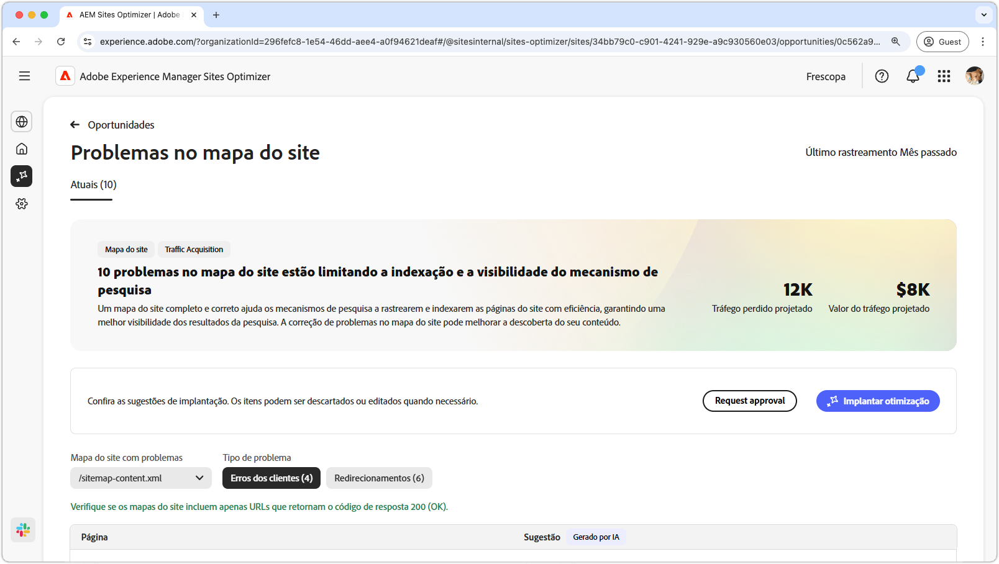
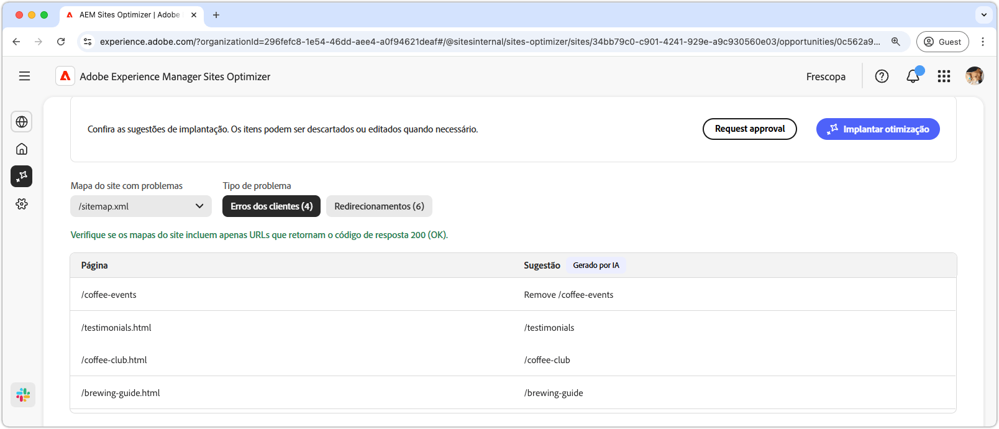
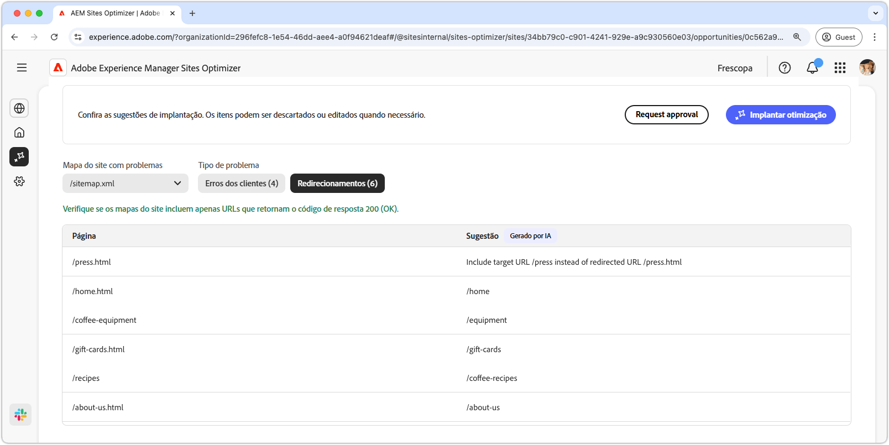
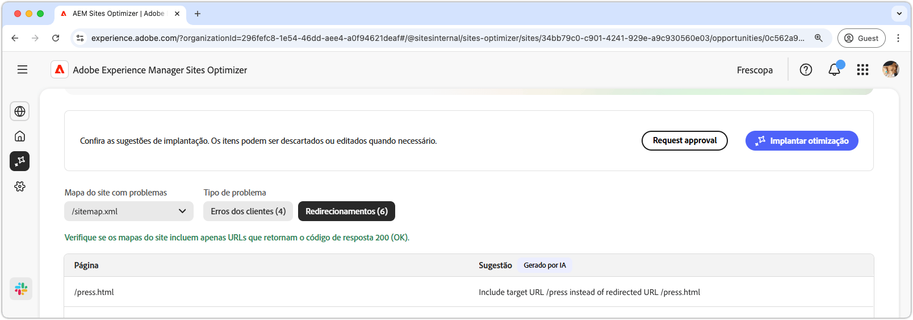

# Oportunidade de problemas do mapa do site

{align="center"}

Um mapa do site completo e correto ajuda os mecanismos de pesquisa a rastrearem e indexarem as páginas do site com eficiência, garantindo uma melhor visibilidade dos resultados da pesquisa. A oportunidade do mapa do site identifica possíveis problemas com seu mapa do site. A correção desses problemas pode melhorar muito a indexação do mecanismo de pesquisa e a capacidade de descoberta de conteúdo no seu site.

Um resumo é exibido na parte superior da página, incluindo um resumo do problema e seu impacto no site e na empresa.

* **Tráfego projetado perdido**: a perda de tráfego estimada devido a problemas de mapa do site.
* **Valor de tráfego projetado**: o valor estimado do tráfego perdido.

## Identificação automática

Os problemas do mapa do site podem ser filtrados usando os seguintes critérios:

* **Mapa do site com problemas**: o URL do mapa do site analisado que contém problemas em potencial.
* **Tipo de problema**: o tipo de problema identificado no mapa do site:
   * **Erros de cliente**: entradas que não retornam uma resposta `200 Success`.
   * **Redirecionamentos**: redirecionamentos com falha ou configurados incorretamente.

>[!BEGINTABS]

>[!TAB Erros de cliente]

{align="center"}

Se os URLs no seu mapa do site retornarem esses erros, os mecanismos de pesquisa poderão supor que o seu mapa do site está desatualizado ou que as páginas foram removidas por engano. O cliente indica que a solicitação do cliente (navegador ou rastreador) era inválida. Os comuns incluem:

* **404 Não encontrado**: a página solicitada não existe.
* **403 Proibido**: o servidor nega acesso à página solicitada.
* **410 Removido**: a página foi removida intencionalmente e não está sendo retornada.
* **401 Não autorizado**: a autenticação é necessária, mas não foi fornecida.

Esses erros podem prejudicar a SEO, especialmente se páginas importantes retornarem um erro **404 ou 410**, já que os mecanismos de pesquisa podem desindexá-los.

Cada problema é exibido em uma tabela, com a coluna **Página** identificando a entrada do mapa do site afetada:

* **Página**: o URL da entrada do mapa do site com um problema.

>[!TAB Redirecionamentos]

{align="center"}

Os mapas do site devem incluir apenas URLs de destino final, não aqueles que redirecionam. Redirecionamentos são destinados a orientar usuários e rastreadores para o local correto, mas podem causar problemas se configurados incorretamente:

* **302 Encontrado (Redirecionamento temporário)**: pode causar problemas de SEO se for usado por engano em vez de um erro **301**.
* **307 Redirecionamento temporário**: semelhante a 302, mas preserva o método HTTP.
* **Loops de redirecionamento**: quando uma página redireciona para si mesma ou cria um loop infinito.
* **Redirecionamentos interrompidos**: quando um redirecionamento resulta em uma página 4xx ou inexistente.

Cada problema é exibido em uma tabela, com a coluna **Página** identificando a entrada do mapa do site afetada:

* **Página**: o URL da entrada do mapa do site com um problema.

>[!ENDTABS]

## Sugestão automática

Cada problema de mapa do site [que atende aos critérios de filtro](#auto-identify) é listado em uma tabela com as seguintes colunas:

* **Página**: o URL da entrada do mapa do site com um problema.
* **Sugestão**: a correção recomendada para o problema.

As sugestões normalmente incluem um caminho atualizado do site para corrigir a entrada do mapa do site. Em alguns casos, eles também podem fornecer instruções mais detalhadas, como especificar o destino de redirecionamento correto.

## Otimizar automaticamente

[!BADGE Ultimate]{type=Positive tooltip="Ultimate"}

{align="center"}

O Sites Optimizer Ultimate adiciona a capacidade de implantar otimizações automáticas de mapas do site.

>[!BEGINTABS]

>[!TAB Implantar otimização]

{{auto-optimize-deploy-optimization-slack}}

>[!TAB Solicitar aprovação]

{{auto-optimize-request-approval}}

>[!ENDTABS]
