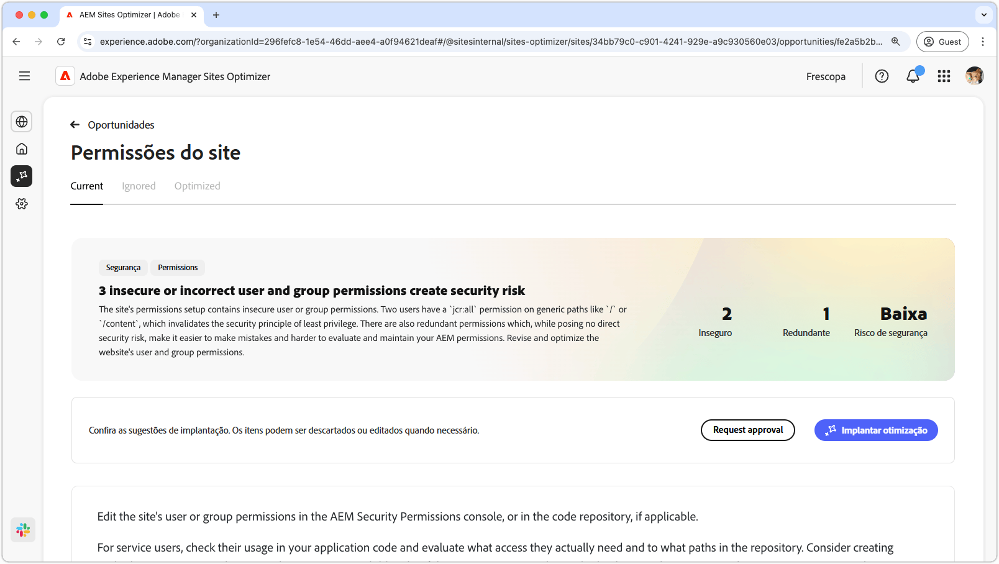
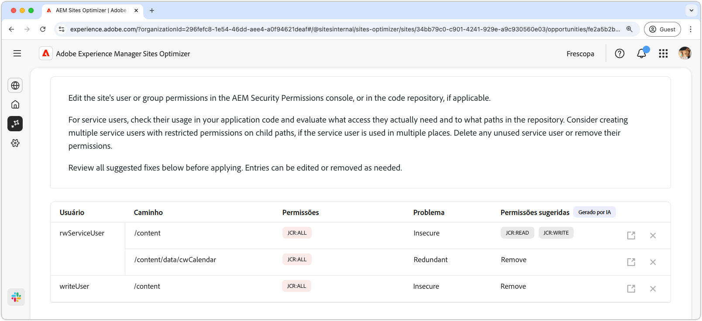
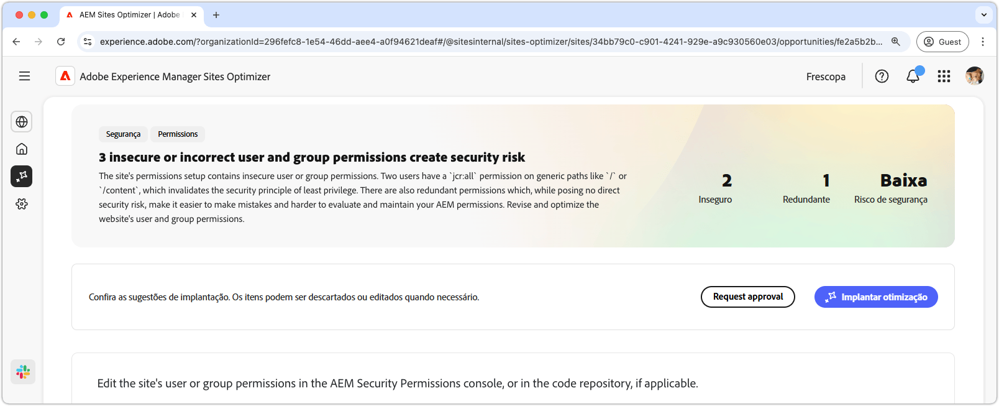

# Oportunidade de permissões de site

{align="center"}

A oportunidade de permissões de site otimiza as permissões do site, essenciais para manter um ambiente seguro e gerenciável do AEM. Esta oportunidade permite que você refine os controles de acesso removendo permissões muito amplas - como `jcr:all` em caminhos genéricos como `/` ou `/content` - e alinhando o acesso do usuário com o princípio do privilégio mínimo. Ao simplificar as permissões e eliminar redundâncias, você pode reduzir os riscos de segurança, melhorar a capacidade de manutenção e evitar futuras configurações incorretas. Tome medidas revisando e atualizando permissões no console de Permissões de segurança do AEM ou no repositório de códigos, garantindo que os usuários de serviço tenham somente o acesso de que realmente precisam.

## Identificação automática

{align="center"}

O recurso **Oportunidade de Permissões do Site** identifica e lista automaticamente

* **Usuário** - A conta de usuário com a permissão suspeita.
* **Caminho** - O caminho no AEM afetado pela permissão.
* **Permissão** - A permissão suspeita.
* **Problema** - Indica o tipo de problema que afeta a permissão.

## Sugestão automática

{align="center"}

A sugestão automática fornece recomendações geradas por IA no campo **Permissões sugeridas**, permitindo que você substitua as permissões sinalizadas por alternativas seguras.

## Otimizar automaticamente o [!BADGE Ultimate]{type=Positive tooltip="Ultimate"}

{align="center"}

O Sites Optimizer Ultimate adiciona a capacidade de implantar a otimização automática para as vulnerabilidades encontradas.

>[!BEGINTABS]

>[!TAB Implantar otimização]

{{auto-optimize-deploy-optimization-slack}}

>[!TAB Solicitar aprovação]

{{auto-optimize-request-approval}}

>[!ENDTABS]
