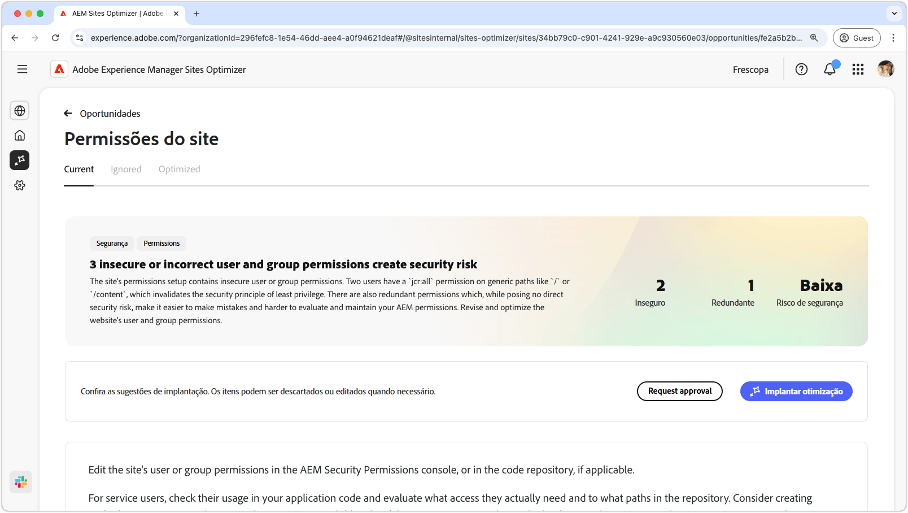
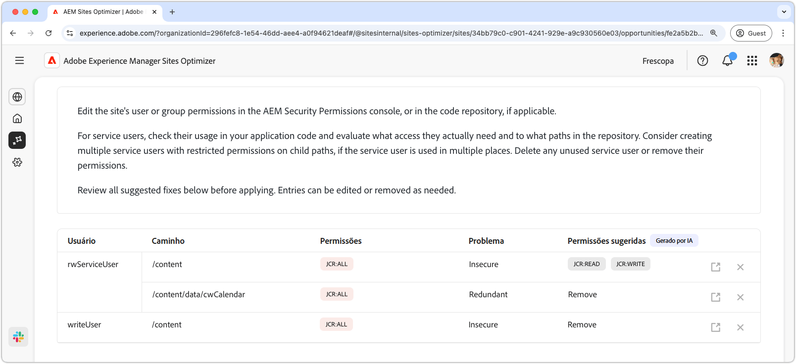
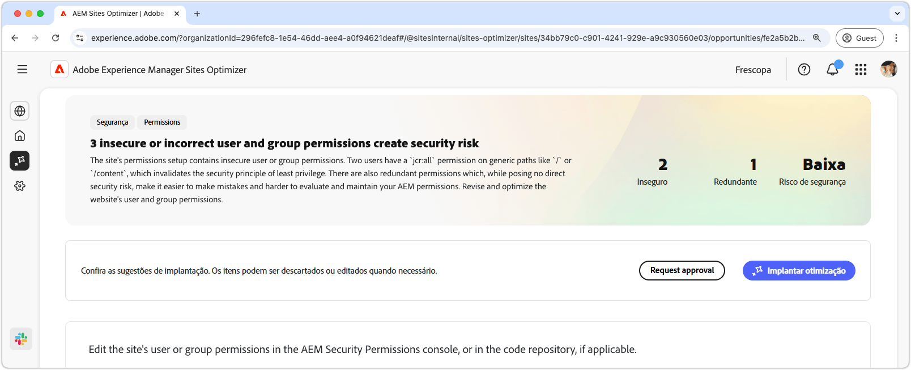

# Oportunidade de permissões de site

{align="center"}

A oportunidade de permissões de site otimiza as permissões do site, essenciais para manter um ambiente seguro e gerenciável do AEM. Esta oportunidade permite que você refine os controles de acesso removendo permissões muito amplas, como `jcr:all` em caminhos genéricos como `/` ou `/content`, e alinhando o acesso do usuário com o princípio do privilégio mínimo. Ao simplificar as permissões e eliminar redundâncias, você pode reduzir os riscos de segurança, melhorar a capacidade de manutenção e evitar futuras configurações incorretas. Revise e atualize as permissões no console de permissões de segurança do AEM ou no seu repositório de código. Isso garante que os usuários de serviços contem somente com o acesso de que realmente precisam.

## Identificação automática

{align="center"}

O recurso **Oportunidade de permissões de site** identifica e lista automaticamente

* **Usuário**: a conta de usuário com a permissão suspeita.
* **Caminho**: use as guias localizadas na parte superior para organizar e filtrar as oportunidades por status.
* **Permissão**: a permissão suspeita.
* **Problema**: indica o tipo de problema que afeta a permissão.

## Sugestão automática

{align="center"}

A sugestão automática fornece recomendações geradas por IA no campo **Permissões sugeridas**, permitindo que você substitua as permissões sinalizadas por alternativas seguras.

## Otimizar automaticamente

[!BADGE Ultimate]{type=Positive tooltip="Ultimate"}

{align="center"}

O Sites Optimizer Ultimate adiciona a capacidade de implantar a otimização automática para as vulnerabilidades encontradas.

>[!BEGINTABS]

>[!TAB Implantar otimização]

{{auto-optimize-deploy-optimization-slack}}

>[!TAB Solicitar aprovação]

{{auto-optimize-request-approval}}

>[!ENDTABS]
