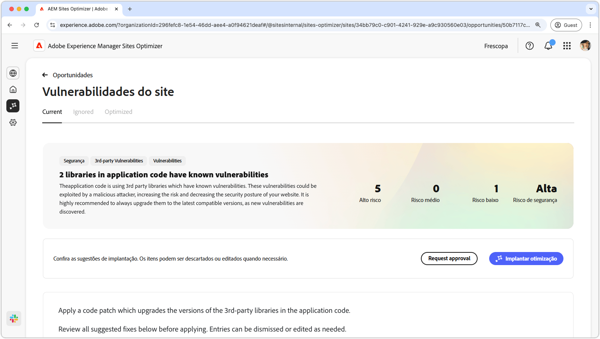
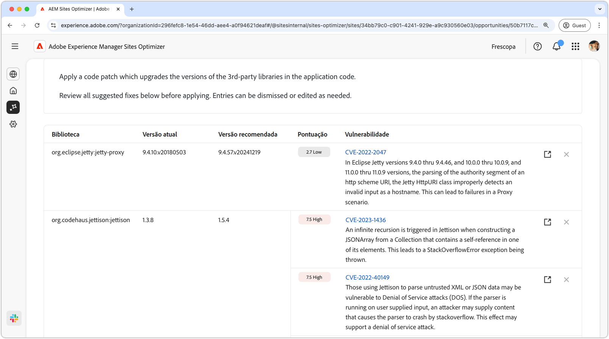
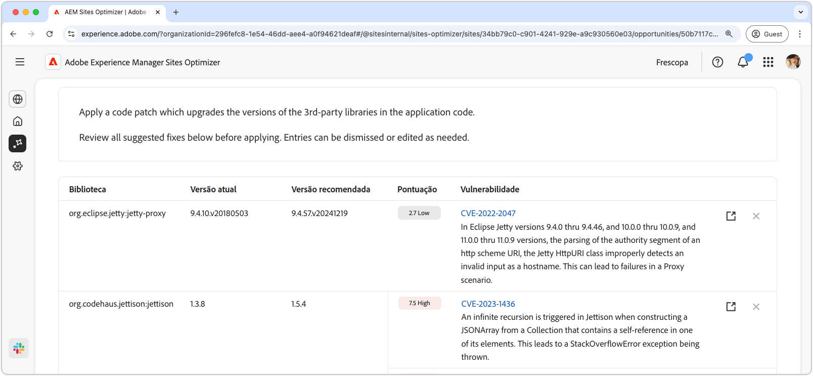
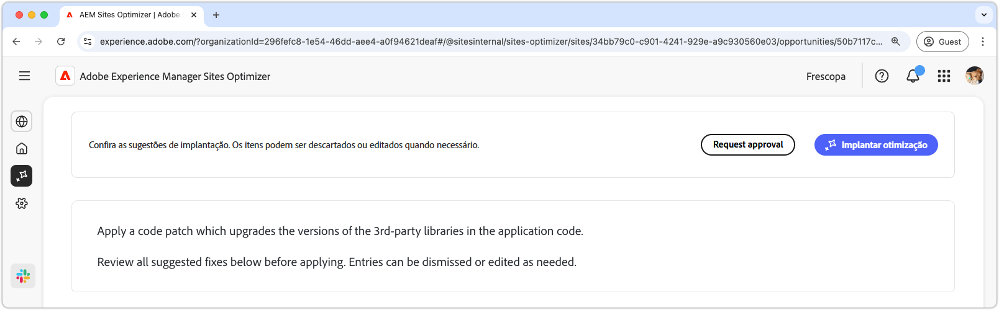

# Oportunidade de vulnerabilidades do site

{align="center"}

A oportunidade de vulnerabilidades do site identifica vulnerabilidades de segurança nas bibliotecas de terceiros usadas pelo seu código de aplicativo. Essas vulnerabilidades podem ser exploradas por um invasor mal-intencionado, aumentando o risco e diminuindo a postura de segurança do site.

A oportunidade de vulnerabilidades do site exibe um resumo na parte superior da página, incluindo o seguinte:

* **Problemas encontrados**: o número de vulnerabilidades encontradas, categorizadas pelo risco de segurança que representam (baixo, médio, alto).
* **Risco de segurança agregado**: o risco de segurança geral para o site com base nas vulnerabilidades encontradas pela oportunidade.

## Identificação automática

{align="center"}

O recurso **Oportunidade de vulnerabilidades do site** identifica e lista automaticamente as vulnerabilidades encontradas em bibliotecas de terceiros usadas pelo seu código de aplicativo. Ele fornece os seguintes detalhes:

* **Biblioteca**: a biblioteca de terceiros que contém a vulnerabilidade. Uma única biblioteca pode ter várias vulnerabilidades.
* **Versão atual**: a versão da biblioteca em uso no momento.
* **Versão recomendada**: a versão sugerida que resolve a vulnerabilidade.
* **Pontuação**: a classificação de severidade da vulnerabilidade, também resumida na parte superior da página.
* **Vulnerabilidade**: o identificador de vulnerabilidade, uma breve descrição e um link para o Banco de Dados Nacional de Vulnerabilidades (NVD) para obter mais detalhes. Acesse o link do NVD clicando no identificador ou no link ao lado da descrição.

## Sugestão automática

{align="center"}

A sugestão automática fornece sugestões geradas por IA para a **Versão recomendada** da biblioteca de vulnerabilidades para a qual você deve atualizar. Cada entrada tem uma **Pontuação** indicando sua severidade geral, ajudando a priorizar as vulnerabilidades mais críticas.

>[!BEGINTABS]

>[!TAB Detalhes da vulnerabilidade]

Cada vulnerabilidade contém um link que direciona para as informações detalhadas no [Banco de Dados Nacional de Vulnerabilidades (NVD)](https://nvd.nist.gov/). Ao clicar no identificador de vulnerabilidade ou no item de link à direita da descrição, você será direcionado para a página do NVD dessa vulnerabilidade.

>[!TAB Ignorar entradas]

Você pode optar por ignorar as entradas da lista de vulnerabilidades. Clicar no **ícone de ignorar** remove a entrada da lista. As entradas ignoradas podem ser engajadas novamente na guia **Ignoradas**, na parte superior da página de oportunidade.<!---right now it does not seem to be implemented, but the page description mentions this functionality-->

>[!ENDTABS]

## Otimizar automaticamente

[!BADGE Ultimate]{type=Positive tooltip="Ultimate"}

{align="center"}

O Sites Optimizer Ultimate adiciona a capacidade de implantar a otimização automática para as vulnerabilidades encontradas.

>[!BEGINTABS]

>[!TAB Implantar otimização]

{{auto-optimize-deploy-optimization-slack}}

>[!TAB Solicitar aprovação]

{{auto-optimize-request-approval}}

>[!ENDTABS]