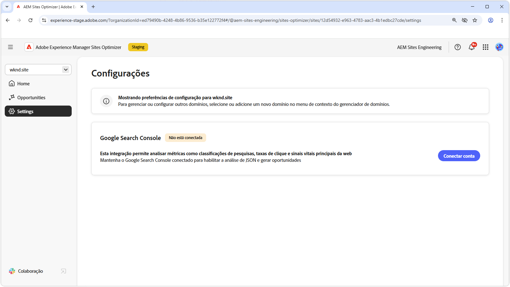

# Documentação do Sites Optimizer

{align="center"}

Damos as boas-vindas à documentação do Sites Optimizer. Aqui você encontra informações sobre como usar o Sites Optimizer para otimizar seus sites do AEM.

## Noções básicas do Site Optimizer

Confira a documentação do AEM Sites Optimizer para saber mais sobre os principais componentes da interface, incluindo o painel Página inicial, Configurações e a lista Oportunidades para obter insights de otimização.

<!-- CARDS 

* ./basics.md
  {title = Basics}
  {image = ./assets/basics/card.png}
* ./opportunities/overview.md
  {title = Opportunities}
* ./settings.md
  {title = Settings}

-->
<!-- START CARDS HTML - DO NOT MODIFY BY HAND -->

    

        

            

                <figure class="image x-is-16by9">
                    
                </figure>
            

            

                

                    

                        <a href="./basics.md" target="_blank" rel="referrer" title="Noções básicas">Noções básicas</a>
                    

                    
Saiba mais sobre as noções básicas do Sites Optimizer e como usá-lo.

                

                <a href="./basics.md" target="_blank" rel="referrer" class="spectrum-Button spectrum-Button--outline spectrum-Button--primary spectrum-Button--sizeM" style="align-self: flex-start; margin-top: 1rem;">
                    Saiba mais
                </a>
            

        

    

    

        

            

                <figure class="image x-is-16by9">
                    
                </figure>
            

            

                

                    

                        <a href="./opportunities/overview.md" target="_blank" rel="referrer" title="Oportunidades">Oportunidades</a>
                    

                    
Saiba mais sobre todas as oportunidades disponíveis do Site Optimizer e como usá-las para melhorar o desempenho do seu site.

                

                <a href="./opportunities/overview.md" target="_blank" rel="referrer" class="spectrum-Button spectrum-Button--outline spectrum-Button--primary spectrum-Button--sizeM" style="align-self: flex-start; margin-top: 1rem;">
                    Saiba mais
                </a>
            

        

    

    

        

            

                <figure class="image x-is-16by9">
                    
                </figure>
            

            

                

                    

                        <a href="./settings.md" target="_blank" rel="referrer" title="Configurações">Configurações</a>
                    

                    
Saiba como definir as configurações do Sites Optimizer e integrar a outras ferramentas.

                

                <a href="./settings.md" target="_blank" rel="referrer" class="spectrum-Button spectrum-Button--outline spectrum-Button--primary spectrum-Button--sizeM" style="align-self: flex-start; margin-top: 1rem;">
                    Saiba mais
                </a>
            

        

    

<!-- END CARDS HTML - DO NOT MODIFY BY HAND -->

