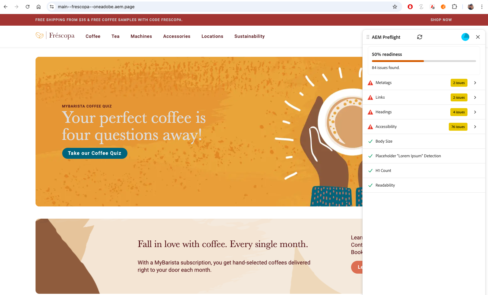

# Comprovação do AEM Sites Optimizer

{align="center"}

A comprovação no AEM Sites Optimizer ajuda a validar e otimizar as páginas antes que elas entrem no ar, analisando o conteúdo e a estrutura e sinalizando problemas com recomendações acionáveis. Ele foi projetado para autores, profissionais de marketing e desenvolvedores que desejam garantir que as páginas tenham alta qualidade, desempenho e estejam prontas para publicação, além de reduzir o retrabalho.

No núcleo da Comprovação estão as Oportunidades, que são identificadas por meio de um conjunto de auditorias que avaliam os aspectos principais da sua página antes da publicação. Essas auditorias apontam possíveis problemas e fornecem recomendações claras e acionáveis para melhorar a qualidade e o desempenho gerais.

## Introdução à simulação

Começar a usar a simulação é fácil. Basta configurar a Comprovação, abri-la em seu ambiente de criação e executar uma auditoria em sua página, e a Comprovação faz o resto.

1. [Configurar simulação](./setup.md) - Saiba como configurar a simulação para sua instância do AEM
1. [Comprovação de acesso](./access-preflight.md) - Saiba onde a Comprovação aparece em seu ambiente de criação
1. [Executar auditorias](./audits.md) - Saiba como iniciar uma auditoria de Comprovação
1. [Resultados e oportunidades de auditoria](./audit-results.md) - Saiba como interpretar resultados de auditoria

## Oportunidades de pré-verificação

<!-- CARDS

* ./opportunities/accessibility.md
* ./opportunities/h1-count.md
* ./opportunities/links.md
* ./opportunities/meta-data.md
* ./opportunities/readability.md
-->
<!-- START CARDS HTML - DO NOT MODIFY BY HAND -->

    

        

            

                <figure class="image x-is-16by9">
                    
                </figure>
            

            

                

                    

                        <a href="./opportunities/accessibility.md" target="_blank" rel="referrer" title="Oportunidade de simulação de acessibilidade">Oportunidade de simulação de acessibilidade</a>
                    

                    
Saiba mais sobre a Oportunidade de simulação de acessibilidade no Sites Optimizer.

                

                <a href="./opportunities/accessibility.md" target="_blank" rel="referrer" class="spectrum-Button spectrum-Button--outline spectrum-Button--primary spectrum-Button--sizeM" style="align-self: flex-start; margin-top: 1rem;">
                    Saiba mais
                </a>
            

        

    

    

        

            

                <figure class="image x-is-16by9">
                    
                </figure>
            

            

                

                    

                        <a href="./opportunities/h1-count.md" target="_blank" rel="referrer" title="Oportunidade de simulação de contagem H1">Oportunidade de simulação de contagem H1</a>
                    

                    
Saiba mais sobre a Oportunidade de simulação de acessibilidade no Sites Optimizer.

                

                <a href="./opportunities/h1-count.md" target="_blank" rel="referrer" class="spectrum-Button spectrum-Button--outline spectrum-Button--primary spectrum-Button--sizeM" style="align-self: flex-start; margin-top: 1rem;">
                    Saiba mais
                </a>
            

        

    

    

        

            

                <figure class="image x-is-16by9">
                    
                </figure>
            

            

                

                    

                        <a href="./opportunities/links.md" target="_blank" rel="referrer" title="Oportunidade de simulação de links">Oportunidade de simulação de links</a>
                    

                    
Saiba mais sobre a Oportunidade de simulação de links no Sites Optimizer.

                

                <a href="./opportunities/links.md" target="_blank" rel="referrer" class="spectrum-Button spectrum-Button--outline spectrum-Button--primary spectrum-Button--sizeM" style="align-self: flex-start; margin-top: 1rem;">
                    Saiba mais
                </a>
            

        

    

    

        

            

                <figure class="image x-is-16by9">
                    
                </figure>
            

            

                

                    

                        <a href="./opportunities/meta-data.md" target="_blank" rel="referrer" title="Oportunidade de simulação de metadados">Oportunidade de simulação de metadados</a>
                    

                    
Saiba mais sobre a Oportunidade de simulação de metadados no Sites Optimizer.

                

                <a href="./opportunities/meta-data.md" target="_blank" rel="referrer" class="spectrum-Button spectrum-Button--outline spectrum-Button--primary spectrum-Button--sizeM" style="align-self: flex-start; margin-top: 1rem;">
                    Saiba mais
                </a>
            

        

    

    

        

            

                <figure class="image x-is-16by9">
                    
                </figure>
            

            

                

                    

                        <a href="./opportunities/readability.md" target="_blank" rel="referrer" title="Oportunidade de simulação de legibilidade">Oportunidade de simulação de legibilidade</a>
                    

                    
Saiba mais sobre a Oportunidade de simulação de legibilidade no Sites Optimizer.

                

                <a href="./opportunities/readability.md" target="_blank" rel="referrer" class="spectrum-Button spectrum-Button--outline spectrum-Button--primary spectrum-Button--sizeM" style="align-self: flex-start; margin-top: 1rem;">
                    Saiba mais
                </a>
            

        

    

<!-- END CARDS HTML - DO NOT MODIFY BY HAND -->
