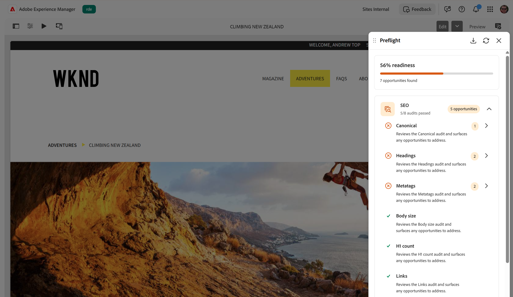

# Simulação do AEM Sites Optimizer

{align="center"}

A comprovação no AEM Sites Optimizer ajuda a validar e otimizar as páginas antes que elas entrem no ar, analisando o conteúdo e a estrutura e apresentando oportunidades com recomendações acionáveis. Ele foi desenvolvido para autores, profissionais de marketing e desenvolvedores que desejam garantir que as páginas tenham alta qualidade, bom desempenho e estejam prontas para publicação, reduzindo o retrabalho.

Inicie a Comprovação do ambiente de criação e selecione **Analisar página** para executar suas auditorias. Uma auditoria avalia um aspecto da página, como seus metadados ou estrutura de cabeçalho, e auditorias relacionadas a Grupos de comprovação em categorias, como **SEO** e **Acessibilidade**. A comprovação relata uma pontuação de prontidão para a página, juntamente com as oportunidades encontradas — as coisas específicas que você pode melhorar, cada uma com uma recomendação acionável.

## Comece a usar o Preflight

Começar a usar o Preflight é fácil. Configure a Comprovação, abra-a no ambiente de criação, execute uma auditoria na página e a Comprovação faça o resto.

1. [Configurar o Preflight](./setup.md) — Saiba como configurar o Preflight para sua instância do AEM
1. [Acessar o Preflight](./access-preflight.md) — Saiba onde o Preflight aparece no seu ambiente de criação
1. [Executar auditorias](./audits.md) — Saiba como iniciar uma auditoria do Preflight
1. [Resultados e oportunidades da auditoria](./audit-results.md) — Saiba como interpretar os resultados da auditoria

## Comprovar categorias de auditoria

<!--
CARDS

* ./opportunities/accessibility.md
* ./opportunities/seo.md
-->
<!-- START CARDS HTML - DO NOT MODIFY BY HAND -->

    

        

            

                <figure class="image x-is-16by9">
                    
                </figure>
            

            

                

                    

                        <a href="./opportunities/accessibility.md" target="_blank" rel="referrer" title="Auditorias de acessibilidade de comprovação">Auditorias de Acessibilidade de Comprovação</a>
                    

                    
Saiba mais sobre as auditorias de acessibilidade de comprovação no Sites Optimizer.

                

                <a href="./opportunities/accessibility.md" target="_blank" rel="referrer" class="spectrum-Button spectrum-Button--outline spectrum-Button--primary spectrum-Button--sizeM" style="align-self: flex-start; margin-top: 1rem;">
                    Saiba mais
                </a>
            

        

    

    

        

            

                <figure class="image x-is-16by9">
                    
                </figure>
            

            

                

                    

                        <a href="./opportunities/seo.md" target="_blank" rel="referrer" title="Comprovação de auditorias de SEO">Comprovação de Auditorias de SEO</a>
                    

                    
Saiba mais sobre as auditorias de SEO de comprovação no Sites Optimizer.

                

                <a href="./opportunities/seo.md" target="_blank" rel="referrer" class="spectrum-Button spectrum-Button--outline spectrum-Button--primary spectrum-Button--sizeM" style="align-self: flex-start; margin-top: 1rem;">
                    Saiba mais
                </a>
            

        

    

<!-- END CARDS HTML - DO NOT MODIFY BY HAND -->
