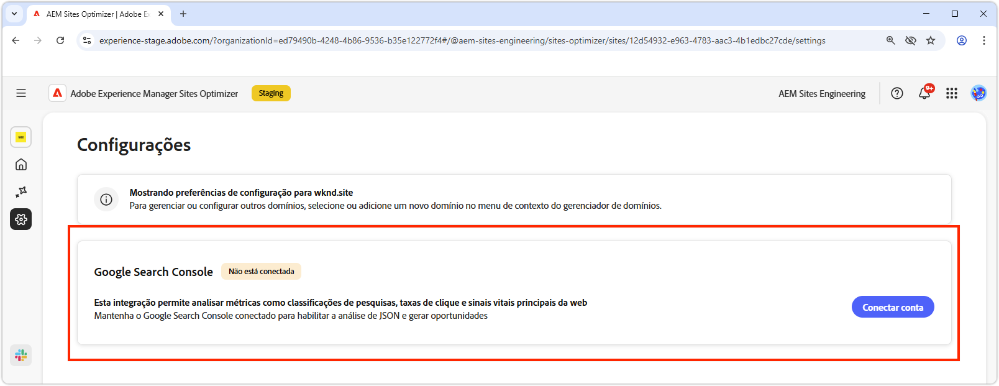

# Configurações do Sites Optimizer

{align="center"}

As configurações do Site Otimizer são o hub central para configurar sua experiência com o Sites Optimizer.

## Google Search Console

{align="center"}

O conector de configurações do Console de pesquisa do Google no AEM Sites Optimizer permite a análise das principais métricas de SEO, como classificações de pesquisa, taxas de click-through e Componentes principais da Web. Ao manter o Google Search Console conectado, você pode aproveitar a análise JSON para descobrir oportunidades de otimização e melhorar o desempenho do site.

Para configurar esse conector, você deve ter credenciais com acesso administrativo ao Google Search Console para o domínio.
