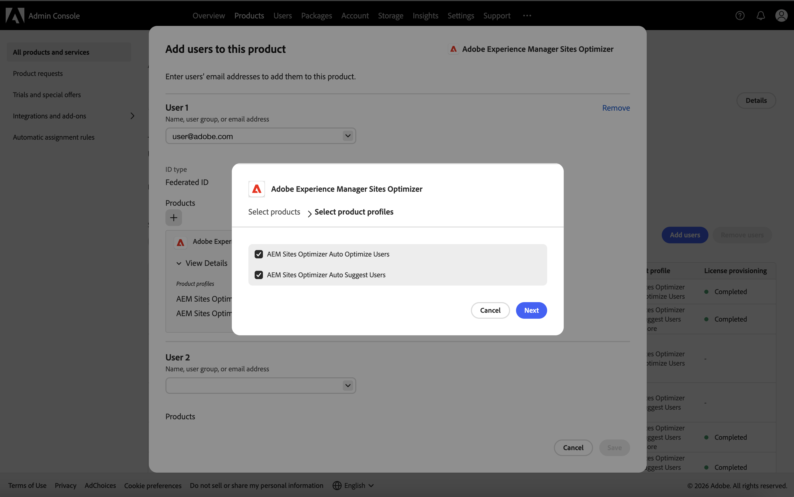

# Configurações do Sites Optimizer

{align="center"}

As configurações do Sites Optimizer são o ponto central para definir sua experiência com o Sites Optimizer.

## Google Search Console

{align="center"}

O conector de configurações do Google Search Console no AEM Sites Optimizer permite a análise das principais métricas de SEO, como classificações de pesquisa, taxas de click-through e sinais vitais principais da Web. Ao manter o Google Search Console conectado, você pode aproveitar a análise JSON para descobrir oportunidades de otimização e melhorar o desempenho do site.

Para configurar esse conector, você deve ter credenciais com acesso administrativo ao Google Search Console para o domínio.

## Conectar ao AEM Sites

O guia a seguir explica como conectar seu site existente do Edge Delivery Services (EDS) ao AEM Sites Optimizer. Antes de começar, certifique-se de que seu site EDS já esteja configurado e funcionando — essa conexão serve especificamente para que o AEM Sites Optimizer acesse seu conteúdo.

A conexão requer duas etapas:

1. Forneça o URL do repositório de código e o URL da origem do conteúdo.
2. Conceda acesso ao AEM Sites Optimizer à sua origem de conteúdo.

### Etapa 1 - Vincular o repositório de código e a origem do conteúdo

No AEM Sites Optimizer, vá para **Configurações → Conectar-se ao AEM Sites** e insira o seguinte:

- **URL do repositório de código** — o URL do GitHub do site EDS, por exemplo:
  `https://github.com/owner/repo`

- **URL da origem do conteúdo** — o URL da pasta do SharePoint ou do Google Drive que hospeda o seu site EDS, por exemplo:
  `https://drive.google.com/drive/folders/...` ou `https://myorg.sharepoint.com/...`

Depois de inserir o URL da origem do conteúdo, o AEM Sites Optimizer detectará o tipo de origem do conteúdo e exibirá as instruções de acesso relevantes abaixo.

### Etapa 2 — Conceder acesso à origem do conteúdo

Siga a seção que corresponde à origem do conteúdo.

#### SharePoint — Domínio da Adobe

{align="center"}

Se o URL da origem do conteúdo usar o domínio do Adobe SharePoint, nenhuma outra ação será necessária. O acesso já está configurado. Clique em **Salvar** para concluir a conexão.

#### SharePoint — Domínio personalizado

Se o URL da origem do conteúdo usar o domínio SharePoint da própria organização, será necessário registrar um aplicativo do Azure e fornecer suas credenciais para o AEM Sites Optimizer.

##### O que você vai precisar

- Permissão para registrar aplicativos no Portal do Azure ou um contato que possa registrar aplicativos em seu nome.
- Direitos de administrador do locatário para dar consentimento à API, ou um administrador que possa aprovar o consentimento à API em seu nome.

##### Etapa 2a — Registrar um aplicativo no Azure

1. Acesse **Portal do Azure → Microsoft Entra ID → Registros de aplicativos → Novo registro**.
2. Nomeie-o, por exemplo: `AEM Sites Optimizer`.
3. Deixe todos os outros padrões e clique em **Registrar**.
4. Na página **Visão geral**, anote:
   - **ID do aplicativo (cliente)**
   - **ID do diretório (locatário)**

##### Etapa 2b — Adicionar permissões da API

1. Vá para **Permissões da API → Adicionar uma permissão → Microsoft Graph → Permissões do aplicativo**.
2. Adicione ambos abaixo:
   - `Sites.Selected` — acesso com escopo a coleções de sites específicas do SharePoint.
   - `Files.SelectedOperations.Selected` — acesso a arquivos sem um usuário conectado.
3. Clique em **Conceder consentimento de administrador** para ambos.

{align="center"}

>[!NOTE]
>
>Para dar consentimento de administrador, é necessário ter direitos de administrador de locatário. Caso contrário, peça ao administrador de TI ou do Azure para concluir essa etapa antes de continuar.

##### Etapa 2c — Criar um segredo do cliente

{align="center"}

1. Ir para **Certificados e segredos → Novo segredo do cliente**.
2. Defina uma descrição e uma expiração e clique em **Adicionar**.
3. Copie o valor secreto imediatamente — ele é mostrado apenas uma vez.

##### Etapa 2d — Conceder acesso ao aplicativo para seu site do SharePoint

Você pode conceder acesso ao aplicativo usando o Microsoft Graph Explorer, o PowerShell ou chamadas diretas à API do Graph.

Navegue até o [Microsoft Graph Explorer](https://developer.microsoft.com/graph/graph-explorer), entre com sua conta da Microsoft e execute as seguintes solicitações:

1. Encontre a ID do site:

```
GET https://graph.microsoft.com/v1.0/sites/{tenant}.sharepoint.com:/sites/{site-name}
```

1. Copie o `id` da resposta e conceda acesso no nível do site:

```
POST https://graph.microsoft.com/v1.0/sites/{siteId}/permissions
```

Corpo:

```json
{
  "roles": ["write"],
  "grantedToIdentities": [{
    "application": {
      "id": "{your-client-id}",
      "displayName": "{Your app name}"
    }
  }]
}
```

##### Etapa 2e — Inserir credenciais no AEM Sites Optimizer

{align="center"}

De volta à caixa de diálogo **Conectar-se ao AEM Sites**, digite o seguinte em **Conexão do repositório de conteúdo via SharePoint**:

- **ID do Locatário (Azure AD)** — em Registro do Aplicativo → Visão Geral.
- **ID do cliente (Registro do aplicativo)** — em Registro do aplicativo → Visão geral.
- **Segredo do Cliente** — criado na Etapa 2c.

Clique em **Validar conexão** para confirmar o acesso e em **Salvar**.

#### Google Drive

{align="center"}

1. No Google Drive, clique com o botão direito do mouse na pasta que hospeda seu site EDS e selecione **Compartilhar**.
2. No campo **Adicionar pessoas e grupos**, digite o email da conta de serviço mostrado na caixa de diálogo **Conectar-se ao AEM Sites**:
   `aem-sites-optimizer@adbe-gcp0843.iam.gserviceaccount.com`
3. Defina o nível de permissão como **Editor**.
4. Desmarque **Notificar pessoas** e clique em **Compartilhar**.

Quando o compartilhamento for concluído, clique em **Validar conexão** na caixa de diálogo e em **Salvar**.

## Gerenciar permissões do usuário

Controlar quem pode acessar um site no Sites Optimizer e o que eles podem fazer com ele. O Access é criado a partir de um pequeno conjunto de *recursos* independentes — Exibir, Editar, Implantar, Configurar e Gerenciar usuários — que você concede a cada pessoa.

O acesso é **aditivo**: as permissões de uma pessoa são a soma de tudo o que ela recebeu. Não há &quot;negar&quot;, então as concessões nunca entram em conflito ou se cancelam mutuamente. Para conceder menos acesso a alguém, remova uma concessão em vez de tentar substituí-la.

### Como o acesso é concedido

Há duas maneiras de uma pessoa ter acesso a eles, e eles trabalham juntos:

- **Acesso a toda a organização** — atribuído pelo administrador da organização da Adobe no [Adobe Admin Console](https://adminconsole.adobe.com/). Ela se aplica a todos os sites da organização. Use-o para pessoas que precisam do mesmo acesso em qualquer lugar.
- **Acesso no nível do site** — atribuído no Sites Optimizer, na página **Configurações → Permissões**. Ela se aplica a um único site e pode ser tão abrangente ou tão limitado quanto necessário. Nenhum acesso ao Admin Console é necessário.

>[!NOTE]
>
>As duas camadas se somam. Uma pessoa com acesso de visualização em toda a organização que também tenha permissão para Editar em um site pode visualizar cada site e editá-lo. Para manter uma pessoa limitada a um único site, certifique-se de que ela não ocupe também uma função em toda a organização.

#### Funções em toda a organização (Admin Console)

O acesso de toda a organização vem de uma das duas funções de produto do **AEM Sites Optimizer**, atribuídas no [Adobe Admin Console](https://adminconsole.adobe.com/):

- **Gerenciador ASO** — acesso total a todos os sites, incluindo **Gerenciar usuários**. Um Gerente pode abrir a página **Permissões** para qualquer site e atribuir acesso a outros.
- **Usuário ASO** — acesso somente para visualização a cada site. Sem alterações e sem gerenciamento de usuários.

Para atribuir uma função, você deve ser um **administrador do sistema** da organização ou um **administrador de produto** da AEM Sites Optimizer.

1. Entrar na [Adobe Admin Console](https://adminconsole.adobe.com/).
1. Vá para **Produtos** e selecione **AEM Sites Optimizer**.
1. Abra a guia **Usuários** e adicione o usuário por email (ou selecione um usuário existente).
1. Clique no ícone **+** (adicionar) para adicionar um perfil de produto e escolha o perfil de produto.

   {align="center"}

1. Clique em **Avançar**.
1. Escolha a função — **Gerenciador ASO** para acesso total ou **Usuário ASO** para acesso somente para visualização — e clique em **Aplicar**.

   {align="center"}

   {align="center"}

Para obter mais informações sobre como adicionar usuários, consulte [Integrar usuários](setup/onboard-users.md).

>[!IMPORTANT]
>
>Somente um administrador de organização pode conceder **Gerenciar usuários** para toda a organização. Um membro que tenha **Gerenciar usuários** em um site pode atribuir acesso a ele, mas não pode criar um **ASO Manager** para toda a organização.

### Níveis de recursos

Cada recurso controla um tipo de ação. Elas são independentes — por exemplo, você pode conceder Implantação sem Editar.

| Recurso | O que ele permite | O que não permite |
|---|---|---|
| Exibir | Veja os dados do site — oportunidades, sugestões, correções, relatórios e configuração — sem alterar nada. | Qualquer alteração. |
| Editar | Crie e altere oportunidades e sugestões (o que deve mudar). | Publicar alterações, alterar configurações ou gerenciar usuários. |
| Implantar | Publique correções em tempo real no site e reverta-as. | Gerenciamento de usuários. |
| Configurar | Altere as configurações e conexões do site. | Publicar correções ou gerenciar usuários. |
| Gerenciar usuários | Conceder ou revogar o acesso de outros membros ao site. | Gerenciar um site ao qual a pessoa ainda não tem acesso. |

>[!NOTE]
>
>**A exibição é sempre incluída.** Cada concessão inclui Exibir automaticamente — não é possível gerenciar, configurar, editar ou implantar algo que não possa ser visto. Por causa disso, a Exibição não pode ser removida sozinha. Para remover completamente o acesso de alguém, remova o membro (consulte [Editar ou remover um membro](#edit-or-remove-a-member) abaixo) em vez de desmarcar todos os recursos.

### Acesso de escopo a tipos de oportunidade

Em um único site, você pode conceder as opções Exibir, Editar e Implantar para **tipos de oportunidade específicos** (por exemplo, links internos Core Web Vitals ou Quebrados) em vez do site inteiro. Isso permite que uma pessoa edite o Core Web Vitals enquanto visualiza apenas todo o resto.

- **Exibir**, **Editar** e **Implantar** podem ser limitados a um ou mais tipos de oportunidade, ou a **Todos** tipos de oportunidade.
- **Configurar** e **Gerenciar usuários** sempre se aplicam a todo o site; eles não podem ser limitados a um tipo de oportunidade.

Cada concessão com escopo aparece como sua própria linha para o membro, com uma coluna **Aplica-se a** mostrando o tipo de oportunidade **Tudo** ou **Todo o site**.

>[!CAUTION]
>
>O escopo limita apenas o que *aquela* concessão oferece — nunca remove o acesso que outra concessão oferece. Se uma pessoa também tiver acesso em toda a organização ou uma concessão de **Todos** tipos, esse acesso mais amplo ainda se aplicará. Portanto, para realmente limitar alguém a tipos de oportunidade específicos, certifique-se de que eles não tenham uma função mais ampla ou uma concessão de **Todos** tipos.

### Adicionar um membro

1. Vá para **Configurações → Permissões** e selecione o site.
1. Clique em **Adicionar membros**.
1. Pesquisar por nome ou email e selecionar uma ou mais pessoas.
1. Escolha o(s) **tipo(s) de oportunidade** aos quais o acesso se aplica (ou **Todos**) e selecione os recursos a serem concedidos.
1. Clique em **Adicionar**.

<!-- MEDIA PENDING: Site Manager / Site User walkthrough videos are being re-recorded with demo data to remove PII, then re-uploaded to video.tv.adobe.com and embedded here with >[!VIDEO]. The earlier uploads v/3503767 and v/3503768 (KT-22672 / KT-22673) contain PII and must not be used. -->

### Editar ou remover um membro

Na tabela **Members**:

- Clique em **Editar recursos** na linha de um membro para alterar o que ele pode fazer. Quando você edita uma concessão existente, o tipo de oportunidade permanece fixo — você altera somente as capacidades e pelo menos uma capacidade deve permanecer selecionada.
- Clique em **Remover** para revogar totalmente o acesso desse membro ao site.

>[!NOTE]
>
>Alterar recursos e remover um membro são ações diferentes. Para remover todo o acesso, use **Remover** — não é possível fazer isso desmarcando recursos, pois uma concessão deve manter pelo menos um recurso (e a Exibição sempre permanece).

### Quem pode gerenciar permissões

A página **Permissões** de um site está disponível para:

- Membros com o recurso **Gerenciar usuários** nesse site e
- Administradores da organização (um gerente ASO).

Os membros sem **Gerenciar usuários** veem uma mensagem informando que não têm permissão para gerenciar o acesso a esse site.

### Ativar gerenciamento de usuários e de acesso

O gerenciamento de usuários e de acesso é controlado por uma configuração para sua organização. Você pode atribuir acesso antes que ele seja ativado, mas só é **imposto** depois que a configuração é ativada.

Se ainda não estiver habilitado, a página **Permissões** mostrará um banner solicitando que você entre em contato com a equipe de conta. Entre em contato com a equipe de conta da Sites Optimizer para ativá-la.

>[!NOTE]
>
>Até que o gerenciamento de usuários e acessos seja ativado, as permissões atribuídas serão salvas, mas não impostas.

### Perguntas frequentes

**Os membros no nível do site precisam de uma função Admin Console?**

Não. O acesso em nível de site é concedido inteiramente dentro do Sites Optimizer, na página **Permissões**. Somente funções em toda a organização são atribuídas na Admin Console.

**O que acontece se alguém tiver acesso a toda a organização e a nível do site?**

Ambos se aplicam. O acesso efetivo deles é a combinação dos dois. As concessões nunca entram em conflito, pois nenhuma concessão pode negar acesso.

**Por que um membro com Gerenciar usuários não pode criar um Gerente em toda a organização?**

Criar uma função em toda a organização é uma ação do Admin Console. Um membro com **Gerenciar usuários** pode atribuir acesso em seu próprio site, mas somente um administrador da organização pode conceder funções em toda a organização.

**Como revogar o acesso de uma pessoa a um site?**

Remova a concessão na página **Permissões**. Isso é diferente dos recursos de edição, que sempre devem deixar pelo menos um recurso.

**Posso limitar uma pessoa a tipos de oportunidade específicos?**

Sim — conceder Exibição, Editar ou Implantar com escopo para tipos de oportunidade específicos em vez de **Todos**. Como o acesso é aditivo, ele só terá efeito se a pessoa não tiver também acesso em toda a organização ou uma concessão de **Todos** tipos.
