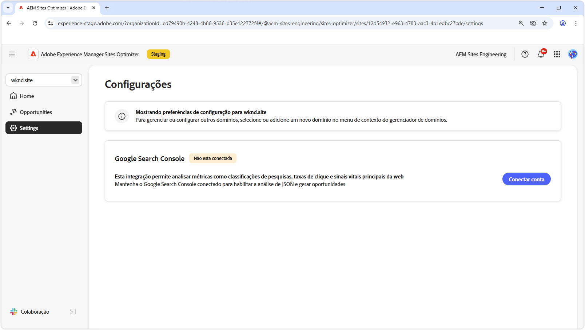
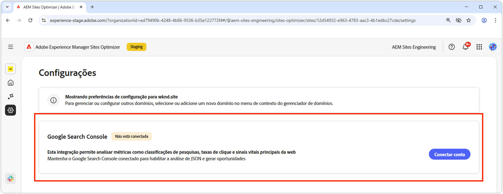
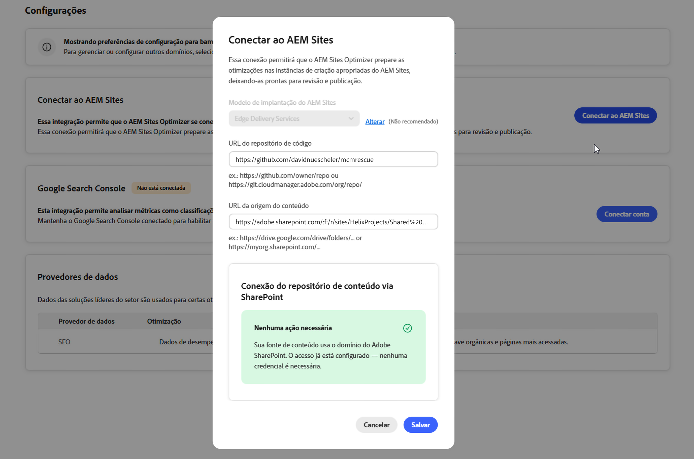
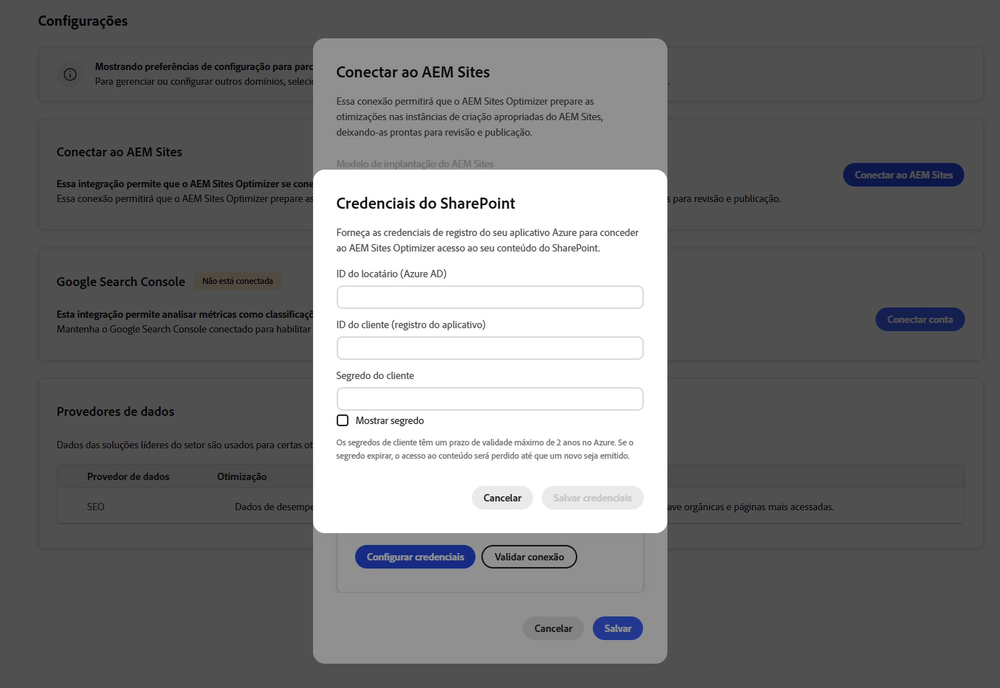
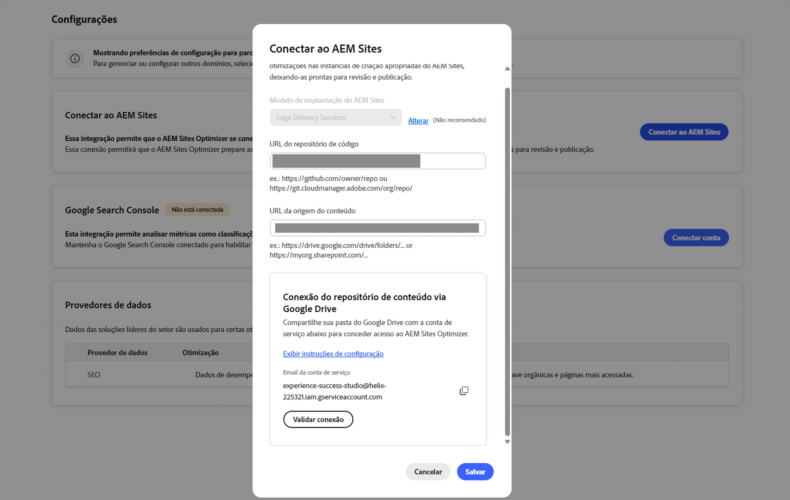

# Configurações do Sites Optimizer

{align="center"}

As configurações do Sites Optimizer são o ponto central para definir sua experiência com o Sites Optimizer.

## Google Search Console

{align="center"}

O conector de configurações do Google Search Console no AEM Sites Optimizer permite a análise das principais métricas de SEO, como classificações de pesquisa, taxas de click-through e sinais vitais principais da Web. Ao manter o Google Search Console conectado, você pode aproveitar a análise JSON para descobrir oportunidades de otimização e melhorar o desempenho do site.

Para configurar esse conector, você deve ter credenciais com acesso administrativo ao Google Search Console para o domínio.

## Conectar ao AEM Sites

O guia a seguir explica como conectar seu site existente do Edge Delivery Services (EDS) ao AEM Sites Optimizer. Antes de começar, certifique-se de que seu site EDS já esteja configurado e funcionando — essa conexão serve especificamente para que o AEM Sites Optimizer acesse seu conteúdo.

A conexão requer duas etapas:

1. Forneça o URL do repositório de código e o URL da origem do conteúdo.
2. Conceda acesso ao AEM Sites Optimizer à sua origem de conteúdo.

### Etapa 1 - Vincular o repositório de código e a origem do conteúdo

No AEM Sites Optimizer, vá para **Configurações → Conectar-se ao AEM Sites** e insira o seguinte:

- **URL do repositório de código** — o URL do GitHub do site EDS, por exemplo:
  `https://github.com/owner/repo`

- **URL da origem do conteúdo** — o URL da pasta do SharePoint ou do Google Drive que hospeda o seu site EDS, por exemplo:
  `https://drive.google.com/drive/folders/...` ou `https://myorg.sharepoint.com/...`

Depois de inserir o URL da origem do conteúdo, o AEM Sites Optimizer detectará o tipo de origem do conteúdo e exibirá as instruções de acesso relevantes abaixo.

### Etapa 2 — Conceder acesso à origem do conteúdo

Siga a seção que corresponde à origem do conteúdo.

#### SharePoint — Domínio da Adobe

{align="center"}

Se o URL da origem do conteúdo usar o domínio do Adobe SharePoint, nenhuma outra ação será necessária. O acesso já está configurado. Clique em **Salvar** para concluir a conexão.

#### SharePoint — Domínio personalizado

Se o URL da origem do conteúdo usar o domínio SharePoint da própria organização, será necessário registrar um aplicativo do Azure e fornecer suas credenciais para o AEM Sites Optimizer.

##### O que você vai precisar

- Permissão para registrar aplicativos no Portal do Azure ou um contato que possa registrar aplicativos em seu nome.
- Direitos de administrador do locatário para dar consentimento à API, ou um administrador que possa aprovar o consentimento à API em seu nome.

##### Etapa 2a — Registrar um aplicativo no Azure

1. Acesse **Portal do Azure → Microsoft Entra ID → Registros de aplicativos → Novo registro**.
2. Nomeie-o, por exemplo: `AEM Sites Optimizer`.
3. Deixe todos os outros padrões e clique em **Registrar**.
4. Na página **Visão geral**, anote:
   - **ID do aplicativo (cliente)**
   - **ID do diretório (locatário)**

##### Etapa 2b — Adicionar permissões da API

1. Vá para **Permissões da API → Adicionar uma permissão → Microsoft Graph → Permissões do aplicativo**.
2. Adicione ambos abaixo:
   - `Sites.Selected` — acesso com escopo a coleções de sites específicas do SharePoint.
   - `Files.SelectedOperations.Selected` — acesso a arquivos sem um usuário conectado.
3. Clique em **Conceder consentimento de administrador** para ambos.

{align="center"}

>[!NOTE]
>
>Para dar consentimento de administrador, é necessário ter direitos de administrador de locatário. Caso contrário, peça ao administrador de TI ou do Azure para concluir essa etapa antes de continuar.

##### Etapa 2c — Criar um segredo do cliente

{align="center"}

1. Ir para **Certificados e segredos → Novo segredo do cliente**.
2. Defina uma descrição e uma expiração e clique em **Adicionar**.
3. Copie o valor secreto imediatamente — ele é mostrado apenas uma vez.

##### Etapa 2d — Conceder acesso ao aplicativo para seu site do SharePoint

Você pode conceder acesso ao aplicativo usando o Microsoft Graph Explorer, o PowerShell ou chamadas diretas à API do Graph.

Navegue até o [Microsoft Graph Explorer](https://developer.microsoft.com/graph/graph-explorer), entre com sua conta da Microsoft e execute as seguintes solicitações:

1. Encontre a ID do site:

```
GET https://graph.microsoft.com/v1.0/sites/{tenant}.sharepoint.com:/sites/{site-name}
```

1. Copie o `id` da resposta e conceda acesso no nível do site:

```
POST https://graph.microsoft.com/v1.0/sites/{siteId}/permissions
```

Corpo:

```json
{
  "roles": ["write"],
  "grantedToIdentities": [{
    "application": {
      "id": "{your-client-id}",
      "displayName": "{Your app name}"
    }
  }]
}
```

##### Etapa 2e — Inserir credenciais no AEM Sites Optimizer

{align="center"}

De volta à caixa de diálogo **Conectar-se ao AEM Sites**, digite o seguinte em **Conexão do repositório de conteúdo via SharePoint**:

- **ID do Locatário (Azure AD)** — em Registro do Aplicativo → Visão Geral.
- **ID do cliente (Registro do aplicativo)** — em Registro do aplicativo → Visão geral.
- **Segredo do Cliente** — criado na Etapa 2c.

Clique em **Validar conexão** para confirmar o acesso e em **Salvar**.

#### Google Drive

{align="center"}

1. No Google Drive, clique com o botão direito do mouse na pasta que hospeda seu site EDS e selecione **Compartilhar**.
2. No campo **Adicionar pessoas e grupos**, digite o email da conta de serviço mostrado na caixa de diálogo **Conectar-se ao AEM Sites**:
   `experience-success-studio@helix-225321.iam.gserviceaccount.com`
3. Defina o nível de permissão como **Editor**.
4. Desmarque **Notificar pessoas** e clique em **Compartilhar**.

Quando o compartilhamento for concluído, clique em **Validar conexão** na caixa de diálogo e em **Salvar**.
