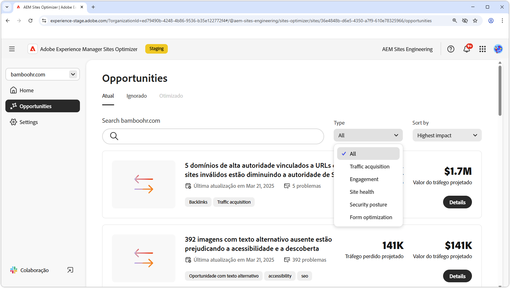
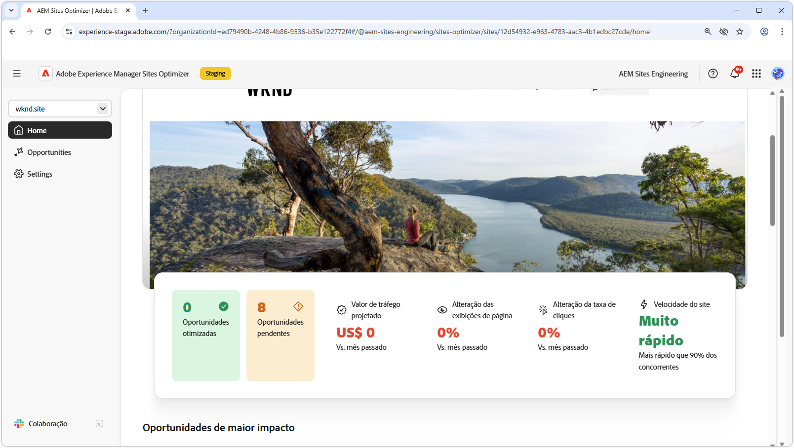

# AEM Sites Optimizer

>[!VIDEO](https://video.tv.adobe.com/v/3455085/?learn=on&enablevpops)

O Adobe Experience Manager (AEM) Sites Optimizer é um serviço na nuvem que analisa e melhora o desempenho de sites criados no AEM. O Sites Optimizer identifica áreas a serem melhoradas em termos de carregamento de página, uso de componentes e entrega de conteúdo. Essa funcionalidade ajuda a aprimorar o desempenho do site, além de reduzir os custos de manutenção e atualização. Ao usar o Sites Optimizer, você pode garantir uma experiência online descomplicada e confiável, o que é importante para manter o engajamento e as conversões.

## Introdução ao Sites Optimizer

<!-- CARDS 

* ./opportunity-types/overview.md
    * {title=Opportunity types}
    * {description = Learn about the available Site Optimizer opportunities and how to use them to improve your site's performance.}
* ./documentation/preflight/overview.md
  * {title=Preflight documentation}
  * {description = Learn about the Preflight in Sites Optimizer and how to optimize your web pages before they're published.}
* ./documentation/overview.md
  * {title=Sites Optimizer documentation}
  * {description=Explore the Sites Optimizer documentation to learn about all its capabilities.}

-->
<!-- START CARDS HTML - DO NOT MODIFY BY HAND -->

    

        

            

                <figure class="image x-is-16by9">
                    
                </figure>
            

            

                

                    

                        <a href="./opportunity-types/overview.md" target="_blank" rel="referrer" title="Tipos de oportunidade">Tipos de oportunidade</a>
                    

                    
Saiba mais sobre as oportunidades disponíveis do Site Optimizer e como usá-las para melhorar o desempenho do seu site.

                

                <a href="./opportunity-types/overview.md" target="_blank" rel="referrer" class="spectrum-Button spectrum-Button--outline spectrum-Button--primary spectrum-Button--sizeM" style="align-self: flex-start; margin-top: 1rem;">
                    Saiba mais
                </a>
            

        

    

    

        

            

                <figure class="image x-is-16by9">
                    
                </figure>
            

            

                

                    

                        <a href="./documentation/preflight/overview.md" target="_blank" rel="referrer" title="Documentação de comprovação">Documentação de comprovação</a>
                    

                    
Saiba mais sobre a Comprovação no Sites Optimizer e como otimizar suas páginas da Web antes que elas sejam publicadas.

                

                <a href="./documentation/preflight/overview.md" target="_blank" rel="referrer" class="spectrum-Button spectrum-Button--outline spectrum-Button--primary spectrum-Button--sizeM" style="align-self: flex-start; margin-top: 1rem;">
                    Saiba mais
                </a>
            

        

    

    

        

            

                <figure class="image x-is-16by9">
                    
                </figure>
            

            

                

                    

                        <a href="./documentation/overview.md" target="_blank" rel="referrer" title="Documentação do Sites Optimizer">Documentação do Sites Optimizer</a>
                    

                    
Confira a documentação do Sites Optimizer para saber mais sobre todos os recursos.

                

                <a href="./documentation/overview.md" target="_blank" rel="referrer" class="spectrum-Button spectrum-Button--outline spectrum-Button--primary spectrum-Button--sizeM" style="align-self: flex-start; margin-top: 1rem;">
                    Saiba mais
                </a>
            

        

    

<!-- END CARDS HTML - DO NOT MODIFY BY HAND -->

## Saiba mais sobre o Sites Optimizer

<!--
CARDS 
* https://helpx.adobe.com/br/legal/product-descriptions/adobe-experience-manager-sites-optimizer.html
    {title=Packages and licensing}
    {description=Learn about AEM Sites Optimizer packages and licensing.}
    {image=./assets/home/licensing.png}
    {target=_blank}
    {cta=Learn more}
* https://business.adobe.com/br/products/experience-manager/sites/optimizer.html
    {title=Explore the capabilities of AEM Sites Optimizer}
    {description=Learn what AEM Site Optimizer can do for your company.}
    {image=./assets/home/business-adobe-com.png}
    {target=_blank}
    {cta=Learn more}
-->
