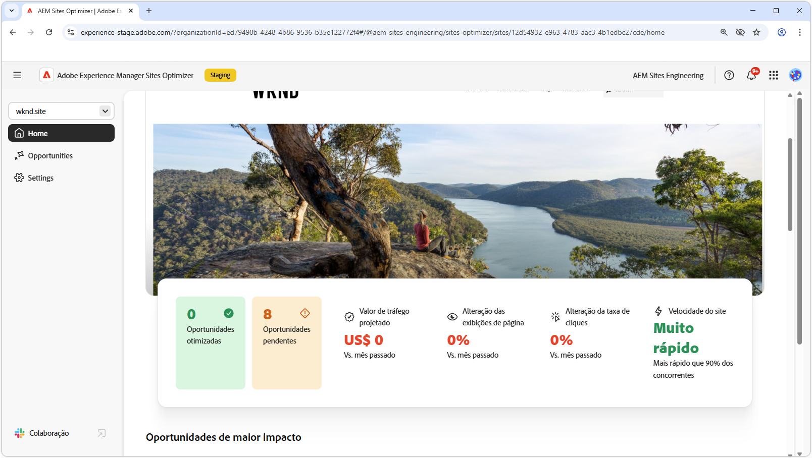

# AEM Sites Optimizer

{align="center"}

O Adobe Experience Manager (AEM) Sites Optimizer é um serviço na nuvem que analisa e melhora o desempenho de sites criados no AEM. Ele identifica áreas em que o carregamento de página, o uso de componentes e a entrega de conteúdo podem ser aprimorados, ajudando você a aprimorar o desempenho do site e a reduzir os custos de manutenção e atualização. Ao usar o Sites Optimizer, você pode garantir uma experiência online perfeita e confiável, o que é importante para manter o engajamento e as conversões.

## Introdução ao Sites Optimizer

<!-- CARDS 

* ./opportunity-types/overview.md
   {title=Opportunity types}
   {description = Learn about the available Site Optimizer opportunities and how to use them to improve your site's performance.}
* ./documentation/overview.md
  * {title=Documentation}
  * {description=Explore the Sites Optimizer documentation to learn about all its capabilities.}

-->
<!-- START CARDS HTML - DO NOT MODIFY BY HAND -->

    

        

            

                <figure class="image x-is-16by9">
                    
                </figure>
            

            

                

                    

                        <a href="./opportunity-types/overview.md" target="_blank" rel="referrer" title="Tipos de oportunidade">Tipos de oportunidade</a>
                    

                    
Saiba mais sobre as oportunidades disponíveis do Site Otimizer e como usá-las para melhorar o desempenho do seu site.

                

                <a href="./opportunity-types/overview.md" target="_blank" rel="referrer" class="spectrum-Button spectrum-Button--outline spectrum-Button--primary spectrum-Button--sizeM" style="align-self: flex-start; margin-top: 1rem;">
                    Saiba mais
                </a>
            

        

    

    

        

            

                <figure class="image x-is-16by9">
                    
                </figure>
            

            

                

                    

                        <a href="./documentation/overview.md" target="_blank" rel="referrer" title="Documentação">Documentação</a>
                    

                    
Explore a documentação do Sites Optimizer para saber mais sobre todos os recursos.

                

                <a href="./documentation/overview.md" target="_blank" rel="referrer" class="spectrum-Button spectrum-Button--outline spectrum-Button--primary spectrum-Button--sizeM" style="align-self: flex-start; margin-top: 1rem;">
                    Saiba mais
                </a>
            

        

    

<!-- END CARDS HTML - DO NOT MODIFY BY HAND -->
