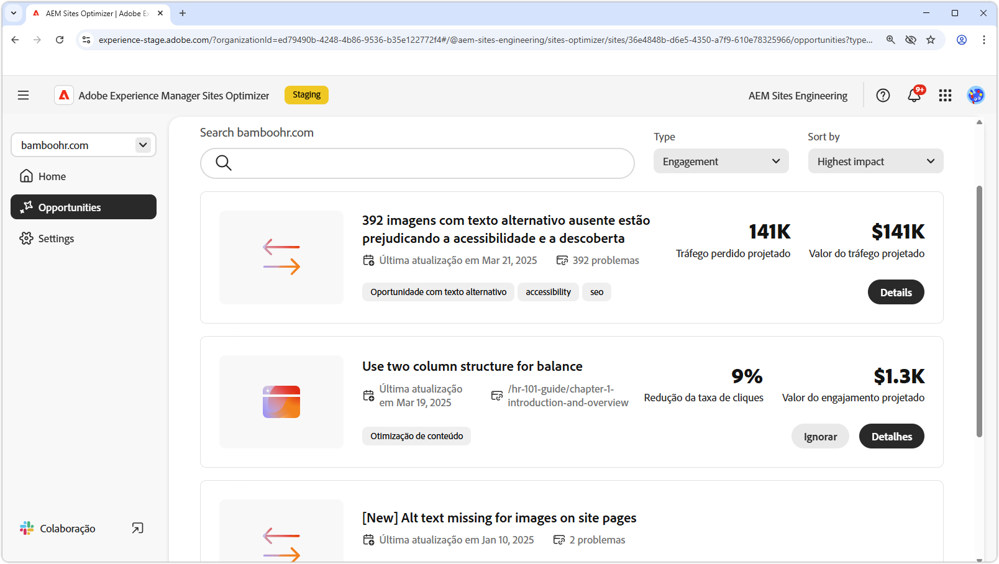

# Oportunidades de envolvimento

{align="center"}

As oportunidades de engajamento no AEM Sites Optimizer são cruciais para melhorar as experiências digitais, fornecendo insights acionáveis sobre como os usuários interagem com páginas da Web. Ao identificar áreas para aprimoramento, como problemas de acessibilidade, links internos quebrados, altas taxas de rejeição e texto alternativo ausente, os profissionais de marketing e autores de conteúdo podem otimizar seus sites para obter melhor desempenho e engajamento do usuário. Essas oportunidades ajudam a garantir que o conteúdo seja eficaz, detectável e atraente, gerando, em última análise, conversões mais altas e uma jornada mais perfeita para o cliente. Aproveitar as recomendações da AEM Sites Optimizer permite que as equipes refinem continuamente sua estratégia digital e forneçam experiências de alto impacto em escala.

## Oportunidades

<!-- CARDS

* ../documentation/opportunities/accessibility-issues.md
  {title=Accessibility issues}
  {image=../assets/common/card-puzzle.png}
* ../documentation/opportunities//broken-internal-links.md
  {title=Broken internal links}
  {image=../assets/common/card-link.png}
* ../documentation/opportunities//high-bounce-rate.md
  {title=High bounce rate}
  {image=../assets/common/card-arrows.png}
* ../documentation/opportunities/missing-alt-text.md  
  {title=Missing alt text}
  {image=../assets/common/card-arrows.png}

-->
<!-- START CARDS HTML - DO NOT MODIFY BY HAND -->

    

        

            

                <figure class="image x-is-16by9">
                    
                </figure>
            

            

                

                    

                        <a href="../documentation/opportunities/accessibility-issues.md" target="_blank" rel="referrer" title="Problemas de acessibilidade">Problemas de acessibilidade</a>
                    

                    
Saiba mais sobre a oportunidade de problemas de acessibilidade e como usá-la para aumentar a segurança do em seu site.

                

                <a href="../documentation/opportunities/accessibility-issues.md" target="_blank" rel="referrer" class="spectrum-Button spectrum-Button--outline spectrum-Button--primary spectrum-Button--sizeM" style="align-self: flex-start; margin-top: 1rem;">
                    Saiba mais
                </a>
            

        

    

    

        

            

                <figure class="image x-is-16by9">
                    
                </figure>
            

            

                

                    

                        <a href="../documentation/opportunities//broken-internal-links.md" target="_blank" rel="referrer" title="Links internos corrompidos">Links internos desfeitos</a>
                    

                    
Saiba mais sobre a oportunidade de links quebrados e como usá-la para melhorar o engajamento no seu site.

                

                <a href="../documentation/opportunities//broken-internal-links.md" target="_blank" rel="referrer" class="spectrum-Button spectrum-Button--outline spectrum-Button--primary spectrum-Button--sizeM" style="align-self: flex-start; margin-top: 1rem;">
                    Saiba mais
                </a>
            

        

    

    

        

            

                <figure class="image x-is-16by9">
                    
                </figure>
            

            

                

                    

                        <a href="../documentation/opportunities//high-bounce-rate.md" target="_blank" rel="referrer" title="Alta taxa de rejeição">Alta taxa de rejeição</a>
                    

                    
Saiba mais sobre a oportunidade de exibições baixas e como usá-la para melhorar o envolvimento do formulário no seu site.

                

                <a href="../documentation/opportunities//high-bounce-rate.md" target="_blank" rel="referrer" class="spectrum-Button spectrum-Button--outline spectrum-Button--primary spectrum-Button--sizeM" style="align-self: flex-start; margin-top: 1rem;">
                    Saiba mais
                </a>
            

        

    

    

        

            

                <figure class="image x-is-16by9">
                    
                </figure>
            

            

                

                    

                        <a href="../documentation/opportunities/missing-alt-text.md" target="_blank" rel="referrer" title="Texto alternativo ausente">Texto alternativo ausente</a>
                    

                    
Saiba mais sobre a oportunidade perdida de texto alternativo e como usá-la para melhorar o engajamento no seu site.

                

                <a href="../documentation/opportunities/missing-alt-text.md" target="_blank" rel="referrer" class="spectrum-Button spectrum-Button--outline spectrum-Button--primary spectrum-Button--sizeM" style="align-self: flex-start; margin-top: 1rem;">
                    Saiba mais
                </a>
            

        

    

<!-- END CARDS HTML - DO NOT MODIFY BY HAND -->
