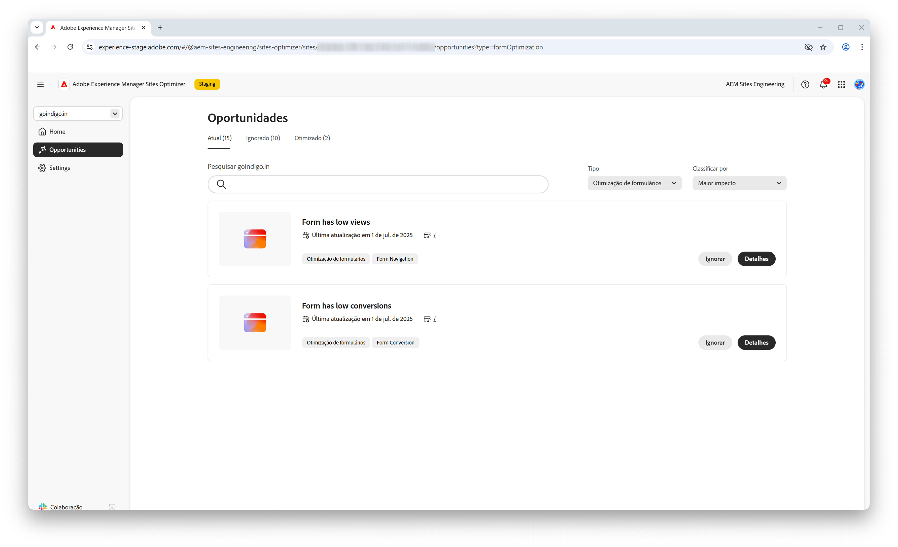

# Oportunidades de otimização de formulários

{align="center"}

A otimização de formulários no AEM Sites Optimizer é essencial para melhorar as interações do usuário e maximizar conversões. Ao identificar áreas para aprimoramento, como exibições baixas e conversões baixas de formulários, as equipes podem refinar o design, o posicionamento e o conteúdo dos formulários para aprimorar o engajamento. Os formulários otimizados garantem uma experiência do usuário perfeita, fazendo com que os visitantes concluam ações e impulsionem os resultados de negócios com mais facilidade. O uso dos insights do AEM Sites Optimizer permite que os profissionais de marketing identifiquem continuamente áreas de aprimoramento, aumentando a eficácia e impulsionando o desempenho geral do site.

## Oportunidades

<!-- CARDS
 
* ../documentation/opportunities/low-views.md
  {title=Low views}
  {image=../assets/common/card-bag.png}
* ../documentation/opportunities/low-conversions.md
  {title=Low conversions}
  {image=../assets/common/card-bag.png}

--->
<!-- START CARDS HTML - DO NOT MODIFY BY HAND -->

    

        

            

                <figure class="image x-is-16by9">
                    
                </figure>
            

            

                

                    

                        <a href="../documentation/opportunities/low-views.md" target="_blank" rel="referrer" title="Exibições baixas">Poucas exibições</a>
                    

                    
Saiba mais sobre a oportunidade de exibições baixas e como usá-la para melhorar o engajamento do formulário no site.

                

                <a href="../documentation/opportunities/low-views.md" target="_blank" rel="referrer" class="spectrum-Button spectrum-Button--outline spectrum-Button--primary spectrum-Button--sizeM" style="align-self: flex-start; margin-top: 1rem;">
                    Saiba mais
                </a>
            

        

    

    

        

            

                <figure class="image x-is-16by9">
                    
                </figure>
            

            

                

                    

                        <a href="../documentation/opportunities/low-conversions.md" target="_blank" rel="referrer" title="Baixas conversões">Poucas conversões</a>
                    

                    
Saiba mais sobre a oportunidade de poucas conversões e como usá-la para melhorar o engajamento do formulário no seu site.

                

                <a href="../documentation/opportunities/low-conversions.md" target="_blank" rel="referrer" class="spectrum-Button spectrum-Button--outline spectrum-Button--primary spectrum-Button--sizeM" style="align-self: flex-start; margin-top: 1rem;">
                    Saiba mais
                </a>
            

        

    

<!-- END CARDS HTML - DO NOT MODIFY BY HAND -->
