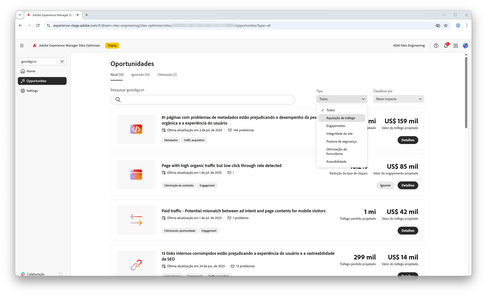
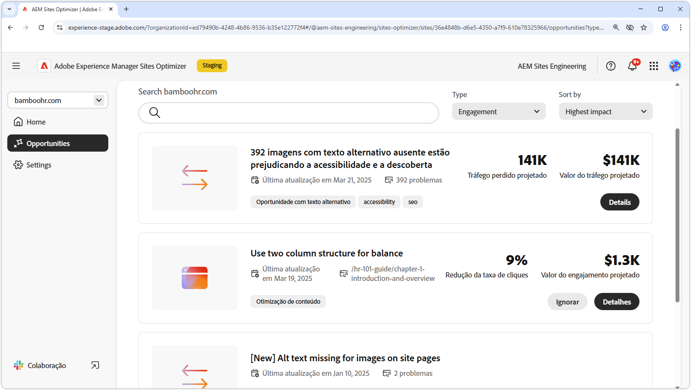
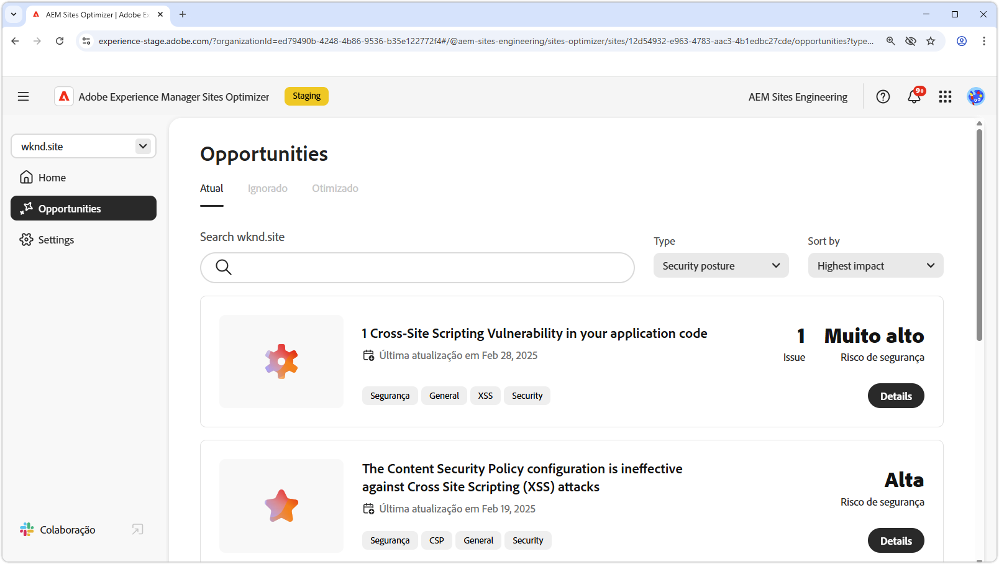
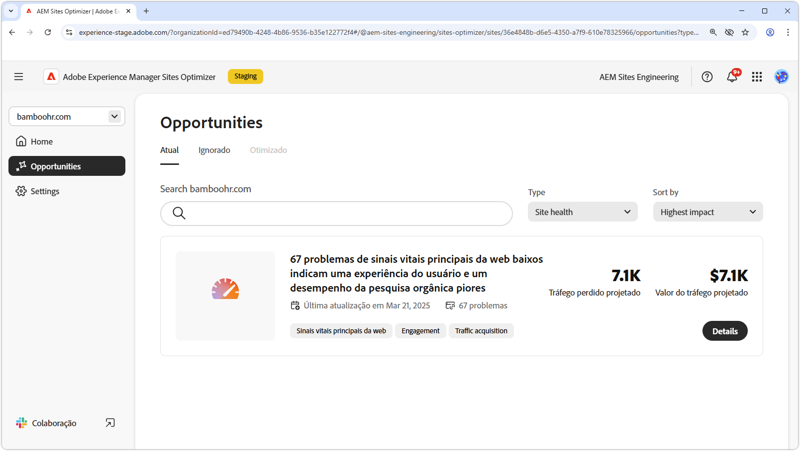
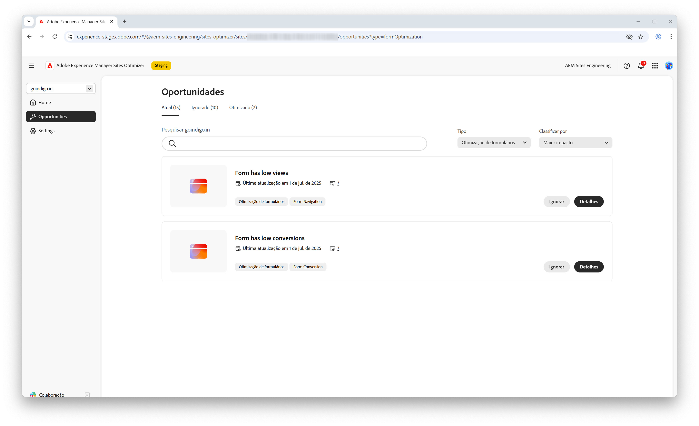

# Tipos de oportunidade

{align="center"}

O AEM Sites Optimizer fornece insights e recomendações valiosos para ajudar você a melhorar o desempenho, a usabilidade e a segurança do seu site. Esses insights estão agrupados nas seguintes áreas de oportunidade principais:

* Engajamento
* Aquisição de tráfego
* Postura de segurança
* Integridade do Site

Cada categoria destaca uma maneira diferente de aprimorar seu site. Uma categoria pode aumentar a interação do visitante. Outra pode melhorar a descoberta. Outros se concentram no fortalecimento da segurança ou na manutenção da estabilidade do local.

Usar essas oportunidades melhora a experiência do usuário, atrai o público-alvo certo e mantém seu site seguro e confiável. Melhorar o engajamento e a aquisição de tráfego impulsiona a interação e a visibilidade, enquanto uma postura de segurança forte e a integridade do site ajudam a garantir confiança e estabilidade.  Confira os links abaixo para ver oportunidades organizadas por categoria e descobrir maneiras de melhorar seu site.

## Tipos de oportunidades

<!-- CARDS 

* ./engagement.md
   { title = Engagement }
* ./security-posture.md
   { title = Security posture }
* ./site-health.md
   { title = Site health }
* ./traffic-acquisition.md
   { title = Traffic acquisition }
* ./form-optimization.md
   { title = Forms Optimizer }

-->
<!-- START CARDS HTML - DO NOT MODIFY BY HAND -->

    

        

            

                <figure class="image x-is-16by9">
                    
                </figure>
            

            

                

                    

                        <a href="./engagement.md" target="_blank" rel="referrer" title="Engajamento">Engajamento</a>
                    

                    
Saiba como melhorar o engajamento com o Sites Optimizer.

                

                <a href="./engagement.md" target="_blank" rel="referrer" class="spectrum-Button spectrum-Button--outline spectrum-Button--primary spectrum-Button--sizeM" style="align-self: flex-start; margin-top: 1rem;">
                    Saiba mais
                </a>
            

        

    

    

        

            

                <figure class="image x-is-16by9">
                    
                </figure>
            

            

                

                    

                        <a href="./security-posture.md" target="_blank" rel="referrer" title="Postura de segurança">Postura de segurança</a>
                    

                    
Saiba como melhorar a segurança do site com o Sites Optimizer.

                

                <a href="./security-posture.md" target="_blank" rel="referrer" class="spectrum-Button spectrum-Button--outline spectrum-Button--primary spectrum-Button--sizeM" style="align-self: flex-start; margin-top: 1rem;">
                    Saiba mais
                </a>
            

        

    

    

        

            

                <figure class="image x-is-16by9">
                    
                </figure>
            

            

                

                    

                        <a href="./site-health.md" target="_blank" rel="referrer" title="Integridade do site">Integridade do site</a>
                    

                    
Saiba como melhorar a integridade do site com o Sites Optimizer.

                

                <a href="./site-health.md" target="_blank" rel="referrer" class="spectrum-Button spectrum-Button--outline spectrum-Button--primary spectrum-Button--sizeM" style="align-self: flex-start; margin-top: 1rem;">
                    Saiba mais
                </a>
            

        

    

    

        

            

                <figure class="image x-is-16by9">
                    
                </figure>
            

            

                

                    

                        <a href="./traffic-acquisition.md" target="_blank" rel="referrer" title="Aquisição de tráfego">Aquisição de tráfego</a>
                    

                    
Saiba como aumentar a aquisição de tráfego com o Sites Optimizer.

                

                <a href="./traffic-acquisition.md" target="_blank" rel="referrer" class="spectrum-Button spectrum-Button--outline spectrum-Button--primary spectrum-Button--sizeM" style="align-self: flex-start; margin-top: 1rem;">
                    Saiba mais
                </a>
            

        

    

    

        

            

                <figure class="image x-is-16by9">
                    
                </figure>
            

            

                

                    

                        <a href="./form-optimization.md" target="_blank" rel="referrer" title="Otimização do Forms">Otimização do Forms</a>
                    

                    
Saiba mais sobre como melhorar a conversão de formulários com o Forms Otimizer.

                

                <a href="./form-optimization.md" target="_blank" rel="referrer" class="spectrum-Button spectrum-Button--outline spectrum-Button--primary spectrum-Button--sizeM" style="align-self: flex-start; margin-top: 1rem;">
                    Saiba mais
                </a>
            

        

    

    

        

            

                <figure class="image x-is-16by9">
                    
                </figure>
            

            

                

                    

                        <a href="./form-optimization.md" target="_blank" rel="referrer" title="Acessibilidade do Forms">Acessibilidade Forms</a>
                    

                    
Saiba mais sobre como melhorar a acessibilidade de formulários com o Forms Otimizer.

                

                <a href="./form-optimization.md" target="_blank" rel="referrer" class="spectrum-Button spectrum-Button--outline spectrum-Button--primary spectrum-Button--sizeM" style="align-self: flex-start; margin-top: 1rem;">
                    Saiba mais
                </a>
            

        

    

<!-- END CARDS HTML - DO NOT MODIFY BY HAND -->

 Os recursos de Otimização do Forms e Acessibilidade do Forms estão disponíveis no programa de acesso antecipado. Você pode enviar um email para aem-forms-ea@adobe.com a partir de sua ID de email oficial para participar do programa de acesso antecipado e solicitar acesso ao recurso. 
