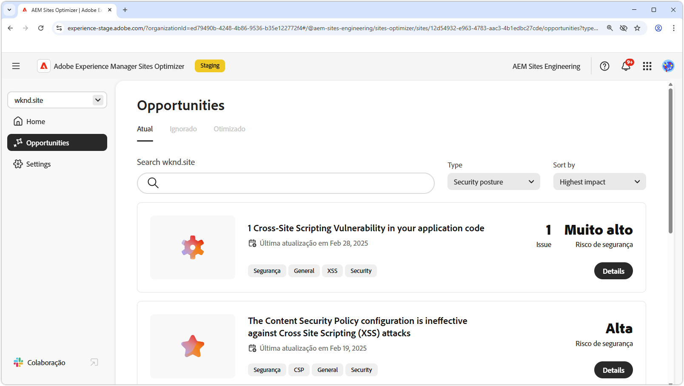

# Oportunidades de postura de segurança

{align="center"}

Manter uma postura de segurança robusta no AEM Sites Optimizer é essencial para proteger experiências digitais e dados do usuário. Ao identificar oportunidades de melhoria, como configuração do CORS, criação de script entre sites, permissões de site e vulnerabilidades de site, as equipes podem abordar proativamente riscos potenciais à segurança e garantir a conformidade com as práticas recomendadas. O reforço das medidas de segurança não só protege as informações confidenciais, mas também aumenta a confiança do usuário e a confiabilidade do site. Aproveitar os insights do AEM Sites Optimizer ajuda as organizações a monitorar e melhorar continuamente sua posição de segurança, reduzindo riscos e mantendo um ambiente digital seguro.

## Oportunidades

<!-- CARDS

* ../documentation/opportunities/cors-configuration.md
  {title=CORS configuration}
  {image=../assets/common/card-code.png}
* ../documentation/opportunities/cross-site-scripting.md
  {title=Cross-site scripting}
  {image=../assets/common/card-gear.png}
* ../documentation/opportunities/website-permissions.md  
  {title=Website permissions}
  {image=../assets/common/card-people.png}
* ../documentation/opportunities//website-vulnerabilities.md
  {title=Website vulnerabilities}
  {image=../assets/common/card-puzzle.png}

-->
<!-- START CARDS HTML - DO NOT MODIFY BY HAND -->

    

        

            

                <figure class="image x-is-16by9">
                    
                </figure>
            

            

                

                    

                        <a href="../documentation/opportunities/cors-configuration.md" target="_blank" rel="referrer" title="Configuração do CORS">Configuração do CORS</a>
                    

                    
Saiba mais sobre a oportunidade de configuração do CORS e de identificar e corrigir vulnerabilidades de segurança do site.

                

                <a href="../documentation/opportunities/cors-configuration.md" target="_blank" rel="referrer" class="spectrum-Button spectrum-Button--outline spectrum-Button--primary spectrum-Button--sizeM" style="align-self: flex-start; margin-top: 1rem;">
                    Saiba mais
                </a>
            

        

    

    

        

            

                <figure class="image x-is-16by9">
                    
                </figure>
            

            

                

                    

                        <a href="../documentation/opportunities/cross-site-scripting.md" target="_blank" rel="referrer" title="Criação de script entre sites">Criação de script entre sites</a>
                    

                    
Saiba mais sobre a oportunidade de criação de script entre sites e como identificar e corrigir vulnerabilidades de segurança do site.

                

                <a href="../documentation/opportunities/cross-site-scripting.md" target="_blank" rel="referrer" class="spectrum-Button spectrum-Button--outline spectrum-Button--primary spectrum-Button--sizeM" style="align-self: flex-start; margin-top: 1rem;">
                    Saiba mais
                </a>
            

        

    

    

        

            

                <figure class="image x-is-16by9">
                    
                </figure>
            

            

                

                    

                        <a href="../documentation/opportunities/website-permissions.md" target="_blank" rel="referrer" title="Permissões do site">Permissões do site</a>
                    

                    
Saiba mais sobre a oportunidade de permissões de site e como usá-la para aumentar a segurança em seu site.

                

                <a href="../documentation/opportunities/website-permissions.md" target="_blank" rel="referrer" class="spectrum-Button spectrum-Button--outline spectrum-Button--primary spectrum-Button--sizeM" style="align-self: flex-start; margin-top: 1rem;">
                    Saiba mais
                </a>
            

        

    

    

        

            

                <figure class="image x-is-16by9">
                    
                </figure>
            

            

                

                    

                        <a href="../documentation/opportunities//website-vulnerabilities.md" target="_blank" rel="referrer" title="Vulnerabilidades do site">Vulnerabilidades do site</a>
                    

                    
Saiba mais sobre a oportunidade de vulnerabilidades do site e como usá-la para aumentar a segurança em seu site.

                

                <a href="../documentation/opportunities//website-vulnerabilities.md" target="_blank" rel="referrer" class="spectrum-Button spectrum-Button--outline spectrum-Button--primary spectrum-Button--sizeM" style="align-self: flex-start; margin-top: 1rem;">
                    Saiba mais
                </a>
            

        

    

<!-- END CARDS HTML - DO NOT MODIFY BY HAND -->

