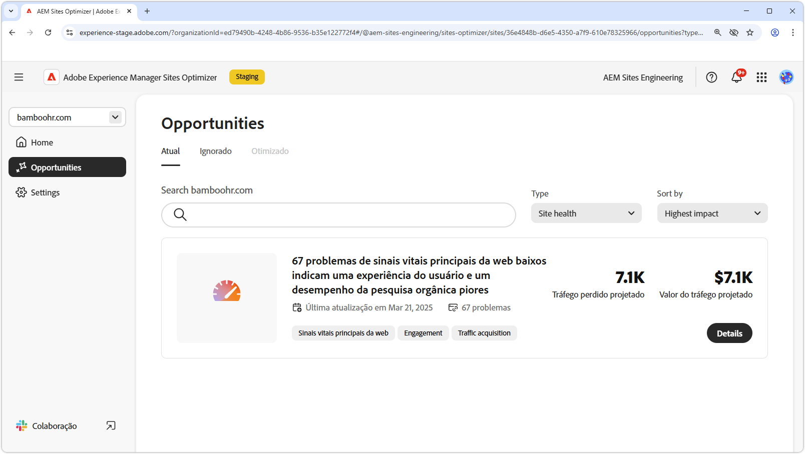

# Oportunidades de integridade do site

{align="center"}

Manter a integridade do site no AEM Sites Optimizer é essencial para fornecer experiências digitais rápidas, confiáveis e de alto desempenho. Ao identificar oportunidades para aprimoramento, como os Sinais vitais principais da web, as equipes podem otimizar a velocidade de páginas, a interatividade e a estabilidade visual para aprimorar a experiência do usuário e as classificações em mecanismos de pesquisa. Um site com boa manutenção garante uma navegação mais suave, melhor engajamento e desempenho geral. O uso dos insights do AEM Sites Optimizer permite um monitoramento e um refinamento contínuos, garantindo que o site permaneça eficiente e eficaz ao longo do tempo.

## Oportunidades

<!-- CARDS

* ../documentation/opportunities/core-web-vitals.md
  {title=Core web vitals}
  {image=../assets/common/card-performance.png}

-->
<!-- START CARDS HTML - DO NOT MODIFY BY HAND -->

    

        

            

                <figure class="image x-is-16by9">
                    
                </figure>
            

            

                

                    

                        <a href="../documentation/opportunities/core-web-vitals.md" target="_blank" rel="referrer" title="Sinais vitais principais da web">Sinais vitais principais da web</a>
                    

                    
Saiba mais sobre a oportunidade de principais sinais vitais e como usá-la para melhorar a aquisição de tráfego.

                

                <a href="../documentation/opportunities/core-web-vitals.md" target="_blank" rel="referrer" class="spectrum-Button spectrum-Button--outline spectrum-Button--primary spectrum-Button--sizeM" style="align-self: flex-start; margin-top: 1rem;">
                    Saiba mais
                </a>
            

        

    

<!-- END CARDS HTML - DO NOT MODIFY BY HAND -->

