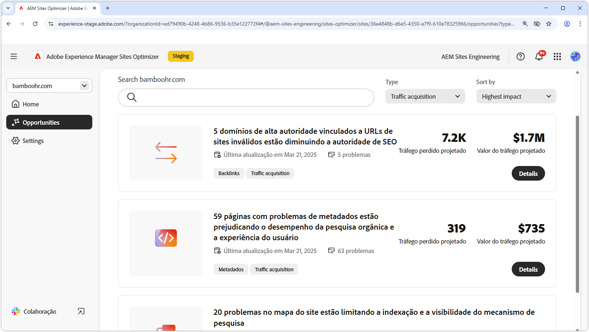

# Oportunidades de aquisição de tráfego

{align="center"}

A aquisição de tráfego é essencial para levar clientes em potencial ao seu site e criar oportunidades para vendas ou geração de leads. Aproveitando estratégias como a SEO (otimização de mecanismo de pesquisa), as empresas podem melhorar a visibilidade da pesquisa e facilitar a descoberta de conteúdo pelos usuários. Um fluxo constante de visitantes não apenas aumenta a percepção e a confiança da marca, mas também fornece informações valiosas sobre o comportamento do usuário, ajudando as equipes a refinar suas ofertas e aprimorar a experiência geral. Aproveitar os insights do AEM Sites Optimizer permite uma otimização contínua, garantindo um crescimento sustentado e taxas de conversão aprimoradas ao longo do tempo.

## Oportunidades

<!-- CARDS
 
* ../documentation/opportunities/broken-backlinks.md
  {title=Broken backlinks}
  {image=../assets/common/card-arrows.png}
* ../documentation/opportunities/invalid-or-missing-metadata.md
  {title=Invalid or missing metadata}
  {image=../assets/common/card-code.png}
* ../documentation/opportunities/missing-invalid-structured-data.md
  {title=Missing or invalid structured data}
  {image=../assets/common/card-bag.png}
* ../documentation/opportunities/sitemap-issues.md
  {title=Sitemap issues}
  {image=../assets/common/card-relationship.png}

--->
<!-- START CARDS HTML - DO NOT MODIFY BY HAND -->

    

        

            

                <figure class="image x-is-16by9">
                    
                </figure>
            

            

                

                    

                        <a href="../documentation/opportunities/broken-backlinks.md" target="_blank" rel="referrer" title="Backlinks corrompidos">Backlinks desfeitos</a>
                    

                    
Saiba mais sobre a oportunidade de backlinks quebrados e como usá-la para melhorar a aquisição do tráfego.

                

                <a href="../documentation/opportunities/broken-backlinks.md" target="_blank" rel="referrer" class="spectrum-Button spectrum-Button--outline spectrum-Button--primary spectrum-Button--sizeM" style="align-self: flex-start; margin-top: 1rem;">
                    Saiba mais
                </a>
            

        

    

    

        

            

                <figure class="image x-is-16by9">
                    
                </figure>
            

            

                

                    

                        <a href="../documentation/opportunities/invalid-or-missing-metadata.md" target="_blank" rel="referrer" title="Metadados inválidos ou ausentes">Metadados inválidos ou ausentes</a>
                    

                    
Saiba mais sobre a oportunidade de metadados inválida ou ausente e como usá-la para melhorar a aquisição do tráfego.

                

                <a href="../documentation/opportunities/invalid-or-missing-metadata.md" target="_blank" rel="referrer" class="spectrum-Button spectrum-Button--outline spectrum-Button--primary spectrum-Button--sizeM" style="align-self: flex-start; margin-top: 1rem;">
                    Saiba mais
                </a>
            

        

    

    

        

            

                <figure class="image x-is-16by9">
                    
                </figure>
            

            

                

                    

                        <a href="../documentation/opportunities/missing-invalid-structured-data.md" target="_blank" rel="referrer" title="Dados estruturados ausentes ou inválidos">Dados estruturados ausentes ou inválidos</a>
                    

                    
Saiba mais sobre a oportunidade de dados estruturados ausente ou inválida e como usá-la para melhorar a aquisição do tráfego.

                

                <a href="../documentation/opportunities/missing-invalid-structured-data.md" target="_blank" rel="referrer" class="spectrum-Button spectrum-Button--outline spectrum-Button--primary spectrum-Button--sizeM" style="align-self: flex-start; margin-top: 1rem;">
                    Saiba mais
                </a>
            

        

    

    

        

            

                <figure class="image x-is-16by9">
                    
                </figure>
            

            

                

                    

                        <a href="../documentation/opportunities/sitemap-issues.md" target="_blank" rel="referrer" title="Problemas no mapa do site">Problemas de mapa do site</a>
                    

                    
Saiba mais sobre a oportunidade de problemas do mapa de site e como usá-lo para melhorar a aquisição de tráfego.

                

                <a href="../documentation/opportunities/sitemap-issues.md" target="_blank" rel="referrer" class="spectrum-Button spectrum-Button--outline spectrum-Button--primary spectrum-Button--sizeM" style="align-self: flex-start; margin-top: 1rem;">
                    Saiba mais
                </a>
            

        

    

<!-- END CARDS HTML - DO NOT MODIFY BY HAND -->
